# 计算机图形学

## Part1 Transformation

#### 2D Transformation

##### Scale

缩放，翻转，切变，旋转（绕原点，逆时针）

线性变换-> x’=ax+by,y’=cx+dy

##### 齐次坐标

增加一个维度表示移动后是点还是向量

##### 仿射变换 

x'=ax+by+tx

y’=cx+dy+ty

点（x,y,1) 向量(x,y,0)

##### 逆变换

##### 变换合成（注意顺序）

##### 变换分解

#### 3D Transformation

类比二维

点（x,y,z,1) 向量(x,y,z,0)

##### 缩放

##### 平移

##### 旋转

绕轴旋转，轴对应的行不变，其他行为旋转矩阵

绕x，z为正θ矩阵，绕y为-θ

cosθ sinθ

-sinθ cosθ

旋转可以分解到绕三轴的转动

三种转动 	roll，pitch，yaw

###### 罗德里格斯旋转公式

对应绕旋转轴n的旋转角度为θ的旋转矩阵

四元数，罗德里格斯旋转公式

#### 视图变换

模型变换->视图变换->投影变换

###### 确定相机

 位置**e**、视线**g**、向上方向**t**

1.保持相机永远在原点，其他实体随相机运动

2.相机在原点，向上方向y，朝向-z，摆好相机

$M_{view}=R_{view}T_{view}$

$T_{view}=\left[\begin{matrix}1&0&0&-x_e\\0&1&0&-y_e\\0&0&1&-z_e\\0&0&0&1 \end{matrix}\right]$ 

旋转坐标轴到相机的旋转矩阵，求逆得到相机旋转到矩阵的旋转矩阵 $R^{-1}_{view}=R^{T}_{view}$

旋转矩阵是正交矩阵，逆矩阵等于转置

相机就位，再做投影

#### 投影变换

正交投影，透视投影

正交投影平行线仍然平行，透视投影平行线相交且近大远小

透视投影接近于相机四棱锥，平行投影接近于无限远相机（投影平面和远平面大小相同）

##### 正交投影

简单方法：不关心z（深度信息）

普遍方法：定义模型，平移至原点，缩放到标准立方体（沿-z，所以z越小越远）

##### 透视投影

平面的点乘k表示同一个点（不等于0）

远平面大于近平面（两平面对应的点连线为斜线）

透视投影：远平面到近平面大小，再做正交投影

**近平面不变，远平面远近不变（z轴不变）以及中心点不变**

通过相似三角形来缩$y^{’}=(n/z)y$

任何近平面点不变，

n和x，y均无关

远平面的点z不变，如中心点（0，0，f）

A=n+f，B=-nf

问题：对于对于两平面中间的点，是否会发生变化

#### 光栅化（Rasterization）

所有物体已经在-1 1 的立方

##### 视锥的定义

对近平面定义宽和高（宽高比）、垂直可视角度（可视角度范围）

##### 在屏幕上绘制

光栅化就是在屏幕上绘制

灰度值和红绿蓝

##### 屏幕空间

像素坐标为（X，Y），中心为（X+0.5，Y+0.5）

屏幕中心为(width/2+height/2)

从$[-1,1]^3$到屏幕空间[0,width]x[0,height]

z方向不动

对多边形打散到像素，绘制在屏幕上

隔行扫描

##### 多边形

四边形、三角形（广泛应用）

三角形很简单，内部是平面，可拆分，内外定义清晰

##### 像素是否被渲染（光栅化）

采样：通过函数还采取对应的值（离散化）

利用像素中心对屏幕空间采样

##### 采样函数

通过叉乘判断点是否在三条边内(在三边的同侧)

##### 加速光栅化

只需要考虑包含三角形的矩形区域（轴向包围盒）

每行的包围盒

#### 反走样/抗锯齿

对锯齿处理

锯齿：走样 Aliasing

动画-时间连续采样

Artifact：不准确和不对的结果，瑕疵

采样的问题：锯齿、摩尔纹、运动速度错觉（车轮效应）

原因：信号过快变化导致采样频率不够

##### 反走样-模糊处理（滤波）

先对图像进行模糊，再进行采样

不能先采样再模糊

##### 频域 Frequency Domain

###### 傅里叶级数展开

把任何函数写成一系列正弦和余弦函数及常数的组合

###### 傅里叶变换

时域和频域可以通过傅里叶变换和逆傅里叶变换得到

通过快速采样可以获得类似原函数的函数

###### 走样

通过相同的采样方式采样两种完全不同的函数，得到相同的结果

###### 滤波

删除一系列信号中特定的频率

通过傅里叶变换可以得到图像中各个频率的信息（频谱）

高通滤波（使得只有高频可以通过），可以得到图像变化剧烈的地方

低通滤波可以将边界模糊

###### 滤波=卷积=平均

滤波器类似于卷积窗口，对窗口内的信号进行计算

可以直接卷积，也可以在频域图上进行卷积

Box Filter低通滤波器

大的box会留下更少的频率，频谱图会变小

##### 采样=重复频谱内容

在时域原始信号上乘另一个函数采样

在频域信号上卷积采样

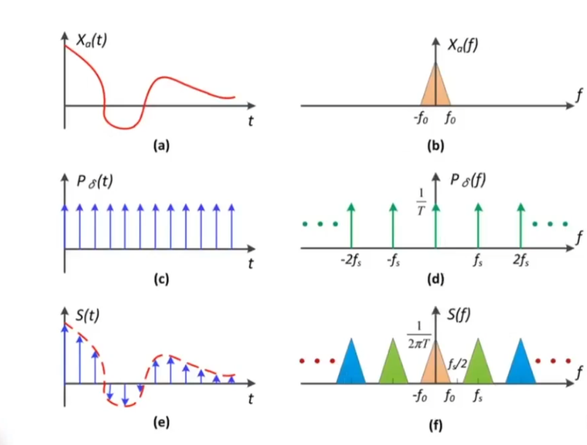

采样频率低，导致频谱间隔小，导致原始信息和搬运信息的重合，导致走样‘

###### 解决方法

1、增加采样率（增加分辨率，物理提升）

2、反走样技术

##### 反走样技术

先模糊再采样=低通滤波再采样

频谱覆盖较低，再采样则不易重叠

##### 实践-如何模糊

使用一个固定大小的低通滤波（卷积）

##### 反走样步骤

1、卷积box-blur

2、采样

#### 超级采样抗锯齿（MSAA）

简单认为一个像素被分割成多个小像素进行采样，对像素使用小像素渲染平均值来计算像素值

完成的是模糊操作

采样其实隐含的完成了，得到了近似的采样区域和像素值

牺牲了性能

实际的采样点可能有不同的分布，也可能被复用

#### 其他抗锯齿 Antialiasing

- FXAA 快速近似抗锯齿

​	只进行图像后期处理，找到图像锯齿边界，换成没有锯齿的边界

- TAA 时间抗锯齿

​	通过上一帧的图像信息复用来抗锯齿，把MSAA的样本复用在时间上

- 超分辨率

​	从低分辨率的图到高分辨率的图，解决信息不足的问题

- DLSS

​	通过深度学习来补全图片信息

### 深度绘制

当多个三角形存在时，如何使其正确的被渲染？如何正确表示其遮挡关系？

**画家算法**：先绘制最远处的东西，再绘制近处的东西，使得近处的东西覆盖远处的东西；需要先对绘制的物体进行深度排序，需要高于O(n)的复杂度排序；

画家算法的缺点是，对于绘制顺序要求高；并且如果出现多个三角形相互遮挡，就无法定义他们的深度关系，就无法使用画家算法

**Z-Buffer**：最终业界使用的算法。这里假定z方向为深度，深度为正值。提供维护一个逐像素的深度，来完成最终的深度绘制

- 对于每个像素，存储其最小的深度（z方向）的信息
- 使用两个缓存图形，一个用来存储像素的颜色信息，另一个只存像素对应的深度
- 生成实际图时，首先认为深度缓存中的深度都是无限远，然后对任何一个三角形都记录其覆盖的每个像素时的深度，每次计算三角形覆盖的像素时判断当前三角形的覆盖该像素的深度是否小于深度缓存中记录的该像素深度；
	- 如果记录的深度大于当前渲染像素的深度，则将当前三角形覆盖该像素的深度信息记录到深度缓存，并把该像素对应的颜色缓存存为该三角形光栅化该像素的颜色信息；
	- 如果不存在多个三角形的某个相同像素的深度相同但颜色不同，该算法和三角形遍历顺序无关
	- 如果对应MSAA多采样的情况下，可能需要对采样点来进行深度患侧而不只是像素点
- 该算法不需要排序，只是一个遍历算法，可以达到O(n)复杂度；该算法处理不了透明物体；

## 着色（Shading）

着色就是对于图像引入不同的明暗和颜色差异，在图形学上理解为对不同的物体应用不同的材质的过程。

### 简单着色模型 （Blinn-Phong）

高光 + 漫反射 + 环境光

- 高光：由于光源直射导致的反射
- 漫反射：由于光源直射导致的向多个方向的反射
- 环境光：由于其他物体反射光源导致的光照反射

定义对于某个shading point在物体表面上

- n为法线
- 光线照射方向是I
- 观测方向为v
- 定义一些关于物体表面的属性，如color、shininess等
- 这些向量都定义为单位向量，因为仅表示方向

对于物体的局部着色，不考虑其他物体的阴影，而不考虑其他物体的遮挡等

#### 漫反射（Diffuse Reflection）

一个直射的光线被反射到各个方向，可能存在很多问题；

漫反射的强度可以看作被照射物体接收到了多少能量，这和物体表面和照射光线的夹角有关，一般根据一个像素点周围的单位面积接收到的光线强度计算

**兰伯特Lambert’s余弦定律：**光照方向和物体表面的法线方向的余弦成正比,预先越大表示反射越强，越小表示反射越弱；如法线和光强照射方向一致则反射最强

**点光源Light Falloff**：认为在任何时刻，一个点光源发出的能量集中在以点光源为球心的球壳上，并且在远处的球壳和近处的球壳上能量是相同的（因为远处的球壳的能量是近处传播过去的）；所以在离点光源越远的地方，球壳单位面积上光强就更低，即某个位置的光强和距离点光源的位置成反比；**所以，计算shading point的光强，需要根据其离点光源的距离来计算**

##### Lambertian Diffuse Shading

通过计算漫反射系数，由点光源强度和点光源到达反射表面的距离计算得到的在反射点的光强，以及由反射表面法向量和光照方向向量（均为单位向量）相乘得到的反射夹角余弦值得到反射光强的多少，就可以得到最终漫反射的光强

所以，**漫反射和观察角度完全无关**，只考虑光照方向和反射表面的夹角

漫反射系数用来定义表面的反射程度，越高代表反射程度越高

#### 高光反射（Specular Term）

反射非常接近镜面反射方向，反射强度依赖于观测方向和镜面反射方向，当观测方向和镜面反射相近时就可以看到反射。

**观察方向和镜面反射方向接近 <==> 半程向量和法线相近**，半程向量是指光线入射方向和观测方向两向量的之和的单位向量，而衡量是否相近的方法即cosα的大小，对于两个单位向量来说即两单位向量的乘积；

所以，在设定反射系数后，结合光强在球壳上的分布（距离光源的距离）以及法线和半程向量的夹角余弦值即可计算反射的结果光强；

如果使用镜面反射向量和观察发现来计算，则称之为Phong模型，是Blinn-Phong的前身，其计算比直接计算法线和半程向量复杂；

在夹角余弦这里有一个指数p，这是因为cos的导数较缓，使得即使偏移角度很大，对高光的减弱仍然较低（可以看到高光的角度范围较大）；所以，可以加上指数，使其下降到趋近零的速度更快，一般可以将p设置超过64，甚至128

#### 环境光（Ambient Term）

假设环境光是来自于四面八方的，而且是强度相同的，此时环境光即不考虑入射光线角度，也不考虑观测角度；如果这样考虑，则环境光就是一种颜色，保证某些区域不是黑色的。

此时，只需要设置环境光系数和环境光强度就可以得到一个常数的环境光反射。

#### Blinn-Phong反射模型

当我们将上述的三种反射加在一起，就可以得到最终的反射模型

### 着色频率（Shading Frequencies）

着色频率就是说，应该把着色的方法运用在哪些地方，如对每个平面计算着色，或者对顶点进行计算着色再使用插值的方式着色三角形，也可以对每一个像素进行着色；

**平面着色（Shade each triangle / flat shading：**对三角形的平面，使用两边叉积求出法线，根据着色算法计算出结果后，直接对三角形进行着色

**顶点着色（Gouraud shading）：**在任意一个顶点上求出法线，对每个顶点进行着色，对顶点间三角形内部的颜色进行插值着色；

**像素着色（Phong Shading）：**对于每一个像素进行一次着色计算；

这三种着色频率在模型面数较少的情况下，复杂的着色频率效果更好、效率越低；但如果模型面数较多的情况下，使用简单的着色频率也不一定比复杂的着色频率效果差；具体需要根据模型的面数决定。

**定义顶点的法向量：**对于任何一个顶点，其一定和很多三角形相连；当求一个顶点的法线时，只需要将其相连的三角形的面的法线求平均即可得到顶点的法线；但因为三角形的面积各不相同，所以求平均时也可能加上一些权重；

**定义像素的法线：**在两个点之间进行插值计算，具体见下节

### 图形管线（实时渲染管线）Real-time Rending Pipeline

管线表示的时一系列图形处理算法和流程，直到最终生成一张最终的图像的过程。

首先定义三位空间中的顶点以及哪些顶点可以形成三角形，再进行投影到平面以及光栅化和深度缓存到实际的像素上，进行着色后就可以得到一张图像。

在现代GPU中，其中的大部分流程是硬件编程的，也允许其中的某些流程进行可编程的客制化。比如可以自定义顶点和像素是如何着色的，可以使用opengl等api；

而shader是对每一个顶点或像素都执行的，只需要写好一次着色器即可，如顶点着色器、像素着色器或者片段着色器；

**着色器**

- 几何着色器
- 计算着色器：可以做几乎任何形式的计算

### 纹理映射（Texture Mapping）

有时，对于同一个模型，需要在物体表面不同位置的点定义不同的属性；

**表面：**对于一个三位物体，其表面是可以展开成为一张二维图片的；如果将一张对应的贴图贴在模型上，就可以定义模型表面每个位置的属性；对于三角形上的每个顶点，都需要规定在纹理上的坐标。

纹理上的坐标系通常使用一个二维坐标系，两个轴分别为u-v，模型的每个顶点可以使用对应在该坐标系的值来获取对应的纹理属性。通常都认为u、v的范围是0-1范围内的；

纹理是可以使用多次的，如果纹理设计较好，其可以在四个方向连续使用同一纹理时达到无缝衔接的效果。

### 在三角形内部进行插值（重心坐标）

由于很多着色是在顶点上操作的，而我们希望在三角形内部得到一个平滑的过度，使得每个顶点之间的过渡都是自然的；通过三角形的顶点得到的纹理中的位置，但也需要得到三角形内部关于纹理的位置映射；所以我们需要插值计算。

#### 重心坐标（Barycentric Coordinates）

重心坐标是定义是在一个特定的三角形上的。在三角形ABC所形成平面内的任何一个点，都可以表示成ABC三个点坐标的线性组合。只需要满足α、β，γ的和为1即可。
但如果这个点在三角形内部，则α、β，γ必须都大于0。

每个顶点对应的参数和其不相邻的、被三角形内部点与三角形顶点连线形成的三个三角形之一的面积有关，如下图，即三个参数可以可以通过面积比得到。

由此，可以得到三角形的重心，三角形的重心将三角形分为等面积的三份。

所以，我们可以根据下列公式计算出三角形内任意点使用三角形顶点表示方法

当得到上述公式后，在对三角形内部的值进行插值时，我们应该使用得到的α、β，γ来线性组合三角形顶点对应的属性

但是，在三位空间中的三角形投影变换后，**不能保证重心坐标不变**。所以，如果需要投影三位空间中的三角形，必须要在三维空间中计算重心坐标，而不是在投影后的三角形中计算；比如，计算深度插值一定不能在投影后的三角形做。

### 应用纹理

对于屏幕上任何一个采样点，都可以通过插值计算出其在纹理上的u-v坐标，所以就可以从纹理中取出一些属性，如颜色、漫反射系数等

### 纹理放大

如果一个纹理和实际渲染的图片相对较小（如分辨率不同），可能在纹理上取到的一些值不是整数；

如果采样点对应的纹理坐标不是整数，那么就需要对非整数坐标进行处理；

#### 简单案例

对一个像素（pixel），其在纹理上取得的一个纹理元素（texel）；在像素对应的纹理元素需要被近似处理，如使用四舍五入选择最近的坐标、双线性插值或双三次插值

**双线性插值：** 对于一个像素，其映射到了纹理上一个非整数的点，对于该点对应的纹理，可以进行一些操作；

1. 找到这个坐标在纹理上临近的四个点
2. 使用线性插值：对应两个离散的点，与两点在同一直线上的点可以用该直线的方程来进行插值计算
3. 首先利用横向的两组点，计算目标点在一个方向上的插值，再利用这两个插值来计算另一个方向上的插值

**双三次插值：** 使用周围的16个点，进行多次4个一组的插值，但计算量较大

#### 复杂案例

因为屏幕上像素覆盖实际纹理大小是各不相同的，近处覆盖的纹理较少，而远处覆盖的纹理较多；近处像素可以使用近似的采样方法，因为其覆盖纹理少，较少的纹理就可以表示像素了；但远处的像素可能覆盖了过多纹理，使得很难使用采样来选择适合的纹理来代表像素。

解决方法中，最简单的是使用超采样技术，如果将每个像素分成多点采样，再在纹理上计算，就可以得到很好的结果，但性能消耗也很大；

实际上，如果避免采样，只要在任何区域内计算得到该区域内纹理的平均值，就不会产生这个问题；这实际上是一个点查询到范围查询的转换；

**Mipmap：** 这是一种**快速近似的矩形范围查询**；Mipmap的本质实际上是使用一个图生成多个分辨率更低的图，这些图是通过平均算法得到的；

- 每次生成的图是前一张生成图的四分之一大小

- 根据等比数列求和，得到的最终的存储大小只比原图多了三分之一

- 另一个问题是，像素覆盖的纹理区域是如何得到的？

	- 首先，取像素自己的中心和相邻上右两像素的中心投影到纹理上

		

	- 将这个像素覆盖的区域近似成为一个正方形，计算方法为计算这个像素与相邻两个像素在纹理上投影后，该像素投影与其他两个投影在纹理上的距离，并取最大值作为近似覆盖纹理矩形区域的边长；

		

- 得到覆盖的区域之后，需要根据这个区域的大小来寻找Mipmap中对应那一层图的哪一块区域；需要寻找的图的层级即为D；覆盖区域越大，就越需要去越高层的Mipmap查询；

	- 但是，也可能存储某些覆盖的区域大小不能完美契合原本的Mipmap层级大小，可能在两个Mipmap单位大小之间；此时，需要对相邻的两个Mipmap都做双线性插值，然后在对这两个插值结果再做一次线性插值，这样就完成了三线性插值；

		但是在Mipmap中是不需要进行真正的插值的，只需要进行查询即可得到结果，所以实际上只进行了一次插值。

		

- 但是对应Mipmap，它可能会忽略掉远处所有的细节，导致和超采样得到的结果差距很大，这是一种过度模糊现象；这是因为Mipmap的计算实际上是进行了对角线方向的压缩，但是实际上可能水平和竖直方向的压缩是不均匀的。

	

	- 为了部分解决这个问题，可以使用各向异性过滤

**各向异性过滤：**可以查看轴向对齐的矩形区域而不只是正方形区域，这样可以得到不同长款比例下的纹理缩放图，对于矩形的查询相比正方形的Mipmap查询结果会更准确，但对于不规则区域的查询任然有很大的问题。并取存储开销会成为原来的三倍。各向异性的倍数是用来计算Ripmap两个方向压缩的层数的，但无论开多少倍，都会收缩到原来存储的三倍左右，所以如果显存足够完全可以将各向异性过滤使用最高档位。

**EWA过滤**：对于任意不规则的形状，可以拆分成圆形来覆盖这个形状，只需要多次查询就可以覆盖这个区域，但查询可能会造成性能损耗

### 纹理的应用

纹理可以有很多应用，简单理解成纹理就是一块内存，可以做点查询和范围查询以及过滤等；所以，纹理实际上可以表示的东西非常多，如环境光贴图，凹凸贴图等；纹理可以定义表面上的任何属性。

#### 环境光

把任何方向上的照射光线通过贴图的方式记录下来，从而直接在着色的时候使用这些环境光贴图；并且使用环境光贴图会假设所有环境光来自无限远处；

存储环境光可以存储在一个球体上，并且可以展开球面来记录该点对应的全部环境光；只需要假设有一个镜面的球或一个鱼眼摄像机，就可以将环境中所有光记录成一个球；

但是这样做，可能会导致球面展开图会导致扭曲，这是因为球面展开时都会在极端出现扭曲；解决方法时将球体外设置一个包围盒，让这些各自方向的光线照射到正方体包围盒上，从而让环境光信息存储到立方体上，这样的话展开立方体成六面不会产生扭曲；

但是，如果存储在球上，就可以通过极坐标方向来快速找到某个方向的光照，但是如果存储在立方体上就需要先判断存储在立方体的哪个面，在找到这个方向光线的信息。

#### 凹凸贴图

纹理也可以描述表面的凹凸状况，使得几何形体不必通过大量的三角形来定义表面凹凸状况，而是通过一个复杂的纹理来定义某些点相对的高度；相对高度可以用来使得法线发生变化，而导致着色发生变化，从而产生了明暗的对比。

通过法线贴图，可以定义一个复杂的纹理，不改变几何形体；法线贴图可以对每个像素的法线做出扰动，即定义了任何一个点相对位置的增减，使得点对应的高度在计算时被认为发生了一定的改变，使得法线也发生了一定的变化。

对于一个二维的凹凸贴图，可以求出某个点法线坐标，通过计算相邻两点间高度差，使用高度差除以两点间距（为1）计算得到某个点的切线，而计算切线的法线只需要将切线旋转90°（公式为对换x、y，并给x加负号）再进行归一化即可。其中c只是一个参数。

对于三位的凹凸贴图，则需要计算目标点在u，v两个方向的切线（同样使用高度差除以u、v方向的距离1），同样计算这个切线是垂直切平面的，得到归一化的切线得到单位向量即可。

注意，这里计算时，定义了一个局部坐标系，定义了法线的坐标系。详细可以看官网对应问题3的解答。

#### 位移贴图

该纹理仍然是一个纹理，但位移贴图是会实际上改变顶点的几何位置；使用凹凸贴图时，在模型边缘会不够真实，以及自身的突起不会投影到自身；

位移贴图的要求是，模型的三角形要足够细致，一般要求三角形的间隔低于位移贴图纹理定义的频率；也可以在初始时使用一个较粗糙的模型，在应用位移贴图的过程中，如果需要拆分三角形则可以细化三角形，这就是动态曲面细分方法（DirectX）；

#### 三维纹理

实际上，纹理也可以定义为三维，表示空间中任意一个点对应的属性；在空间中只需要定义一个噪声的函数，根据一系列的计算得到空间中点的属性；比如可以设定大理石花纹和山脉起伏；

#### 提供阴影预计算

也可以记录一些之前已经算好的信息，如可以记录一些在计算环境光时无法记录的信息；这种时候可以使用环境光遮蔽(ambient occlusion)技术，也可以计算处一个环境光遮蔽纹理乘以着色结果来提前进行计算。

## 几何（Geometry）

### 隐式几何体（Implicit Representations of Geometry）

隐式几何体不会明确表示点的信息，而是通过一个隐式函数或关系来表示这些点的集合，如球体方程； 普遍说法是，任意满足三元函数的点都是集合中的点；

- 代数表面（Algebraic Surfaces），使用隐函数表达式表示的表面

	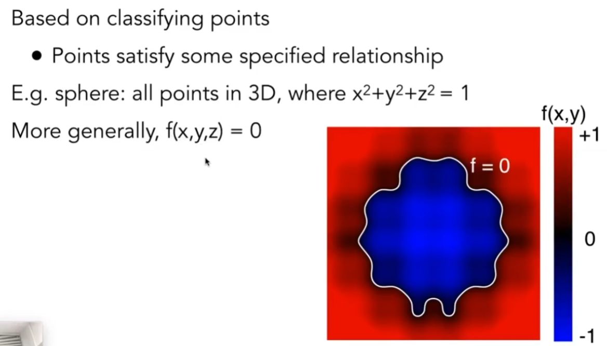

- CSG（Constructive Solid Geometry），通过一系列基本几何的基本运算来定义新的几何物体，如一个球体和一个圆柱体的交集、并集、补集等操作

	

- 距离函数（Distance Functions），不描述几何体的表面，而是描述空间中任何一个点到几何物体表面的最小距离；如果一个点在物体内部，距离函数是负，在物体外部为正；对于两个几何体，对它们的距离函数进行融合（如相加），就可以得到最终融合的几何体表面；并且当距离函数等于0，就可以找到物体的表面

	

- 水平集（Level Set Methods），通过一张表格等式来表示复杂形体的距离函数，寻找时只需要找到等于0的这条线即可描述物体的表面；当在三维中时，可以固定第三个参数，可以找到满足某属性的一个表面；

	

- 分形（Fractals），一个几何体中存在和自身部分相似的地方，可能是缩放大小不同；类似于递归，可以通过语言描述

隐函数中找到满足条件的解是比较困难的，但判断一个点是不是在该表面上是非常简单的（代入即可)，小于0表示在曲面内，大于0表示在曲面外；隐函数表示是很容易的，容易存储和查询，也适合对表面和光线求交，描述的曲度很好，没有采样错误。

### 显式几何体（Explicit Representation of Geometry）

 所有点都是直接给出的，或根据参数映射定义的表面；通过参数映射是指，给出一个二维空间u-v，在u-v中一片区域内的点通过一个到三维空间的映射就可以得到全部三维的点;

- 点云（Point Cloud），通过表示表面上的点来表示整个表面，通过一系列密集的点就可以得到表面，可以方便的表示多种几何体，一般也需要通过点云转化为多边形面
- 多边形面（Polygon Mesh），存储顶点和多边形（三角形或四边形），易于处理和模拟，但需要存储点之间的连接和关系，较复杂

对于一个显式表示的几何体，是较为容易找到所有符合条件的点的（只需要带入参数方程中u-v的全部值），但是不好判断这个点是在表面内侧还是外侧；

这两种表示方法各有优缺点，目前没有什么特别好的表示方法。

**Wavefront Object File（.obj）：** 通常用于图形研究，通过定义特定的顶点，法线，纹理坐标和连接关系等；如v表示顶点坐标，vt是纹理坐标，vn是法线；f中包含三段，每段中分别是顶点序号/纹理坐标序号/法线坐标，三段表示这三个点形成一个三角形

### 曲线（Curves)

使用一系列的控制点来定义曲线的一些性质，但是不要求曲线一定经过全部控制点，但需要经过起始点。如，曲线经过p0点切线沿p0p1方向，切线是p1p2，经过p3时切线是p2p3方向；

#### Bezier Curves - de Casteljau 算法

使用三个控制点的曲线叫做quadratic Bezier；假设从起始点到终点需要0-1的时间，之间任意时间使用t表示；连接这两个点，将这两个点中找到一个点分为t和1-t两份；完成后，在另外的两个控制点之间也找到分为t和1-t的分割点；将得到的两个分割点连接再找到t和1-t的分割点，这个分割点就是这条贝塞尔曲线在时间所在的位置；

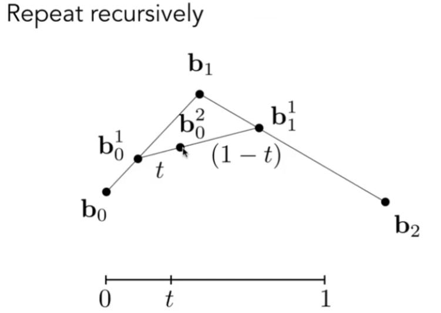

所以，如果需要得到完整的曲线，只需要枚举时间t即可画出贝塞尔曲线；

对于四个点或更多点，也是这样找，使用递归的方法找到所有分割点，直到分割点只能找到最后一个即可。

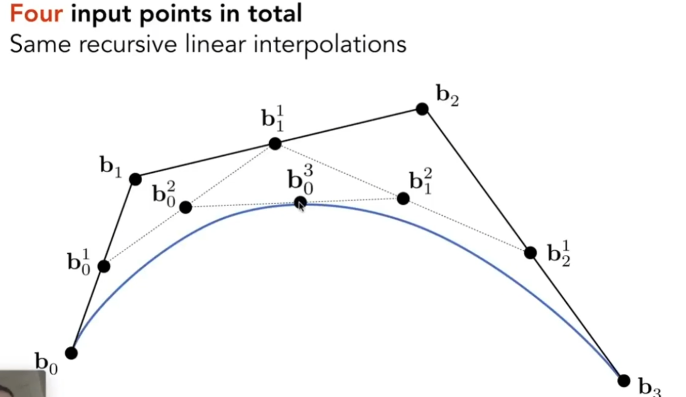

由此，可以得到贝塞尔曲线最终的代数表达式，对于贝塞尔曲线在任意时刻的位置，可以使用控制点、伯恩斯坦多项式的线性组合得到，伯恩斯坦多项式的第一项即为$C_n^i$

并且，根据以上推到，实际上贝塞尔曲线也可以在三维空间进行计算，只需要将控制点换为三维点即可。

#### 性质

- 贝塞尔曲线规定必须过起点和终点
- 对于有四个控制点的贝塞尔曲线，起始点位置贝塞尔曲线的切线一定是3(b1-b0)，结束点的切线一定是3(b3-b2)
- 对于一条贝塞尔曲线，如果需要做仿射变换，可以直接对控制点进行仿射变换后再画出即可，结果和直接对贝塞尔曲线做仿射变换一样
- 凸包性质（Convex hull）
	- 凸包是指可以包含全部给定点的最小凸多边形
	- 凸包性质是指，任意贝塞尔曲线上的任意点，都在给定控制点所形成的凸包之间

#### 逐段贝塞尔曲线（Piecewise Bezier Curves）

如果通过非常多的控制点来控制贝塞尔曲线是比较困难的，但是实际上，完全可以使用很少的控制点定义一段的贝塞尔曲线，再进行相连就可以较为简单的控制贝塞尔曲线；并且一般来说三次贝塞尔(cubic Bezier)是比较受欢迎的，比如用作字体、路径等;

所以，我们可以使用前两个点和后两个点形成的向量来控制曲线，可以看作控制杆；

**连续性：** 

- 如果给定了两段曲线，两个曲线在都经过一个点，这是最基本的C0连续
- 如果该点左右导数相同，就是C1连续

#### 样条曲线（Splines）

也是定义一些控制点，使得曲线连续，保证曲线经过这些点，从而形成一个可控的曲线；

**B-splines：** 对贝塞尔曲线进行扩展，不需要分端，而只是需要通过改变局部的点就可以得到较好的效果；较为复杂；

### 曲面（Surfaces）

#### 贝塞尔曲面

我们可以使用贝塞尔曲线得到贝塞尔曲面，实际的运用中，需要在两个方向上分别运用贝塞尔曲线；即先沿一个方向生成四条贝塞尔曲线，然后在t时刻，取所有曲线上的对应点作为新的贝塞尔曲线的控制点，再生成一条贝塞尔曲线，这条曲线的方向和前面曲线的方向程90°；这样，只要走完t，就可以得到所有新的贝塞尔曲线形成的曲面；

实际上，时间t需要被二维扩展，因为对应前四条贝塞尔曲线需要使用u时间控制，而生成曲面时需要时间v控制；

#### 网格操作（几何处理）

- 网格细分（subdivision），通过细分更多的三角形可以得到更光滑的表面，更多的细节
- 网格简化（simplification），通过减少三角形来节省存储，损失细节
- 网格正规化（regularization），使得三角形变得类似正三角形，而不会特别的畸形 

##### 细分（Subdivison）

细分的主要思想就是引入更多的三角形，并且让这些三角形的位置发生一定的变化，使得模型表面更加光滑一些；

**Loop Subdivision：** 通过连接三角形三条边的中点，使得一个三角形变成四个三角形；根据权重调整新生成的顶点的位置达成细分，而新老顶点的更新是不同的；

- 对于新的顶点，找到两个共用一条边的细分三角形，共用边的中点是需要调整的点，这个点的位置是其边上两端顶点的权重和不在边上的顶点权重共同决定的

	

- 对于旧的顶点，需要找到老顶点和其他三角形相邻老顶点是同一个顶点的点；此时，需要根据自己顶点的度和位置、相邻顶点的平均位置、以及根据度计算规定的常数来计算得到；

	

**Catmull-Clark Subdivision：** 对于有些网格不是三角形表示，就需要这个细分方法；需要定义两个概念，非四边形面是指边数不等于4的面，奇异点是指度不是4的点；

- 对于每个面中增加一个点，对于每个边取中点，并且将这些点相连；这样操作后，奇异点数量会增加；所以，如果在一个非四边形面中增加一个点，就会增加一个奇异点，但是这个非四边形面就会消失；即在经过一次细分后，非四边形面就不会再存在了，奇异点数量也不再增加；

	

- 更新节点的位置

	- 如果是面中间增加的新点，根据面的四个顶点进行更新
	- 如果是边上新增的点，根据该边相邻两个面上的新点以及边两端的点更新
	- 如果是四边形原本的点，需要根据相邻4个面的面上新增点、边上新增点以及自身的位置来更新

##### 简化（Simplification）

使用更多的三角形是可以增加细节的，但对于计算的消耗也非常的大；实际上，使用精细还是相对粗糙的模型是和远近以及计算设备和目标有关的，使用精简的模型可以节约性能但不损失太多观感；

**边坍缩（Collapsing an Edge）：** 简单理解就是将一条边连接的两个顶点聚集成一个点，使得边数和顶点减少，但关键是应该坍缩哪些边才能保证较小的模型轮廓损失；

- 二次误差度量（Quadric Error Metrics），新的顶点应该是到原本连接的面的平方和是最小的

	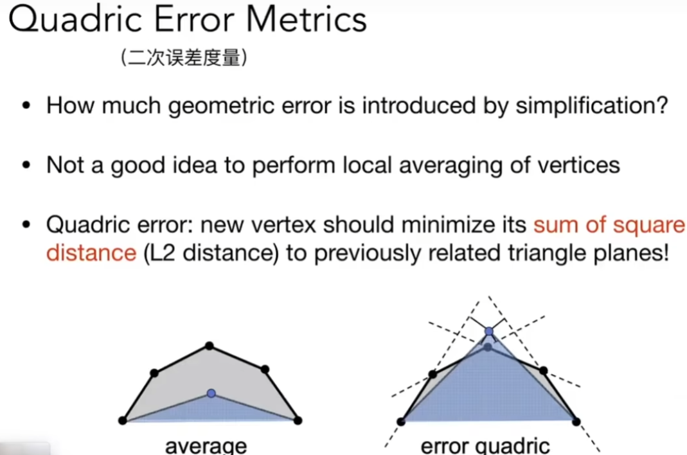

- 坍缩边，需要使得一条边所坍缩形成的顶点，其新顶点的位置对原本模型的影响最小；也就是，从二次度量误差最小的边开始选择并进行坍缩；但是一条边的坍缩会导致其他边的二次度量误差发生变化，所以需要优先队列来维护受影响的边的二次度量误差；

	

	实际上这张算法不能保证全局上的最优解，这是一个贪心算法，但效果已经足够好

## 光线追踪（Ray Tracing）

### 阴影（Shadows）

着色计算因为不会计算外部光线的遮挡、折射等问题，所以是无法解决是否有阴影对于的问题；

#### Shadow Mapping

这是一个图像空间算法，在生成阴影时不需要知道场景的几何信息，而且必须处理走样问题；

**硬阴影（Hard shadow）：** 这个方法的思想是，一个不在阴影中的点可以被摄像机看到，说明这个点也可以被光源看到；否则如果摄像机可以看到但光源看不到就说明它处于阴影中；这样的阴影称作硬阴影；

1. 从光源开始渲染；从光源看向场景，记录光源看到的所有点的深度图；

2. 从摄像机出发，看向场景中的点；把场景中的点投影回光源观察时的成像平面上，找到光源视角记录的对应该点的像素的深度信息，并且计算该点到光源视角的深度信息；

	

3. 如果光源视角对应像素的深度和实际摄像机拍摄该点到光源的距离相等，则说明该点可以同时被摄像机和光源看到；如果深度不一致则说明这个点不被光源看到，处于阴影之中；

阴影存在很多问题，如硬阴影（只适合点光源），阴影质量是取决于shadow map的分辨率的，但是在实际计算中，一个像素可能覆盖多个空间中的点，而且存在浮点数计算精度问题很难进行判断相等；而且从光源进行计算时，也需要考虑存储的深度图的分辨率需要多高的问题，如果shadow map分辨率过低可能导致阴影的锯齿，而过高会导致高性能开销；并且硬阴影的边界是非常锐利的；

**软阴影（Soft Shadows）：** 实际上，由光学原理可知，自然的点光源是存在一定大小的，不会造成物体边界导致的阴影过于锐利，这是因为靠近阴影边界的区域是存在半影区域的，这些区域的光线较弱但不会是完全无光的；这张现象可以通过日蚀现象理解；如果点光源没有大小就不会有软阴影；

### 光线追踪（Ray Tracing）

 因为光栅化并不适合去表述全局的效果，所以出现了软阴影；并且有一些特殊情况，如高光反射（Glossy reflection）导致的二重反射到摄像机，或者由于漫反射多次到达摄像机，导致的间接光照，这些问题是需要解决的。

并且，光栅化是非常快的，但是质量是相对低的；而光线追踪是一种非常准确和高质量的方法，但是非常的慢；所以，光栅化是用来做实时渲染的，而光线追踪往往对于离线渲染较为合适。

#### 基础光线追踪算法

**光线（Light Ray）：** 光线有以下假设

- 光线是按照直线传播的（即使实际上不对）
- 光线之间是不会发生碰撞的（实际上也不对）
- 光线是从光源出发到人眼的（由于光路是可逆的，所以可以理解为人眼发出光线照射到物体上）

所以，实际上光线追踪是将光从摄像机处投射出去，从而产生一副图像；

##### 光线投射（Ray Casting）

- 从每一个像素出发，从摄像机投掷一条光线，到场景中的一个物体发生相交
- 把这个发生相交的点和光源进行连线，计算该物体上的点是否在阴影中
	- 如果该交点对光源可见，则形成一条有效的光路，对于摄像机可见
	- 而如果对光源不可见，则认为该点在阴影中

**产生眼部光线（Eye Rays）:** 投射光线时，只需要找到光线和物体的最近交点，这样就避免了深度测试流程；

**像素着色（shading Pixels）：** 计算交点是否对光源可见，从而根据光源可见性来计算这个像素的着色信息；

但是这张光线追踪仍然只考虑了光线只折射一次的情况，所以需要新的模型；

##### Recursive （Whitted-Style） Ray Tracing

这种算法可以计算光线的无限次弹射和反射，如在上图玻璃表面的反射和内部的折射；

这种算法和上述光线追踪不同的是，Whitted-Style会对每次光线发生折射或反射的交点计算是否可以对光源可见，如果可见，则把这些交点计算出来的着色值都最终加到像素的着色值上；而且，对于每次折射和反射都应该考虑能量衰减；

对于这些光线，从摄像机射出的光线称为primary ray，反射和折射后的光线称为secondary ray，而用于判断是否对光源可见的光线都称为shadow ray；

#### 光线和物体表面的交点（Ray-Surface Intersection）

光线被定义为从起点出发的一个方向向量；任意光线都可以使用起点和t倍的方向向量表述；

球被定义为球面上的点到球心的距离都等于半径；而球和光线的交点必定同时满足光线和球的表示，所以可以联立并解出对于的信息；

根据隐式定义几何体，交点一定在几何体上；根据光线的定义，交点也一定在光线上；所以，联立几何体表面和光线表示可以解出正实数解即可，这种方法可以推广到全部几何体；

如果对于一个显式表面，如对光线和三角形求交点，则需要其他的方法；对三角形求交点有很多的应用，如渲染时是否可见、阴影和光照的情况，以及做几何测试，如一个点是否在物体内（一个点和一个封闭曲线，如果一个点发出的射线和曲线的交点个数是奇数个则该点一定在曲线内，否则在曲线外）

**光线和三角形的交点：** 简单的思路是对全部三角形来判断是否和光线有交点，但性能开销太大；首先应该做光线和屏幕求交点；

平面定义为一个垂直于一个法线并且过特定点；并且通过联立和光线的表示，解出正数实数解即可；

通过解出和平面的交点后，再判断是否在三角形内即可；

**Moller Trumbore 算法：** 这种算法可以让求光线和平面的交点以及判断是否在三角形内，思想是使用三角形的重心坐标来表示平面内的任意点；这样的话只需要解出重心坐标系数就可以直接判断是否在三角形所在平面以及是在三角形内部（即三个重心坐标的参数都非负即在三角形内）

#### 加速计算光线和表面的交点

 传统的光线交点计算需要遍历全部像素和物体和物体和反射次数，计算量巨大，所以需要进行一些优化；

**包围盒（Bounding Volumes）：** 对于一个复杂的几何体，可以使用一个简单的几何体将其完全包围起来，如球体、立方体；如果光线无法触碰包围盒，就一定无法触碰物体表面；

对于包围盒生成的面，是使用三个对面实现的，即长方体的6个面在其所在平面的延展来定义；因为最常使用的包围盒是轴对齐包围盒AABB（Axis-Aligned Bounding Box）

##### 求光线和AABB的交点

对于任何一个AABB，如果光线和其相交，那么可以求出光线进入和离开一对面的时间节点；并且，除非光线入射时垂直于一对面，其他情况下光线必定要穿过两对面；此时，只要记录进入和离开这两对面的交集，即可得到光线进入和离开包围盒的时间段；

并且，在三维中，只有光线进入了三个对面才能说明光线进入了包围盒，而只要光线离开了一个对面就说明光线离开了包围盒；所以，需要对光线进入三组对面的时间求最大值，而对光线离开所有对面的时间的最小值，从而得到进入和离开包围盒的时间；如果进入的时间小于离开的时间，就说明光线在包围盒中有停留；

然而光线是一个射线，所以需要需要检查离开时间，如果离开时间小于0则表示盒子在光线后；如果离开时间小于进入时间，则说明光线是在盒子之中，光线一定和盒子相交；

所以，当且仅当进入时间小于离开时间，且离开时间大于0，才表示光线和盒子有交点；

为什么包围盒需要轴对齐？这是因为如果轴对齐可以快速简化运算，如果轴对齐完全可以简化成在轴上的时间计算，而不需要计算任意平面的情况；

##### 均匀空间划分（Uniform Spatial Partitions （Grid））

1. 预处理，首先构建加速网格

	构建包围盒，需要将整个场景中的内容放入一个包围盒中；对这个包围盒进行划分成方格，并且标记所有和物体表面相交的格子；

	

2. 光线与场景的交

	计算光线走过的格子，如果光线走过的格子中也存在于物体的表面，就将这个格子记录下来；
	对于一条光线，其下一个到达的格子一定是光沿传播方向的三个格子之一；

	

这种方法下，无论格子过于稀疏还是过于密集都会导致性能下降；实际情况下，经过实验，找到了一个常数使得均匀划分格子较合适。

##### 空间划分（Spatial Partition）

- 八叉树，在三维上把一个节点定义为一个空间，通过正立方体的3个方向上切分划分成8块子空间
- K-D树，每次按照轴向交替二分划分空间（如先x后y再x），使得空间被均匀划分
- BSP树，也是一种二分划分空间的方法，每次自选一个方向将空间划分开；和K-D树的区别是，这种划分方法不沿着轴向，可能导致计算量较大，以及如果高维还需要使用超平面划分

这里主要关注K-D树，简单来说，K-D树就是交替使用轴向划分空间，示意图如下；

对于任何一个空间，都可以按照其空间维度上的轴依次划分；所有具体的信息都存在叶子节点上，不存在中间节点上；

所以，光线进行判断时，需要先判断光线和根节点所在空间的交点，如果存在，则进入K-D树内部格子的交点判断；每次判断交点都对该节点对应的格子进行，如果和该格子存在交点，则继续判断该节点的子节点所在格子是否和光线有交点；如果有交点就继续向对应节点的格子进行判断，直到找到叶子节点。

但是，实际上如何判断K-D树划分的空间和需要判定的三角形或物体表面有交集是比较困难的，以及有些物体可能横跨多个空间导致被多次存储也会导致存储浪费；

##### 物体划分和BVH （Object Partition & Bounding Volume Hierarchy）

BVH不划分空间，而是通过划分物体来形成树形结构；对于一个物体，将其的三角形每次分为两堆，对划分的部分再次划分直到划分空间中满足一定数量即可；这样的话，解决了包围盒交集导致的物体重复存储，而且划分方式也较简单（只需要按照坐标进行划分）；

这样划分的Bounding Box是可能相交的，只要包围盒中三角形尽量不重叠就可以了；

- 找到一个包围盒，将包围盒中的物体分为两部分
- 重新计算包围盒的子包围盒，即将包围盒中的物体划分给更小的包围盒
- 当一个包围盒划分到的物体数量较少时，可以停止继续划分
- 所有的物体都存储在叶子节点中

划分方法有很多，比如可以想K-D树一样进行轴向交替划分；也可以每次垂直包围盒最长轴向进行划分；或者取包围盒中最中间的物体位置来进行划分，可以保证这个树尽可能平衡；如果场景物体发生变化，就需要计算新的BVH；

当计算光线和BVH的交集时，和K-D数差不多，只需要一直对有交集的包围盒求交，并且找到叶子节点，计算光线和其中物体的交点即可。

#### 辐射度量学（Basic radiometry）

辐射度量学是根据实际物理量来定义光、材质等来计算正确的图像，而不是如之前模型做了各种各样的简化和假设。

它精确定义了光在空间中的属性，如Radiant flux，intensity，irradiance和radiance

**Radiant Energy ：** 定义为辐射带来的能量，使用焦耳来进行测定；

**Flux （Power）：** 定义为能量在单位时间内的转化量，相当于功率，使用瓦特或者流明来测定；也可以定义为单位时间内通过光子的数量；

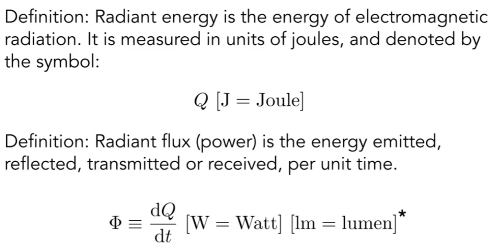

**Radiant Intensity：** 定义为每个单位立体角上的Power

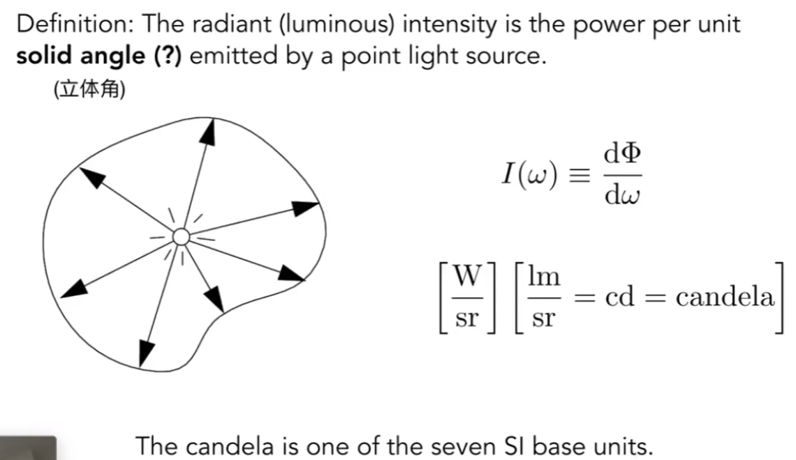

**立体角 Solid Angles：** 角度可以使用弧长除以半径定义，一个圆对应的弧度是2Π；在三维空间中，对应一个球体出发形成的一个锥体，立体角定义为锥体面积除以半径平方，而一个球的立体角是4Π立体角，单位是steradians

****

**单位立体角：** 根据球坐标中θ和Φ的定义，可以计算球坐标上的单位面积以及立体角定义，可以得到单位立体角的定义；

并且如果对两个方位角求二重积分，就可以得到这个球体的单位立体角，即4Π

**均匀点光源 Isotropic Point Source：** 一个均匀光源在任意方向上的亮度，等于其Intensity在球面上的积分除以整个球面的立体角

**Irradiance:** 定义为单位面积的能量，单位面积需要和入射方向垂直，单位是勒克斯；

这里和兰伯特定律这里的光线接收有关系，即Irradiance必须是投影到与光线垂直的面积上接收的能量；

同样地，理解点光源散发能量时，Irradiance是随着球壳渐远而逐渐减小的；

**Radience：** 定义为在单位立体角和单位投影面积上的一个表面散发的能量，即表面散发的能量对方位立体角和对投影面积的的混合偏导；

**Incident Radiance：** 单位方位角中到达表面的单位面积中的能量；可以考虑为从某个方位角进入并照射到表面的能量

**Exiting Radiance：** 离开表面的单位投影面积上光的强度（单位立体角上的能量）

##### Irradiance vs Radiance

Irradiance是在dA面积中收到的全部能量，Radiance是dA面积接收到的从dw方向的能量，dA理解为单位面积

E是Irradiance，L是Radiance，即Radiance是Irradiance在某个夹角方向上的一部分，积分起来就是说dA收到的全部能量就是各个方向能量的积分

#### BRDF双向反射分布函数（Bidirection Reflection Distribution Fuction）

反射需要使用一个函数式来解释，光线照射到物体表面，发生反射的方向、强度等信息；

**单点反射（Reflection）：** 这是一个光线照射到物体表面，被一部分吸收、一部分反射出去的过程；对应一个表面的单位面积上，一个方向的radiance照射到该面积，然后又被反射成irrdiance从该面积上射出；

对于一个单位面积上出射的radiance除以单位面积上总的irradiance，这就是BRDF，这就表示了如何将一个单位面积上收到的能量发射到各个方向上；

BRDF实际上描述和光线和物体之间的作用关系，定义了光线在物体表面上是如何反射和漫射的；实际上考虑了从某一个方向的入射光线，在某一个方向上反射出去会是什么样的强度；

所以，只需要考虑每个方向的入射光和BRDF对出射方向的贡献，最终相加到摄像机方向的最终效果；

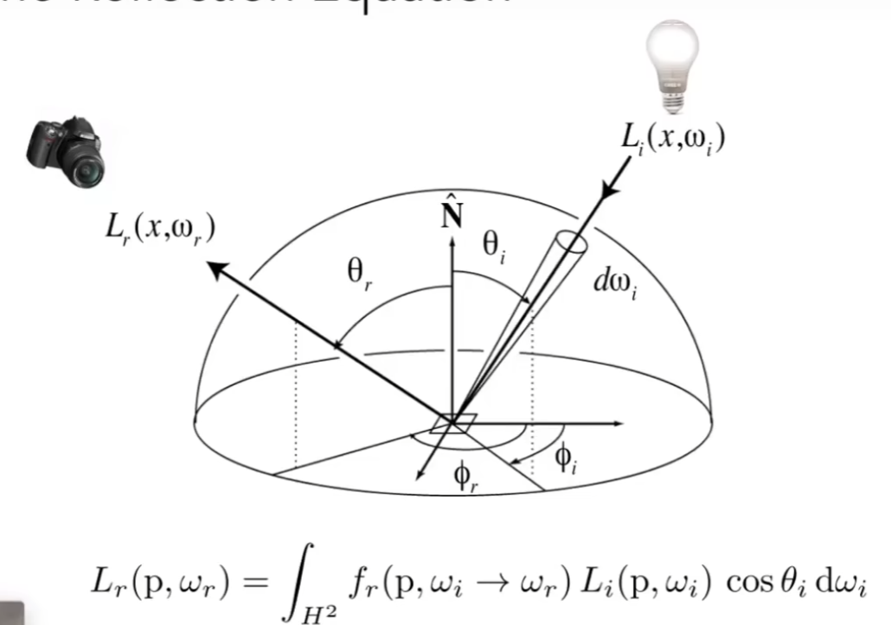

这样，只需要定义任何一种物体的BRDF，就可以计算光线的反射；

但是这样的困难在于，需要考虑的入射radiance是不止来自光源的，还可能来自其他物体出射的irradiance，也就是需要考虑光线弹射；

##### 渲染方程（The Rendering Equation）

这里还需要考虑，一个物体反射的光可能来自于自身发射出的光；所以，最终得到的渲染方程是包括物体自身发光和反射其他光线的结果；这里假设所有光线是朝外侧的，并且认为是半球的模型来接收外部射入光线，把cosθ写成法线和入射方向的点乘；这是一个递归的定义

这样，通过这个方程就可以描述全部的光线传播；

从反射方程来看，对于点光源的简单反射只需要考虑自身发出的光、入射光、BRDF和夹角预先即可得到反射光线；

而对于面光源，考虑成点光源的几何，只需要把面光源对于反射表面经过立体角和BRDF反射得到的光线的情况；

对于出现了反射光线的其他物体，并且正好可以找到物体表面的对应点，实际上也就是把其他物体当作是光源来处理；但是某个点的radiance就依赖于其他物体反射的radiance了，这样就形成了递归的处理；

对于这些未知的递归定义的项，可以使用一种更简单的方式写出来这个表示；

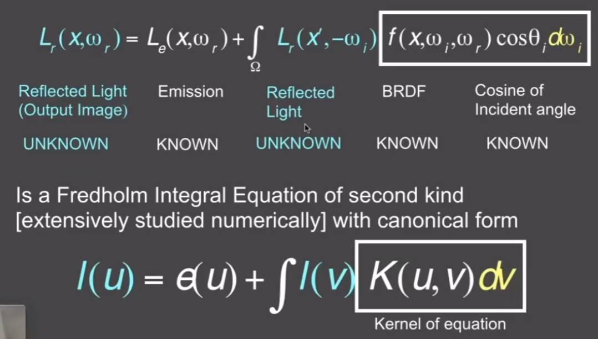

并且通过算子定义，将这个渲染方程写成：对于所有物体辐射出来所有所有能量，等于所有光源的能量加上辐射出来的能量后被反射的能量；

这种方法最终是对解出渲染方程的L有帮助的，这是因为I-K矩阵是可以使用展开式来得到一个结果的；

而这个式子最终展开表示了多次反射光照的结果，拆出的项是光线不同弹射次数的影响；如可以得到直接光照、间接光照、环境光照等效果；

对于光栅化，一般只能告诉我们前两项，而根据这个式子可以更容易获得多次光照的结果；

### 蒙特卡洛路径追踪

##### 蒙特卡洛积分

这是一种使用随机采样的方式来对积分进行数值计算的方法。对于积分域内不断采样，对多次采样的结果进行平均，认为该函数在积分域内的平均值乘以积分域长度可以代表f（x）在积分域内的定积分结果；

所以，当p（x）是概率密度函数，且假设该函数的值一直是1/（b-a）；对于一个区域内的蒙特卡洛积分就应该是每个采样点除以1/（b-a）之后再求和，所以可以得到基本的蒙特卡洛估计算子

而更通用的情况下，如果在一个积分域内使用一个概率密度函数采样，得到这个样本的采样值和概率密度，就可以计算积分域内的定积分；

采样越多，结果越准确，即N越大；并且对于蒙特卡洛积分在x上的积分，就必须在x上进行采样

##### 路径追踪（Path Tracing）

对于Whitted-Style的光线追踪，存在很多的问题：

- 只能计算Mirror反射的材质，而无法计算Glossy反射

	

- 其阻止了漫反射光线的二次转播，使得正确的全局光照无法产生，也无法计算漫反射对其他物体的影响

	

实际上正确的方法是使用辐射度量学得到的渲染方程才能得到正确的光线反射；但是解渲染方程也有一些困难的地方：

- 这是一个半球上的积分，需要考虑多方向的光照
- 需要接受多方向的光照需要考虑其他方向物体上的光照，这是一个递归的定义

这个方程也完全可以使用蒙特卡洛积分来计算其值，解出解出来自各个方向的光经过BRDF反射到观察的方向即可；

计算方法为，在不同方向上进行采样，得到的采样值和概率密度，从而可以得到积分结果；比如可以假设在半球的立体角上来进行均匀采样，然后根据BRDF和采样方向的入射光来计算出这个渲染方程；

这样，就可以得到直接光照情况下的渲染方程；计算时需要计算该物体通过反向追踪，找到光源后得到该光源对物体表面点的光照贡献；

但是，现在还应该考虑光线被一个物体照射到其他物体上；实际上，在另一个点上计算来自其他物体的反射光是不考虑是否是间接光照的，只需要考虑这种照射就是一种直接光照即可，所以可以进行递归的计算；

计算时，只需要增加一些步骤：如果在追踪物体表面点对于的方向时，找到了一个物体，那么就去获得该物体对追踪方向的直接光照的光线贡献；

但是这样计算仍然有一些问题：

- 这样计算可能导致计算光线弹射后的数目太高，因为每次弹射都是向各个不同方向的；

这样的话，只有使得N=1的时候才可以解决这个问题，不会产生指数爆炸；

当N=1时，这就是路径追踪和光线的产生（见后文）

- 这是一个递归的算法，需要显式的定义返回的时刻，否则这个算法就永远不会停下；直接定义弹射次数会导致光线能量直接消失，这不符合物理学定义；

	这时候，可以引出轮盘赌的算法来解决这个问题；

##### Ray Generation

当N=1时，得到的结果噪声是非常大的；但是我们可以通过产生多条路径来计算反射，最后平均这些反射结果，也是一种可以简化渲染的方法。

我们只需要在像素内，均匀取N个不同的位置，对于每个选取的位置发出一条光线到场景中，然后计算这条光线在场景中的反射和着色；这样，就只产生了N条这样的光线，取平均计算即可；

##### 轮盘赌（Russian Roulette）

设定一些概率，以一定的概率p向某个方向发出一些光线，得到的结果除以p；并且以1-p的概率不发出光线；这样计算后，最终期望得到的结果是和前面方式相同的；

##### 在光源上采样

这种算法是完全正确的，但这和SPP（samples per pixel）有关，即个像素打出多少光线有关；因为随机的在一个方向上进行采样，就导致了很多光线打出后浪费了，没有找到正确的反射；

实际上，蒙特卡洛积分并不要求均匀采样，但是蒙特卡洛的要求是在反射表面的立体角上的采样和积分；现在想要在光源上进行采样和积分；

这时候，可以使用积分换元法，将dw改成dA，实际上光源上的单位面积也可以理解为投影在球的立体角对应的表面积，需要考虑光源正对着色点的投影面积，以及光源和表面交点的距离（考虑为一个新的球体的半径，投影面积是球体表面积的一部分）；

这时候，积分换到了光源位置的采样和积分，此时概率密度函数就是单位面积分之一；

这样做的结果就是，之前的算法是不知道光源方向的采样（可能找不到），现在的采样直接计算出了光源的贡献；这样做，光线传播就变成了光源的直接贡献+其他物体反射光线的贡献；而光源的贡献就不存在轮盘赌了，可以直接计算出来；

这时候还有一点问题，就是需要计算直接光照是否被其他物体挡住了，这种计算只需要根据AABB包围盒计算即可；

#### 其他问题

如果存在点光源，将较为困难使用这种方法，建议做成较小的面积光源；

对应路径追踪算法是比较困难的，其牵扯到的内容较多，不容易实现；但这是较为现代化图形学的计算；

因为光线追踪几乎可以得到真实的照片效果，非常前沿，所以还是需要进行学习；

**Ray tracing：**

- 之前的Ray tracing就是Whitted-style Ray tracing
- 现在指的是多种光线传播方法的集合
	- （Unidirectional & Bidirectional）path tracing
	- Photon mapping
	- Metropolis light transport
	- VCM / UPBP

其他需要考虑的问题包括：

- 如何进行各个方向的采样
- 蒙特卡洛积分最适合的概率密度是什么（重要性采样）
- 随机数也有一些特殊的性质（low discrepancy sequence）
- 如何结合不同的采样方法来得到更好的结果（multiple imp.sampling)
- 像素得到的radiance如何平均计算（pixel reconstruction filter）
- radiance不代表颜色，如何把radiance转换为颜色（gamma correction，curves，color space）

## 材质与外观（Materials and Appearance）

外观是光线和材质共同作用的结果，研究其作用方式是非常主要的。

实际上，材质就是定义了光线的反射情况，材质就是BRDF；

### 漫反射/兰伯特材质

认为在一个点上，空间中任何方向进入的光都是均一的，并且反射到各个方向的光也是均一的；

这个式子的意思是，对半球上所有入射光进行积分，结合BRDF，就可以得到任何一个方向上漫反射的radiance；而在漫反射中BRDF和入射光Li都是常数，所以可以拿出积分式，从而可以计算半球上的cosθ积分；

根据漫反射中任一入射光等于任一反射光，可以得到BRDF为1/Π；从而可以定义反射率albedo在0-1之间，即σ，可以定义不同颜色的BRDF。

### Ideal reflective/ refractive material（BSDF）

对于这种材质，光线一部分被镜面反射，一部分进入物体内部；而进入物体内部的光线可能被吸收一部分，也可能完整再次从物体内初涉；

### Perfect Specular Reflection

完全的镜面反射，入射光和出射光的和即为法线方向；通过自上往下的观察，可以看到其在平面为基础的半球的方位角上的关系，入射方向和出射方向是相反的；

镜面反射也是可以使用BRDF描述的。

### Specular Refraction

光在进入新介质后，可能会被折射到不同的方向和颜色；根据斯内尔定律，折射会发生在入射光线和入射表面法线的平面内，这种折射是和材质的折射率有关的；

计算时，根据入射角、入射介质、折射介质的折射率就可以计算折射角度的余弦；这里要注意，这个余弦可能存在根号内小于0的无意义情况，这种情况代表折射不会发生，具体解法只需要计算不等式即可；

所以，如果入射介质的折射率大于折射介质的折射率，就可能出现没有折射的情况，这就是全反射现象；人在水下就会遇到相应的情况；

对于折射现象来说，这时候应该使用BTDF来定义，因为这里不再是反射，但可以和BRDF统称为BSDF；

### Fresnel Reflection/Term

对于不同的入射方向，其反射的能量都是不同的，这种反射的差异可以使用菲涅尔项来描述；而实际情况下还会出现光在振动方向上的极化；

根据计算菲涅尔项，可以得到极化方向上的反射率，根据平均反射率可以得到最终的折射率；这种计算需要根据入射和反射的介质、入射角度等都有关系；

但这种算法也有简化版本，可以使用Schlick近似来做，通过曲线拟合来计算；

### 微表面模型（Micofacet Material：Motivation）

微表面的假设是，当观察较远时，是看不到物体表面粗糙的细节的，而是观察到一个近乎光滑的表面。微表面认为，从远处看到的是材质，而近处看到的是几何。

如果表面较为平滑，法线分布较为类似，这样宏观上表面的法线近似于整体表面的法线，这样就会形成一个Glossy材质；而如果法线分布较为杂乱，这样就会形成diffuse的材质；

微表面的BRDF，首先考虑菲涅尔项的能量分布，再考虑法线的分布（认为微表面上只有法线方向和反射方向相同的地方才能反射到正确的方向，所以需要计算），以及几何项（这是用来修正自身表面上，可能存在的部分微表面遮挡了其他微表面的情况，如光线几乎和表面平行入射的情况）；

这种模型在PBR中经常使用；而微表面模型也有很多不同的模型类型。

### Isotropic / Anisotropic Materials （BRDFs）

材质可以被区分为两种：各向同性材质和各向异性材质；各向同性材质是指物体表面的微表面分布几乎没有太多方向关系，法线分布很均匀；而各向异性材质的法线和方向非常相关。

这种性质体现在BRDF上，就是说如果一个BRDF不满足在方位角上旋转后，得到一个差不多的BRDF，就认为这个材质是各向同性的，否则就是各项异性的；

### BRDF的性质

- BRDF是非负的，因为其描述的是能量的性质
- BRDF是线性的
- BRDF是可逆的，如果完全调换BRDF的入射和反射方向，得到的结果是相同的
- BRDF是能量守恒的，能量只会被吸收或者完全反射
- 存在各向同性和各向异性的分类
	- 如果是各向同性材质，四维的材质就会降到三维
	- 而对于所有的BRDF都存在可逆性，BRDF的考虑方位角时，不需要考虑正负，只考虑相对大小

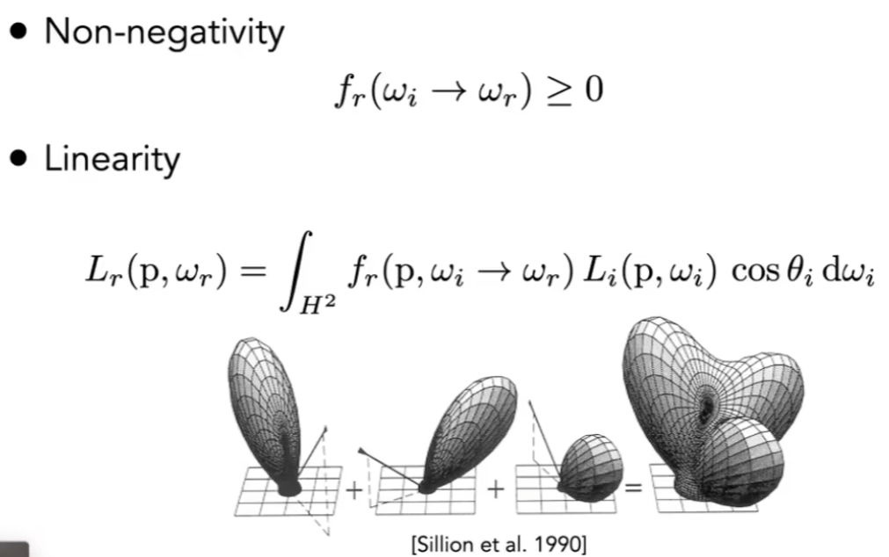

### 测量BRDF

BRDF只有完全测量出的结果才是真正准确的BRDF；根据测量，实际上的BRDF的测量结果和schlick等方法近似的结果相差较远；

测量BRDF时，只盯着一个着色点，使用一个光源在特定方位来照射物体，并且使用相机在各个方向来记录反射结果即可；

这种方法简单考虑，就是将摄像机和光源的位置枚举，得到最终的反射结果；通过各向同性的材质就可以降低一些测量，以及考虑方位角的特性也可以简化测量，或者通过采样猜测BRDF；

## 渲染进阶话题

### 高级光线传播

**无偏和有偏光线传播**：对于蒙特卡洛的估计，如果一个方法得到的期望和采样的样本数量无关，这样的估计就是无偏的，否则就是有偏的；而有偏方法中，如果样本趋向于无穷多，期望收敛到真实期望，则称为是一致的；

#### 双向路径追踪（BDPT）

传统路径追踪的起点是相机，而双向路径追踪的生成是两条路径；一条半路径的从相机出发，另一条从光源出发；最后，连接两条半路径就可以得到一条完整的路径。

有时候单向的路径追踪中，不容易找到一条能量高的、从光源出发的路径，这时双向路径追踪就会效果更好。

#### Metropolis光线传播（MLT）

使用马尔可夫链蒙特卡洛（MCMC）；马尔科夫链可以根据样本生成相近的下一个样本，这种方法可以生成一个和某一条光路类似的另一条光路；

这种方法特别适合做光路特别复杂的光线传播，因为只要找到一条困难的路径，就可以生成很多相似的路径。

但是，简单的蒙特卡洛算法是可以逐渐得到一个收敛无噪点的图像；但是MLT是几乎无法计算何时收敛的，这样会导致图像比较脏，也无法当作动画算法；

#### 光子映射（Photon Mapping）

这是一种有偏估计，非常适合渲染caustics（这是由于光线的聚焦得到的一些光线明暗对比），也适合做复杂光路（如Specular-Diffuse-Specular）的计算；

光子映射的一个简单方法如下：

1. 从光源出发辐射出很多的光子，直到光子打到Diffuse的物体上就将光子停在原地，并且记录全部光子在Diffuse物体上
2. 从摄像机发出一些光线，记为sub-path，当这些光线打到Diffuse物体上时，也停住即可
3. 做本地的密度估计。即对于任何的一个着色点，可以取其最近的N个光子，找到这些光子占据的面积，然后使用光子数量除以面积，这样可以得到该着色点周围光子的密度

光子映射如果光子较少，就会导致场景噪声太大，如果光子较多可能会导致画面有些模糊；

这是因为这种方法使用的是使用光子除以对于面积来计算密度估计，但是实际上只有数量达到足够多的光子才会产生完全正确的估计，所以说这种方法是一致性的，但是估计是有偏的。

所以，有偏的等于模糊的，一致的等于在无穷取样的情况下不存在模糊。

#### VCM （Vertex Connection and Merging）

这种方法结合了BDPT和光子映射；这种算法在较远距离使用BDPT连接半光路，而在临近点使用光子映射。

####Instant Radiosity

实时辐射度算法的思想是，已经被照亮的面，都被当作新的光源来计算。

单设这种计算方法，可能导致，如果两个点距离非常近就会导致在不该发光的地方亮度极高；而且无法计算Glossy的物体。

### 高级表面模型

#### 散射介质（Participating Media）

如果光线在传入介质中，可能会在介质中发生一些变化；如，传播中被吸收，或者被散射到不同的方向，或者收到其他的光线；

描述这种散射，就会使用相位函数来定义（Phase Function）；

这种方法，可以使得光在同一种介质中，发生类似于在物体表面的弹射和散射；这种适合不能再使用渲染方程，因为这不再基于物体表面的反射；

这种方法适合渲染烟雾等介质，其实模拟的是光线穿透一些材质的现象。

#### 头发表面（Hair Appearance）

这时，需要考虑光线和曲线的作用；

##### Kajiya-Kay Model

这是一种简单的模型，把头发考虑成圆柱体；一些照射光线主要被反射到圆锥内，另一部分散射到其他各个方向上；这种模型不够真实。

##### Marshner Model

这种模型仍然是考虑为圆柱，但使得光线除了反射到各个方向外，一些光线也穿透了头发；在头发内的光，有些穿出了头发，有些在头发的另一个表面内部再次反射后穿出；

这时，将头发考虑为一个类似透明的圆柱，经过透明圆柱时，根据圆柱内的颜色进行光的吸收，结合多种方向的反射，就可以得到最终的结果；

####毛发表面（Fur Appearance）

如果使用头发表面模型来渲染动物毛发，得到的结果不尽人意；这是因为动物的毛发和人类的头发结构是相同的，但动物毛发中的髓质远多于人类头发，这就代表光线进入后就更容易被散射；

##### Double Cylinder Model

双层圆柱模型是用来模拟毛发中的髓质对光的散射和反射，其他的内容和头发的模型是类似的；

#### 颗粒材质 Granular Material

颗粒材质，类似于谷粒，沙砾等形成的材质；这种情况下，需要考虑一些对模型的简化，如使用较小的颗粒来组成一个模型；

#### 表面模型（Surface Material）

Translucent Material指的是某些光进入物体后，可能会从其他位置经过散射和折射，从其他位置再次射出，如玉石等物体。

##### 次表面散射（Subsurface Scattering）

这种方法可以理解为对BRDF的延申，这种方法可以叫做BSSRDF，但是光线不止作用于物体表面的一个点，而是可以经过一些过程后作用于其他点；

##### Dipole Approximation

假设物体内部有一个光源，以及和一个虚拟光源在物体外部对物体表面进行照射，这样的结果类似于次表面散射的结果；

使用次表面散射可以得到非常好的人物皮肤表面；

#### 布料（Cloth）

布料是一些缠绕的纤维构成的；首先，使用Fiber构成一股线，之后再使用线来得到一张布料；

布料的表面和编制的方法、方向和材质都有关系；如果简单计算，可以人物这些线就是在一个平面内形成了布料，根据BRDF来直接计算；

##### Render as Participating Media

但是有些布料的表面（如天鹅绒），实际上其布料不是一个平面，所以就需要将布料认为空间中的体积，而对体积中定义织物对应的性质来计算光的作用，类似于云雾的渲染；其实就是把布料当作一种反射介质来渲染；

 

##### Cloth：Render as Actual Fibers

如果需要更精细的渲染，可以假设纤维是人体头发，来进行定义和渲染，这种得到的结果是非常真实的，但是计算量是非常大的。

#### 细节材质（Detailed Appearance）

有时渲染得到的结果是过于完美的，没有划痕、没有沟壑，这样就会导致模型渲染过于光滑、完美，不够真实；

这里可以考虑在微表面模型中，关于法线的分布，这种定义如果使用正态分布可能过于平滑，但是实际上可能存在非常多的扰动，至少统计数据符合规律；

如果考虑一个像素覆盖的一些微表面，而不是一个微表面，根据一部分微表面来计算法线的分布，这就可以得到一些粗糙的材质；

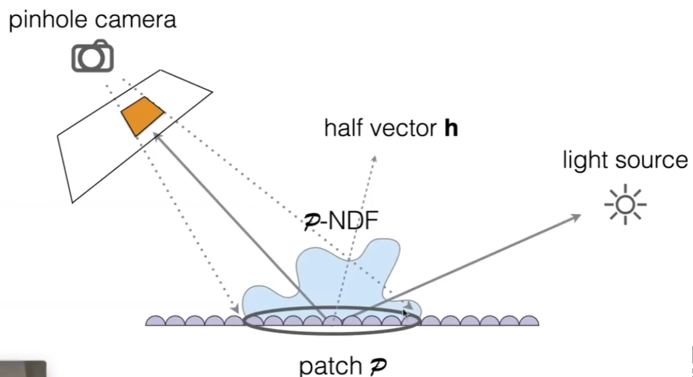

当材质的细节足够小，使得接近光的波长时，就不能再假设光是沿直线传播的了，这时候就需要考虑光的波动性特性；如果需要考虑这种级别的细节，就需要使用波动光学相关的内容；这样，可以得到波动光学作得到的BRDF

#### 程序化生成的材质（Procedural Appearance）

类似于定义一个函数，来定义一些材质的特性，使得我们不需要存储材质，而是可以通过在使用时使用材质生成一些材质的性质；实际的使用是三维空间内的噪声的函数，可以得到一些材质的结果；

## Cameras, Lenses and Light Fields

对于成像设备来说，需要利用小孔成像原理，接受特定方向的光从而生成一张图像；针孔相机得到的图像是没有深度的，图像是完全没有景深的。

### 视场（Field of View）

对于一个固定的传感器，当镜头和传感器的距离（焦距）缩小时，视场会增大；

 在定义视场时，一般以35mm的胶片（传感器大小）为基准来定义一个标准的焦距规定，这是一种等效的定义方法；

同样地，传感器的越小，那么视场也会越小；并且对于渲染时，传感器和胶片可能存在定义上的不同；

### Exposure（曝光）

曝光其实是时间乘以irradiance，记录的值是总共时间下的接收到的总的irradiance（可以理解为能量）；同时，曝光也会被光圈的大小影响；

**光圈（Aperture）：**光圈是一种模仿人类瞳孔的设计，这是一种控制光亮进入的装置；光圈的大小是可以改变的，是由f-stop数值控制的。写法为F/N或FN；N一般认为是光圈直径的大小；

**快门速度（shutter speed）：** 调整传感器上像素感应光线的时间；快门在初始状态下是关闭的，摄像时会突然开启后再关闭，使得光线进入；
物体在告诉运动情况下，如果在快门打开时间内发生了运动，这样物体在运动中反射的光就会造成运动模糊。

**感光度（ISO gain）：** 这是一种后期处理，通过在硬件信号或者成像数字上乘以一些数值来调整最终的感光数值；ISO是线性的增益。

调整光圈大小时，可以使用F-stop来定义光圈的大小；数字越大则光圈越小；

调整快门速度时，单位是秒，一般最多是半秒；

ISO也可以调整，调整的结果就是根据ISO对于的参数来调整感光结果；对于任何一张图，ISO越大，图像的内容会被放大，但是噪声也会被放大。

对于一张照片，如果光圈大小越小，就需要使用更高的快门速度去补偿亮度；但大光圈会影响景深，而快门速度影响运动模糊，所以需要权衡；

所以，在高速摄影下，需要非常高的快门速度，而且需要不变的曝光度，那么就可以使用大光圈；而延时摄影就需要更长的曝光时间；

### 薄透镜近似（Thin Lens Approximation）

对于一个薄透镜，由以下性质；平行光会被聚焦，而点光会被平行折射；并且，现在的相机使用透镜组，可以使得透镜做到近似改变焦距的效果。

焦距的到数等于相距到数加物距倒数；

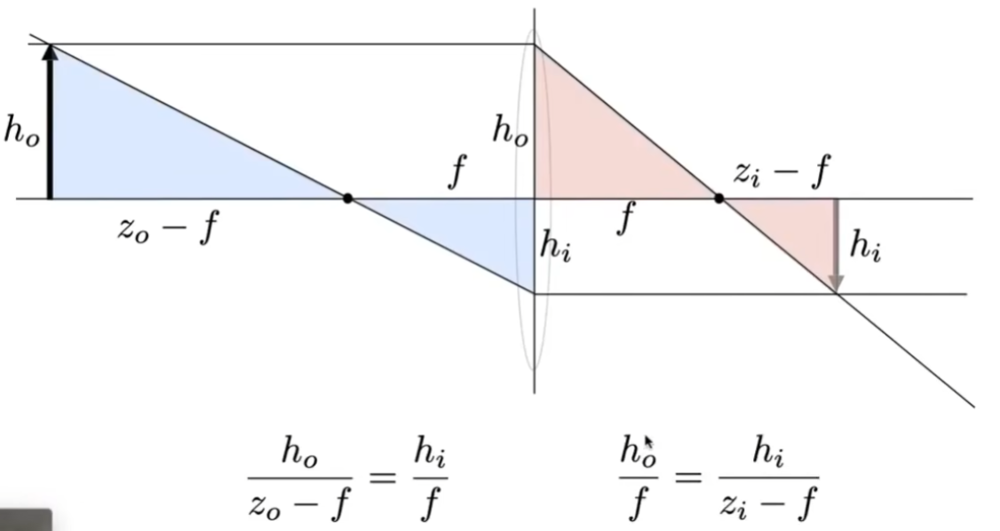

### 失焦模糊（Defocus Blur）

对于场景中的一个点，如果其穿过透镜后，到达的焦点处不在成像平面上，而是继续向前才能到达传感器，这样在到达传感器时就会形成一个圆，这种情况就是Circle of Confusion；

根据图中可见，根据相似三角形定理，就可以得到C的大小；所以，可以看到如果光圈越大C也越大，得到的图像就越模糊；

### F-Number (F-stop)

实际上的定义是焦距除以光圈直径；

### Ray Tracing Ideal Thin Lenses 

对于之前的光线追踪，实际上小孔成像的方法，是没有景深的，但是也可以通过计算摄影的一些想法来实现这样的效果；

通过定义一个成像平面和透镜的参数，然后将平面和透镜放置到场景中的一个位置；在成像平面上的一个点连接到透镜上的一个的点，这样就可以计算穿过透镜后光线的方向，然后计算光线的折射即可。

实际的思路就是在路径追踪时，增加一个透镜折射的部分；

### 景深（Depth of Field）

景深是指，在场景中有一段深度的部分，在成像平面范围内形成的CoC是足够小的，形成的图像是锐利的；实际上就是只有景深形成的地方是不模糊，而其他位置的成像是距离成像平面较远，所以就模糊；

### Light Field / Lumigraph

我们可以使用全光函数来描述人可以看到的一切东西；实际上，这个函数表示为人在球面中，对任意方向，在任意时间上，看到的由两个球坐标得到的信息场；

如果继续扩展，对这个函数增加一些参数，如人在空间中任意位置，以及结合时间，就可以描述人在任何时间，任何位置，任何角度看到的任何信息。

**光线**（**Ray**）

光线的定义可以有两种，一种是按照之前的起点方法定义，另一种是按照光线上的两个点来定义；

描述一个物体，可以把物体表面向各个方向发出的光线记录在其包围盒上，使得观察时可以找到包围盒上对应的结果。

**光场：** 光场就是记录在任何位置往任何方向去的光的强度；实际上，可以使用u-v表示光场的位置（类似贴图），使用θ-φ表示光线的方向

我们认为光场是一个黑盒，只要在盒子表面，就可以直到经过该黑盒表面的任意方向的光能得到的最终结果；

#### 光场组织

如果同时定义两个平行的平面，此时有光线同时穿过了两个平面，那么就会产生两个平面上的交点，通过这两个交点就可以定义一条光线；所以，如果参数化光场，就可以使用两个平面，一共四个参数来表示光场中的光线；

假设物体在s-t平面右侧，如果从左往右看，就会看到物体全貌在不同方向的表现，而从右往看则会看到照射到一个像素位置上不同方向的光具体的样子；

#### 光场照相机

光场照相机的原理是使得像素变成透镜，让透镜分解光后记录；这种照相机支持后期的聚焦，利用光场之后，可以先记录光场，后期再进行聚焦等操作的调整；

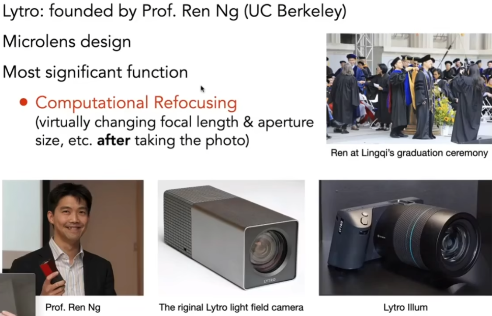

对于一个光场照相机的内部，其使用一组透镜使得光被分解到各个方向后再记录下来；如果需要查看，则取得某个方向上的特定的光线即可实现虚拟情况下照相机的运动；

光场照相机的缺点是，在胶片上使用了一片像素记录原本照相机一个像素的信息，使得最终成片像素较低，而且成本极高；

## Color and Perception

对于一个光谱，可以看到光的能量在不同波长上的分布，图形学主要关注可见光谱；

**谱功率密度（Spectral Power Distribution）：** 折射用来定义光在不同波长上分布的密度是多少；

SPD有一种线性叠加的性质，即光是可叠加的；

### 颜色

颜色实际上是人的一种感知，而不是物理的定义；人对于物体的感知是依赖于最终光线到达的视网膜，而视网膜上的感光细胞中的视锥细胞是用来进行颜色感知的；

而视锥细胞还分为三种细胞，S细胞（高频光），M细胞（中频光），L细胞（低频光）;而不同的人所具有的这三种细胞的个体差异非常大，这就导致了颜色感知差异是非常大的，所以颜色只是人的感知；

所以感知的结果是，把感知波长的响应乘以光线的强度对全可见光波长上的积分；

这三个得到的三个数字被转换为电信号和脑内成像，就会使得人主观看到一种颜色；

### 同色异谱（Metamers）

同色异谱就是指，不同的光谱信号，可能经过计算后得到的数字是相同的，导致看到的颜色也是相同的，而这两种光实际上是不同的；

这样的话，就可以在显示器或其他应用上，使用可以显示的光谱来调和出不能显示的光谱所能成现的颜色；

#### Color Reproduction / Mathcing

混合颜色的方法一般是加色系统（Additive），使用三种原色来进行混合和计算，其中可以使用明暗度来调整颜色；

#### CIE RGB

RGB系统是用来定义做眼色的匹配的，其将三种基础单色固定的颜色来进行调和，来混合得到其他波长的颜色

在这个CIE RGB的频谱中，可以看到在其覆盖范围内，使用对应的三种基色的数值组合起来，就可以得到覆盖范围内的任意波长的光，从而产生不同颜色的光；

#### SRGB（Standard Color Spaces）

这是一种标准的RGB色彩空间，被广泛采用；

#### CIE XYZ

这是一种科研常用的色彩空间，这个颜色匹配系统是人为定义的色彩系统；通过这种计算得到的Y可以近似表示亮度；

#### Separating Luminance，Chromaticity

对可显式颜色的可视化，可以使用两维来进行表示；首先对颜色表示X，Y，Z进行归一化；而Y表示的是亮度，所以可以先进行固定，对x和y进行可视化；

对于色域来说，越靠近中间的颜色越混杂，越边界的颜色越纯净；

#### 色域（Gamut）

实际上，颜色空间是不能表示整个色域的，不同标准覆盖的整个颜色空间是存在区别的；

#### HSV（Hue-Saturation-Value）

这种颜色空间，可以通过色调、饱和度和亮度来定义颜色；

#### CIELAB Space

这种颜色空间是和感知相关的，这种颜色空间认为全部颜色的尽头是该颜色的互补色；

### CMYK

这是一种典型的检测系统，通过混合墨水来达到不同的颜色；而K颜色主要是因为黑色墨水便宜且使用量大；

