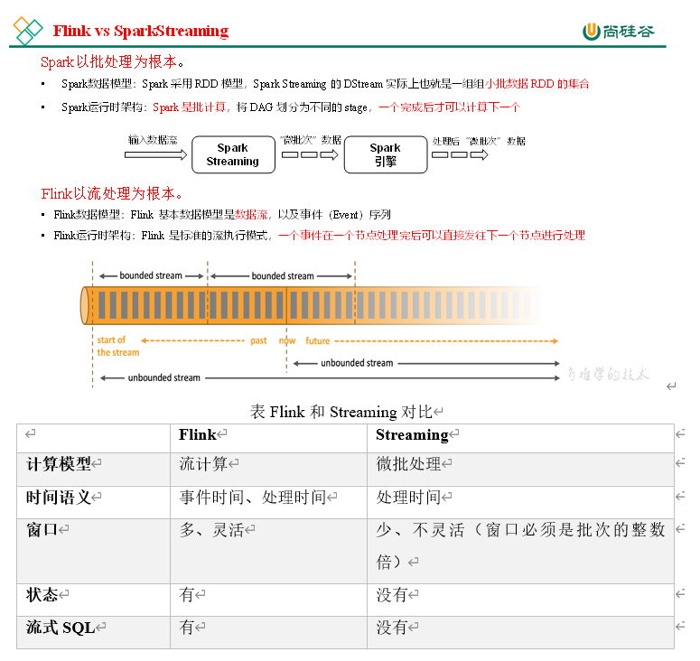
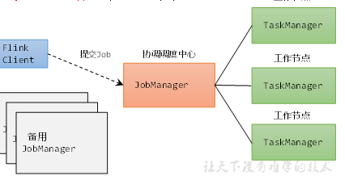
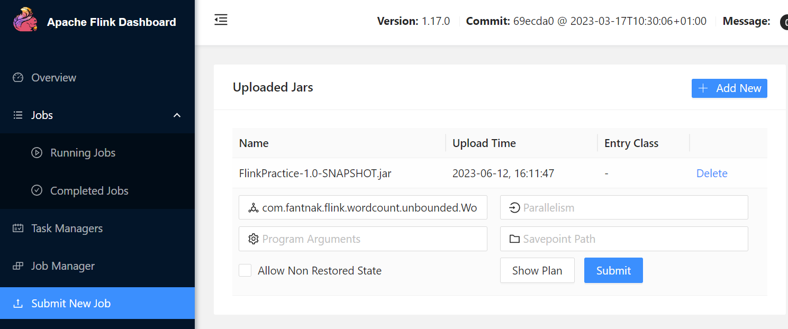
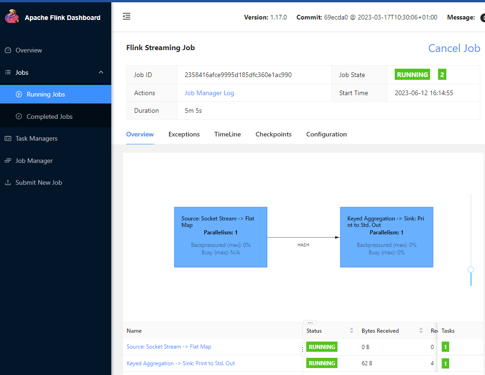
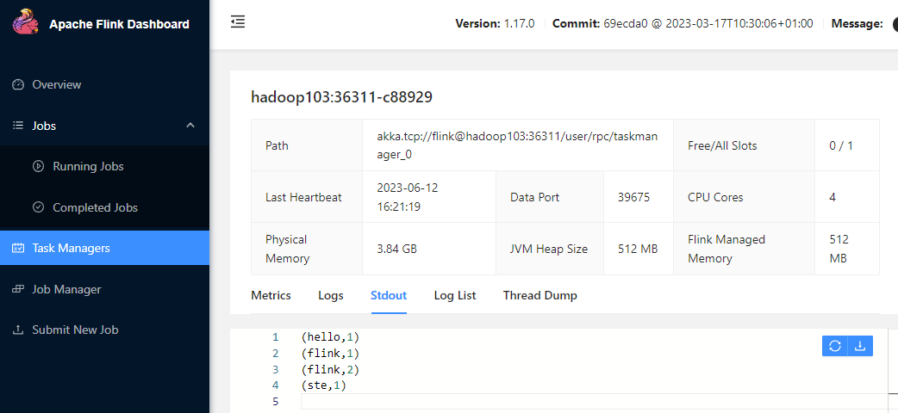
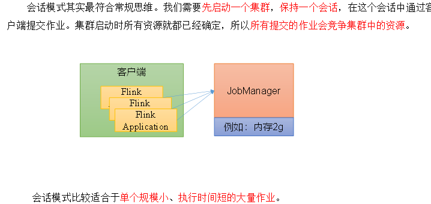
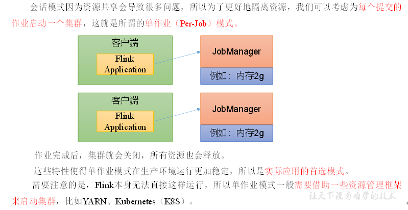

# Flink

## Flink简介

Flink是做数据流上的有状态计算（Stateful Computations over Data Stream），这是一个分布式处理框架，对无界和有界的数据进行有状态计算。

- 有界流
	- 有定义流的开始，但没有定义流的结束
	- 无休止产生数据
	- 需要持续处理数据而不是等待全部数据到达再处理
	- 如消息队列
- 有界流
	- 定义了流的开始和结束
	- 可以等到所有数据到达再计算
	- 有界流可以排序数据，而不需要有序的摄取数据
	- 有界流通常被称为**批处理**
	- 如文件
- 有状态处理
	- 把流处理需要的额外数据保存成一个状态，然后针对这条数据进行处理，并且更新状态的信息
	- 状态本身可以被保存在Flink内部，不借助其他系统 
	- 状态可以保存在内存和外部

Flink的特点是：低延迟、高吞吐、结果准确和良好的容错性

- 高吞吐和低延迟，每秒处理百万级事件，毫秒级响应
- 结果的准确性，Flink提供了事件事件(event-time)和处理时间(processing-time)语义。对应乱序事件流，仍然可以提供一致和准确的结果。
- 精准一次（exeactly-once）的状态一致性保证
- 和其他存储系统和连接很好，如Kafka、Hive、JDBC、HDFS、Redis等
- 高可用，本身存在保证，加上K8s、YARN和Mesos等继承，拥有极快的快速恢复和动态任务扩展的能力



Flink存在分层的API

- SQL 
- Table API （声明式领域专用语言）
- DataStream / DataSet API （对流计算和批处理指定处理）
- 有状态流处理（底层API，定义处理函数）

## Flink流式处理入门

使用wordcount案例入门Flink。

### DataSet写法

1. 创建Maven工程，导入依赖

	```xml
	<properties>
	        <flink.version>1.17.0</flink.version>
	</properties>
	
	    <dependencies>
	        <dependency>
	            <groupId>org.apache.flink</groupId>
	            <artifactId>flink-streaming-java</artifactId>
	            <version>${flink.version}</version>
	        </dependency>
	
	     <dependency>
	            <groupId>org.apache.flink</groupId>
	            <artifactId>flink-clients</artifactId>
	            <version>${flink.version}</version>
	     </dependency>
	</dependencies>
	
	```

2. 批处理：逐行读入文件数据，将每行拆分成多个单词，按照单词分组，统计每组的数据的个数

	```java
	public class WordCountBatchDemo {
	    public static void main(String[] args) throws Exception {
	        //1 创建执行环境
	        ExecutionEnvironment env = ExecutionEnvironment.getExecutionEnvironment();
	        //2 读取数据：来自文件
	        DataSource<String> line = env.readTextFile("D:\\1mproving\\Practice\\FlinkPractice\\src\\main\\resources\\words.txt");
	        //3 切分数据、转换（map阶段）
	        FlatMapOperator<String, Tuple2<String, Integer>> wordAndFreqOne = line.flatMap(new FlatMapFunction<String, Tuple2<String, Integer>>() {
	            @Override
	            public void flatMap(String s, Collector<Tuple2<String, Integer>> collector) throws Exception {
	                //3-1   根据空格切分单词
	                String[] words = s.split(" ");
	                //3-2   将单词放到二元组，变成（word，1）的形式
	                for (String word : words) {
	                    Tuple2<String, Integer> wordTuple2 = Tuple2.of(word, 1);
	                    //3-3   使用采集器Collector向下游发送数据
	                    collector.collect(wordTuple2);
	                }
	            }
	        });
	        //4 按照word进行分组
	        UnsortedGrouping<Tuple2<String, Integer>> wordGropFreq = wordAndFreqOne.groupBy(0);//按照第0个索引分组，得到（word,freq)
	//5 各个分组进行聚合（reduce阶段）
	        AggregateOperator<Tuple2<String, Integer>> sum = wordGropFreq.sum(1);//将分组后索引为1的列表求和
	//6 输出
	        sum.print();
	    }
	}
	```

输出

```
(go,1)
(am,1)
(flink,2)
(hello,2)
(out,1)
(I,2)
(where,1)
(words,1)
(nice,1)
```

这种代码的实现方式是基于DataSet API的，从Flink 1.12开始，官方推荐直接使用DataStream API，在提交任务时通过将执行模式设为BATCH来进行批处理：

```shell
$ bin/flink run -Dexecution.runtime-mode=BATCH BatchWordCount.jar
```

### DataStream写法

```java
public class WordCountStreamDemo {
    public static void main(String[] args) throws Exception {
        //1 创建执行环境
        StreamExecutionEnvironment env = StreamExecutionEnvironment.getExecutionEnvironment();
        //2 读取数据
        DataStreamSource<String> line = env.readTextFile("D:\\1mproving\\Practice\\FlinkPractice\\src\\main\\resources\\words.txt");
        //3 处理数据 切分 转换 分组 聚合
        SingleOutputStreamOperator<Tuple2<String, Integer>> wordAndFreqOne = line.flatMap(new FlatMapFunction<String, Tuple2<String, Integer>>() {
            @Override
            public void flatMap(String s, Collector<Tuple2<String, Integer>> collector) throws Exception {
                String[] words = s.split(" ");
                for (String word : words) {
                    Tuple2<String, Integer> tup = Tuple2.of(word, 1);
                    collector.collect(tup);
                }
            }
        });

        KeyedStream<Tuple2<String, Integer>, String> wordAndFreq = wordAndFreqOne.keyBy(new KeySelector<Tuple2<String, Integer>, String>() {
            @Override
            public String getKey(Tuple2<String, Integer> stringIntegerTuple2) throws Exception {
                //获取二元组中的word
                return stringIntegerTuple2.f0;
            }
        });

        SingleOutputStreamOperator<Tuple2<String, Integer>> sum = wordAndFreq.sum(1);
        //4 输出数据
        sum.print();
        //5 执行
        env.execute();
    }
}
```

输出中，可以发现流处理的结果是按照每个输入来的，每得到一行输入就会输出一次；从中可以看到，流处理是保存了状态的，使得下次数据输入的处理可以得到之前的状态结果。

输出前的编号指的是并行度。

```
13> (flink,1)
14> (words,1)
13> (flink,2)
12> (nice,1)
7> (out,1)
5> (hello,1)
3> (am,1)
3> (where,1)
11> (go,1)
5> (I,1)
5> (hello,2)
5> (I,2)
```

### 无界流处理

开启一个socket监听

```shell
nc -lk 7777
```

```java
public class WordCountStreamUnboundedDemo {
    public static void main(String[] args) throws Exception {
        StreamExecutionEnvironment env = StreamExecutionEnvironment.getExecutionEnvironment();

        //获取数据 从socket
        DataStreamSource<String> socket = env.socketTextStream("hadoop102", 7777);

        SingleOutputStreamOperator<Tuple2<String, Integer>> sum = socket.flatMap(
                        (String s, Collector<Tuple2<String, Integer>> collector) -> {
                            String[] words = s.split(" ");
                            for (String word : words) {
                                collector.collect(Tuple2.of(word, 1));
                            }
                        }
                ).returns(Types.TUPLE(Types.STRING, Types.INT)) //解决Lambda表达式的类型擦除问题，即重新指定二元组的类型
                .keyBy(
                        value -> value.f0
                ).sum(1);

        sum.print();
        env.execute();
    }
}
```

该程序运行后，会持续监听Socket，每次socket传入一行数据后，flink会根据之前的状态来进行计算，否则flink等待。这就是事件驱动型。

## Flink部署

### Flink集群的角色

- 客户端（Client）：代码由客户端获取并转换，之后提交给JobManager
- JobManager：管理Flink中的节点，对作业进行调度和管理；获取到要执行的作业任务后，进一步转换后，分发给TaskManager进行处理
- TaskManager：处理任务的节点，完成数据的操作



### 配置Flink

（1）进入conf路径，修改flink-conf.yaml文件，指定hadoop102节点服务器为JobManager 

```
# JobManager节点地址.
jobmanager.rpc.address: hadoop102
jobmanager.bind-host: 0.0.0.0
rest.address: hadoop102
rest.bind-address: 0.0.0.0

# TaskManager节点地址.需要配置为当前机器名
taskmanager.bind-host: 0.0.0.0
taskmanager.host: hadoop102
```

（2）修改workers文件，指定hadoop102、hadoop103和hadoop104为TaskManager

```
hadoop102
hadoop103
hadoop104
```

（3）修改masters文件

```
hadoop102:8081
```

修改hadoop103 和 hadoop104的taskmanager.host为自己的主机即可。

在flink-conf.yaml文件中还可以对集群中的JobManager和TaskManager组件进行优化配置，主要配置项如下：

- l jobmanager.memory.process.size：对JobManager进程可使用到的全部内存进行配置，包括JVM元空间和其他开销，默认为1600M，可以根据集群规模进行适当调整。

- l taskmanager.memory.process.size：对TaskManager进程可使用到的全部内存进行配置，包括JVM元空间和其他开销，默认为1728M，可以根据集群规模进行适当调整。

- l taskmanager.numberOfTaskSlots：对每个TaskManager能够分配的Slot数量进行配置，默认为1，可根据TaskManager所在的机器能够提供给Flink的CPU数量决定。所谓Slot就是TaskManager中具体运行一个任务所分配的计算资源。

- l parallelism.default：Flink任务执行的并行度，默认为1。优先级低于代码中进行的并行度配置和任务提交时使用参数指定的并行度数量。

回到hadoop102，即JobManager，执行bin目录中的`start-cluster.sh`

### 测试提交代码到集群运行

1. 使用flink推荐的build打包插件，每次打包前记得clean

	```xml
	<build>
	    <plugins>
	        <plugin>
	            <groupId>org.apache.maven.plugins</groupId>
	            <artifactId>maven-shade-plugin</artifactId>
	            <version>3.2.4</version>
	            <executions>
	                <execution>
	                    <phase>package</phase>
	                    <goals>
	                        <goal>shade</goal>
	                    </goals>
	                    <configuration>
	                        <artifactSet>
	                            <excludes>
	                                <exclude>com.google.code.findbugs:jsr305</exclude>
	                                <exclude>org.slf4j:*</exclude>
	                                <exclude>log4j:*</exclude>
	                            </excludes>
	                        </artifactSet>
	                        <filters>
	                            <filter>
	                                <!-- Do not copy the signatures in the META-INF folder.
	                                Otherwise, this might cause SecurityExceptions when using the JAR. -->
	                                <artifact>*:*</artifact>
	                                <excludes>
	                                    <exclude>META-INF/*.SF</exclude>
	                                    <exclude>META-INF/*.DSA</exclude>
	                                    <exclude>META-INF/*.RSA</exclude>
	                                </excludes>
	                            </filter>
	                        </filters>
	                        <transformers combine.children="append">
	                            <transformer
	                                    implementation="org.apache.maven.plugins.shade.resource.ServicesResourceTransformer">
	                            </transformer>
	                        </transformers>
	                    </configuration>
	                </execution>
	            </executions>
	        </plugin>
	    </plugins>
	</build>
	```

2. 打包后，通过hadoop102：8081（设置的访问门户）进行提交，设置访问的类,并且提交

	

	

3. 在TaskManager的运行节点上找到Stdout即可查看输出

	

4. 在Running Job中可以选择Cancel Job停止作业

如果需要通过命令行来提交任务：

1. 将包上传到集群机器上

2. 执行命令，指定运行、JobManager的地址、全类名、jar包的路径

	```shell
	$ bin/flink run -m hadoop102:8081 -c com.fantnak.flink.wordcount.unbounded.WordCountStreamUnboundedDemo /opt/packages/flink/FlinkPractice-1.0-SNAPSHOT.jar
	```

### 部署模式

Flink为各种场景提供了不同的部署模式，主要有以下三种：会话模式（Session Mode）、单作业模式（Per-Job Mode）、应用模式（Application Mode）。

它们的区别主要在于：集群的生命周期以及资源的分配方式；以及应用的main方法到底在哪里执行——客户端（Client）还是JobManager。

#### 会话模式



#### 单作业模式



#### 应用模式


#### Standalone运行模式

独立模式是指Flink独立运行，不依靠外部资源。

如果资源不足，或者出现故障，没有自动扩展或重分配资源的保证，必须手动处理。

所以独立模式一般只用在开发测试或作业非常少的场景下。

##### 会话模式部署

提前启动集群，并通过Web页面客户端提交任务（可以多个任务，但是集群资源固定）。也就是之前使用的方式。

##### 单作业部署

Flink的Standalone集群并不支持单作业模式部署。因为单作业模式需要借助一些资源管理平台。

##### 应用模式

应用模式下不会提前创建集群，所以不能调用start-cluster.sh脚本。

我们可以使用同样在bin目录下的standalone-job.sh来创建一个JobManager。

1. 进入到Flink的安装路径下，将应用程序的jar包放到lib/目录下

2. 执行以下命令，启动JobManager

	```shell
	$ bin/standalone-job.sh start --job-classname com.fantnak.flink.wordcount.unbounded.WordCountStreamUnboundedDemo
	```

3. 使用bin目录下的脚本，启动TaskManager，这样只能在执行命令的机器启动一个TaskManager

	```shell
	$ bin/taskmanager.sh start
	```

4. 此时程序已经运行，如果需要更大TaskManager则自行到对应机器启动

5. 如果需要停止集群，则需要命令

	```shell
	$ bin/taskmanager.sh stop
	$ bin/standalone-job.sh stop
	```

	job停止，集群也会关闭

### YARN运行模式

客户端把Flink应用提交给Yarn的ResourceManager，Yarn的ResourceManager会**向Yarn的NodeManager申请容器**。在这些容器上，Flink会部署JobManager和TaskManager的实例，从而启动集群。Flink会根据运行在JobManger上的作业所需要的Slot数量**动态分配TaskManager资源**。

1. 配置环境变量，增加一些环境变量，保证已经配置了Hadoop

	```shell
	export HADOOP_CONF_DIR=${HADOOP_HOME}/etc/hadoop
	export HADOOP_CLASSPATH=`hadoop classpath`
	```

2. 启动hadoop集群

#### 会话模式部署

