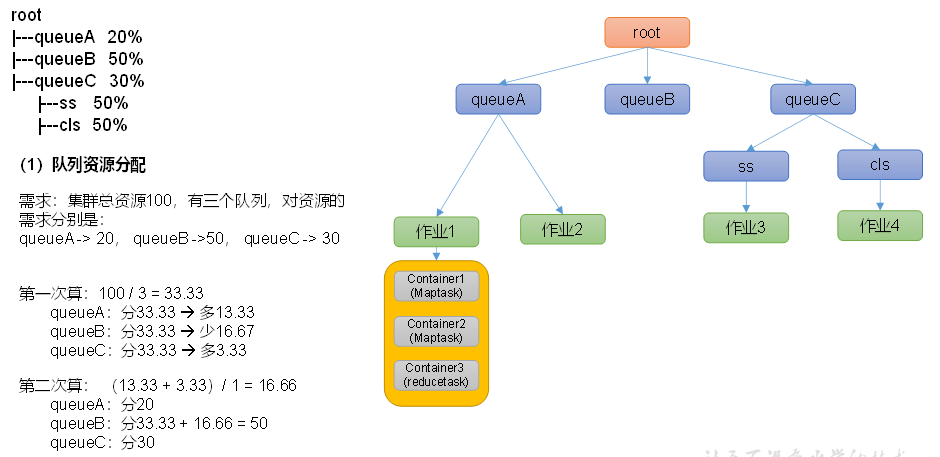

# Hadoop

## 大数据概论

**Big Data：** 指无法在一定时间内用常规软件捕捉管理数据的几何，需要更强的能力和处理模式来对海量、高增长和多样化的信息资产进行采集、管理和计算。

**大数据的特点**

- Volume（大量）
- Velocity（高速）
- Variety（多样）：结构化数据和非结构化数据的存储
- Value（低价值密度）：数据的提纯
- Veracity（质量）：数据的准确度和可信赖程度

## Hadoop概述

Hadoop是由Apache开发的分布式系统基础架构，主要解决海里数据的存储和分析计算；Hadoop一般指的是可能是Hadoop周围的生态圈框架，Zookeeper、Hive等。

**Hadoop的发行版本：**

- Apache：开源的基础版本
- Cloudera：集成了很多其他的大数据框架，以及友好的用户界面（CDH）
- Hrtonworks：HDP，被Cloudera收购后改为CDP

**Hadoop的优势：**

- 高可靠性：底层维护多个数据副本，健壮性好
- 高扩展性：在集群间分配数据任务，方便管理和扩展集群
- 高效性：在MapReduce思想下，Hadoop是并行工作的，加快处理速度
- 高容错性：将失败的任务重新分配

**Hadoop的组成** 

- 1.x版本
	- MapReduce（计算+资源调度）
	- HDFS（数据存储）
	- Common（辅助工具）
- 2.x版本
	- MapReduce（计算）
	- Yarn（资源调度）
	- HDFS
	- Common
- 3.x在组成上没有区别，但在实现细节上有区别

### HDFS概述

Hadoop Distribute File System，一种分布式文件系统。

使用NameNode记录集群上每个文件块的位置，使用DataNode在集群中的计算机上存储具体的数据位置。

使用Secondary NameNode辅助管理NameNode。

- NameNode：存储数据的元数据，如文件名、文件的目录结果、文件属性以及每个文件的块列表和块所在的DataNode
- DataNode：在本地文件系统存储文件块的数据，以及块数据的校验和
- Secondary NameNode：每隔一段时间对NameNode进行备份

### Yarn概述

- ResourceManager：整个集群资源（内存、CPU）的主控
- NodeManager：单个服务器资源的主控
- ApplicationMaster：单个任务的主控
- Container：容器，相当于是一台独立的服务器，封装了任务运行所需要的资源（如CPU、内存、硬盘和网络等）


### MapReduce概述

- Map阶段：并行的处理输入数据
- Reduce阶段：对Map的结果进行数据汇总

### 大数据生态体系


## Hadoop运行模式


- 本地模式（Local Mode）

	数据存储在linux服务器本地，使用linux文件系统管理

- 伪分布式（Pseudo-Distributed Mode）

	数据存在在linux本地，但在自己的HDFS中

- 完全分布式（Fully-Dstributed Mode）

	完全分布式，数据存储在多个HDFS及多个服务器间工作

### 完全分布式运行模式配置

- 文件分发脚本 xsync

	- scp（secure copy）安全拷贝：可以实现服务器之间的数据拷贝

		- 基本语法 `scp -r $pdir/$fname $user@$host:$pdir/$fname`，

		- 即`命令 递归操作 需要拷贝的文件路径/名称 目的端用户@主机：目的端路径/名称`，如果是拉取数据则需要讲后面两个部分互换。即使两个ip都不是本机，只需要输入正确的ip和密码即可。
		- 如果希望可以在全局中默认配置路径，可以把路径设置成环境变量

- 远程同步脚本rsync

	- rsync进行基本的备份和镜像，不拷贝相同内容以及支持符号连接，只做差异文件复制
		- 基本语法`rsync -av $pdir/$fname $user@$host:$pdir/$fname`
		- 即`命令 归档拷贝（-a）/显示复制过程（-v） 目的用户@主机：目的路径/名称`

### 集群配置

- NameNode和SecondaryNameNode以及ResourceManager一般不安装在同一台机器上，因为内存消耗较大


- Hadoop配置文件：Hadoop的配置文件分为两类，默认配置文件和自定义配置文件

	- 自定义配置文件：在Hadoop路径下的/etc/hadoop中的core-site.xml, hdfs-site.xml, yarn-site.xml, mapred-site.xml

- hadoop页面

	- Web端查看HDFS的NameNode

		浏览器中输入：http://hadoop102:9870，查看HDFS上存储的数据信息

	- Web端查看YARN的ResourceManager

		浏览器中输入：http://hadoop103:8088，查看YARN上运行的Job信息

	- 在配置历史服务器后，可以访问计算历史

- 使用`hadoop fs -put srcPath destPath`来上传文件，`hadoop fs -mkdir dirName`来创建文件夹
- 可以看到，hdfs的存储是在data文件夹中的，Replication代表了其备份在多少台机器上


- 集群恢复

	- 停止进程`sbin/stop-dfs.sh`
	- 删除每个集群上的data和logs
	- 进行格式化`hdfs namenode -format`，该命令会删除数据，小心使用

- **Hadoop常用端口号**

	| 端口名称                  | Hadoop2.x   | Hadoop3.x         |
	| ------------------------- | ----------- | ----------------- |
	| NameNode内部通信端口      | 8020 / 9000 | 8020 /  9000/9820 |
	| NameNode HTTP UI          | 50070       | 9870              |
	| MapReduce查看执行任务端口 | 8088        | 8088              |
	| 历史服务器通信端口        | 19888       | 19888             |

- **Hadoop常用配置文件**
	- core-site.xml
	- hdfs-site.xml
	- yarn-site.xml
	- mapred-site.xml
	- workers(3.x) - slaves(2.x) 

## HDFS

### HDFS概述

这是一种分布式的文件系统，用于管理在不同机器上的文件存储，通过目录树的方式来定义文件存储位置。

适合**一次写入，多次读出**的情况。一个文件的修改只能在**末尾追加**，而不能在中间修改。

#### HDFS的优缺点

**优点**

1. 高容错性：数字键保存多个副本，提高容错性，丢失一些副本后可以自动恢复
2. 适合大数据处理
	- 数据规模：处理GB到PB级别的数据
	- 文件规模：处理百万数量的文件数量
3. 可以构建在廉价机器上

**缺点**

1. 不适合低延时的数据访问，如毫秒级的存储数据是做不到的
2. 无法高效对大量小文件存储
	- 小文件也会占用很多NameNode和大量的内存来存储文件目录和块信息
	- 小文件的寻址时间会超过读取时间，违反了HDFS的设计原则
3. 不支持并发写入、文件随机修改
	- 写操作只允许单线程写
	- 仅支持数据追加，不支持数据修改

### HDFS组成架构


1. NameNode（nn）：master，管理HDFS的信息
	- 管理名称空间
	- 设置副本的测量
	- 管理数据块（Block）的映射信息
	- 处理客户端的读写请求
2. DataNode：slave，实际进行数据的操作
	- 存储实际的数据块
	- 进行数据块的读写操作
3. Secondary NameNode：不是NameNode的备份，当NameNode宕机时，不能立即替换NameNode进行工作
	- 辅助NameNode，分担工作量，如定期合并Fsimage和Edits并且推送给NameNode
	- 紧急情况下，可以辅助恢复NameNode
4. Client：客户端
	- 文件切分：文件上传HDFS时，Client将文件切分成Block大小再上传，通常Block就是128M或256M
	- 与NameNode交互，获取文件的位置信息
	- 与DataNode交互，读取或者写入数据
	- 提供一些命令来管理HDFS，比如HDFS进行增删改查

### HDFS文件块大小（面试）

HDFS的文件在物理上是分块存储的（Block），这个参数指该块中最多存储的数据大小，默认为128M。

1. 集群中存储的数据都是按照block的
2. 将**查找文件所在块**的时间定义为寻址时间，约为10ms
3. 寻址时间为传输时间的1%时的状态是最佳的，即传输时间是寻址时间的100倍，约为1s
4. 一般的机械硬盘中，设置为128M即可，因为传输速度大约为100M/s。如果设备较好，可以使用256M。

**块大小怎么设置合适？**

1. 如果HDFS的块太小，会增加寻址时间，寻找Block都要很长时间
2. 如果HDFS块太大，传输的开销太大

### HDFS相关Shell操作

```shell
hadoop/hdfs fs -command
```

这是基础的命令前缀。HDFS和Linux命令也非常相似。

- 上传

	- -moveFromLocal src dst 从本地剪切粘贴到HDFS
	- -copyFromLocal src dst 本地拷贝到HDFS
	- -put 和上一条完全相同
	- -appendToFile src dst 追加一个文件到已存在的文件末尾

- 下载

	- -copyToLocal src dst 把文件拷贝到本地
	- -get 等同于上一条，dst中可以对文件重命名

- 其他操作

	- -ls 查询根目录

	- -cat 查询文件内容

	- -chgrp / -chmod / chrown 更改文件权限

	- -mkdir 创建文件夹

	-  -cp src dst 在HDFS中的拷贝

	- -mv src dst 在HDFS中的剪切

	- -tail filename 查看一个文件末尾1kb的数据

	- -rm 删除文件

	- -rm -r 递归删除文件夹内全部内容

	- -du  统计文件夹的大小

		- -s 显示总信息
		- -h 分文件显示信息

	- -setrep num file设置HDFS中一个文件副本的数量

		副本在一台服务器只能有一个，如果副本期望数量高于集群机器数量，则会在集群扩展时增加副本数量

### HDFS的API操作

- 在Windows中配置Hadoop的相关API组件https://github.com/steveloughran/winutils/tree/master

- 在idea中新建Maven工程

	1. 引入Maven依赖

		```xml
		    <dependencies>
		        <dependency>
		            <groupId>org.apache.hadoop</groupId>
		            <artifactId>hadoop-client</artifactId>
		            <version>3.1.3</version>
		        </dependency>
		        <dependency>
		            <groupId>junit</groupId>
		            <artifactId>junit</artifactId>
		            <version>4.12</version>
		        </dependency>
		        <dependency>
		            <groupId>org.slf4j</groupId>
		            <artifactId>slf4j-log4j12</artifactId>
		            <version>1.7.30</version>
		        </dependency>
		    </dependencies>
		```

	2. 编写客户端相关代码

		首先创建工具类来创建客户端和连接，然后使用一些api进行操作即可。

		```java
		/**
		 * 1.获取一个客户端对象
		 * 2.执行相关操作命令
		 * 3.关闭资源
		 */
		public class HdfsClient {
		
		    private FileSystem fileSystem;
		
		    @Before
		    public void init() throws URISyntaxException, IOException, InterruptedException {
		        //        使用hdfs协议连接hadoop服务器
		        URI uri = new URI("hdfs://hadoop102:8020");
		//         创建配置
		        Configuration configuration = new Configuration();
		//      设置用户名
		        String user = "fantank";
		//        创建FileSystem对象，访问HDFS
		        fileSystem = FileSystem.get(uri, configuration, user);
		    }
		
		    @After
		    public void close() throws IOException {
		        fileSystem.close();
		    }
		
		
		    @Test
		    public void testMkdir() throws IOException {
		        fileSystem.mkdirs(new Path("/huaguoshan"));
		    }
		
		    @Test
		    public void testUpload() throws IOException {
		//        public void copyFromLocalFile(boolean delSrc, boolean overwrite,
		//                                Path src, Path dst)
		//        The src file is on the local disk. Add it to the filesystem at the given dst name. delSrc indicates if the source should be removed
		//        Params:
		//        delSrc – whether to delete the src
		//        overwrite – whether to overwrite an existing file
		//        src – path
		//        dst – path
		        fileSystem.copyFromLocalFile(false, true, new Path("C:\\Users\\ARK_LIU\\Pictures\\Cyberpunk 2077\\95803645_p0_master1200.jpg"),
		                new Path("hdfs://hadoop102/arknights.jpg"));
		    }
		}
		```

	3. 配置hadoop相关参数

		可以在resource目录中，配置和hadoop虚拟机中一样的配置文件，而api配置的优先级是高于hadoop内部配置的。

		```xml
		<!-- hdfs-site.xml-->
		<configuration>
		    <property>
		        <name>dfs.replication</name>
		        <value>1</value>
		    </property>
		</configuration>
		```

		如果需要设置参数，也可以通过创建客户端的Configuration来设置参数。

		```java
		        Configuration configuration = new Configuration();
		        configuration.set("dfs.replication", "2");
		```

		优先级是按照**就近原则**的，代码中的设置优先级最高，其次是应用配置文件，最后是服务器配置文件。

- 文件下载操作

	下载时，默认会携带一个crc文件作为校验数据，保证数据传输的正确性

	```java
	    @Test
	    public void testDownload() throws IOException {
	        fileSystem.copyToLocalFile(false, new Path("hdfs://hadoop102/arknights.jpg"), new Path("C:\\Users\\ARK_LIU\\Pictures\Ark"), false);
	    }
	```

	最后一个参数为是否使用校验，可以关闭。

- 文件删除操作

	```java
	    @Test
	    public void testDelete() throws IOException {
	        //删除文件和文件夹，递归删除
	        fileSystem.delete(new Path("/output2"), true);
	    }
	```

- 文件改名和移动

	```java
	    @Test
	    public void testMv() throws IOException {
	        //更名
	        fileSystem.rename(new Path("/ling.jpg"), new Path("/ark.jpg"));
	        //文件移动
	        fileSystem.rename(new Path("/ark.jpg"), new Path("/input/ling.jpg"));
	    }
	```

- 获取文件详情和块信息

	需要使用迭代器

	```java
	    public void testListFiles() throws IOException {
	        //递归获取文件列表
	        RemoteIterator<LocatedFileStatus> listFiles = fileSystem.listFiles(new Path("/"), true);
	        while (listFiles.hasNext()) {
	            LocatedFileStatus fileStatus = listFiles.next();
	            System.out.println("------------" + fileStatus.getPath());
	            System.out.println(fileStatus.getPermission());
	            System.out.println(fileStatus.getOwner());
	            System.out.println(fileStatus.getGroup());
	            System.out.println(fileStatus.getLen());
	            System.out.println(fileStatus.getModificationTime());
	        }
	    }
	```

	块信息会返回块的起始位置，以及其存储在的服务器的hostname

- 判断是文件还是文件夹

	```java
	    @Test
	    public void testIsFile() throws IOException {
	        FileStatus[] fileStatuses = fileSystem.listStatus(new Path("/"));
	
	        for(FileStatus fs : fileStatuses) {
	            String path = fs.getPath().getName();
	            path += fs.isFile() ? "\tis File" : "\tis Folder";
	            System.out.println(path);
	        }
	    }
	```

### HDFS读写流程（面试）

#### HDFS写数据流程

1. 客户端上传数据，先通过HDFS客户端创建一个分布式文件系统，向NameNode进行文件上传请求；

2. NameNode需要检测用户的权限（所有者和组）以及目录结构（是否存在）等。检查完毕后响应可以上传文件。

3. 客户端收到响应后。请求上传第一个Block（0 - 128M），需要NameNode返回存储数据的DataNode来传输数据

4. NameNode需要选择对应的节点并返回，此时需要考虑节点距离最近、节点是否可用以及负载均衡等因素，向客户端返回DataNode

5. 客户端接收DataNode。开始创建FSDataOutputStream流，向DataNode发送数据。客户端需要请求DataNode建立Block的传输通道。这个通道是由DataNode之间依次连接的。

6. 通道建立完毕后，DataNode应答消息由建立起来的传输通道中的DataNode节点链表依次返回给客户端。

7. 客户端接收应答后，开始向自己连接的DataNode传输文件，由DataNode依次向下一个DataNode传输数据，同时也向本地存储文件。

	传输数据以Packet（64k）为一个单位，其中由最小单位chunk（512byte数据）和chunksum（4byte校验位）组成。

	发送的同时，客户端在本地存储一个Ack队列，当DataNode依次返回某个Packet应答成功，才会在ack队列中删除。

	

##### 网络拓扑——节点距离计算

**节点距离：两个节点到达最近共同祖先的距离和**


- 任何机架内的机器到本机架的距离都是1
- 机架到集群，集群到互联网的距离也是1
- 同一机架内的机器不能直接相连，需要到达机架后再相连

##### 机架感知（副本存储的节点选择）

如果是三个副本：

1. 第一个副本存储在Client所在的DataNode上，如果Client不在DataNode就随机选一个存储第一份
2. 第二份要尽量和第一份不在同一个Rack的随机一个节点，如果只有一个Rack就只能在本地机架中随机选择一个
3. 第三份应该和第二份放在同一个机架中，但如果第二份和第一份在同一个Rack，第三份会尝试放到其他Rack中


####HDFS读数据流程

1. 客户端创建分布式文件系统对象，向NameNode请求文件的下载
2. NameNode进行权限校验和判断是否文件存在，如果存在则返回目标文件的元数据（哪些DataNode存放了该文件的哪些块）
3. 客户端根据就近原则选取一个DataNode开始读数据，但是DataNode可以根据负载均衡情况，可以将部分块的请求转发到其他DataNode来进行读取。但这种读取在一个文件的读取中，只能是串行完成的。
4. 客户端串行读取和合并数据，完成后关闭资源即可。


### NameNode和SecondaryNameNode

#### NN和2NN工作原理

NN的更新原理和Redis的AOF相似。

1. 内存中的元数据是通过fsimage数据直接加载的
2. 当客户端发送请求，使得NN的元数据发生改变时。首先将操作追加记录在edits_inprogress(工作中的日志)
3. 2NN会定期询问NN的日志是否记录满了，并且也会定时向NN询问是否执行CheckPoint操作
4. 开始执行CheckPoint后，工作中的Edits改为一个新的日志，原来的工作日志取消inprogress标识表示该日志已经写完了。之后的读写操作记录在新日志中。
5. 2NN拉取NN的fsimage和已经完成的edits日志，在内存中进行合并，并且生成新的fsimage.checkpoint作为合并后的新元数据。
6. 2NN将checkpoint文件发送到NN，使得该文件覆盖原来的fsimage成为新的元数据映像即可
7. NN加载新的元数据映像到内存


#### Fsimage和Edits

- Fsimage是HDFS文件系统元数据的永久性检查点，包含了HDFS文件系统的所有目录和文件inode序列化信息
- Edits是存放文件系统所有更新操作的路径，文件系统客户端执行的所有写操作都要先放入Edits中
- seen_txid(data/dfs/name//current/seen_txid)，保存了edits_的最后一个数字，即记录了edits到哪一个编号了
- 每次NamNode启动时，会合并Fsimage和edits的数据，保证数据是最新的


#### 查看文件的内容

1. Fsimage

	基本语法`hdfs oiv -p 文件类型 -i 镜像文件 -o 转换后的文件输出路径`

	```shell
	hdfs oiv -p XML -i  fsimage_0000000000000000387 -o /home/fs/fsimage.xml
	```

	```xml
	<inode><id>16391</id><type>DIRECTORY</type><name>staging</name><mtime>1685507901738</mtime><permission>fantank:supergroup:0755</permission><nsquota>-1</nsquota><dsquota>-1</dsquota></inode>
	......
	<directory><parent>16390</parent><child>16391</child></directory>
	```

	这里是按照树形结构来进行管理目录和文件的关系的，可以通过id和child以及parent标签找到上下的路径。

	这里不存储文件块在其他服务器的的信息，而是DataNode向NameNode发送相关的信息。

2. 查看Edits文件

	基本语法`hdfs oev -p 文件类型 -i 编辑日志 -o 转换后的文件输出路径`

	```xml
	  <RECORD>
	    <OPCODE>OP_RENAME_OLD</OPCODE>
	    <DATA>
	      <TXID>395</TXID>
	      <LENGTH>0</LENGTH>
	      <SRC>/home/fsimage.xml._COPYING_</SRC>
	      <DST>/home/fsimage.xml</DST>
	      <TIMESTAMP>1685601081562</TIMESTAMP>
	      <RPC_CLIENTID>85930b02-232f-471e-a6ad-b41bef16d1d6</RPC_CLIENTID>
	      <RPC_CALLID>8</RPC_CALLID>
	    </DATA>
	  </RECORD>
	```

	这个文件中通过RECORD标签记录文件系统修改信息。

	**每次开机时**，fsimage后跟随的序号代表此前的全部edits已经合并过了，就不需要再次合并了。

	**2NN和NN的差距**在于，NN中存储了最新的edit信息，而2NN只有每次checkpoint合并后的数据。

#### 检查点的时间设置

Checkpoint的默认时间是3600秒，在hdfs-default.xml中有设置；

而操作检查是每1分钟进行一次询问，如果到达100万次修改则进行一次Checkpoint。

一般NN会使用2个达成高可用，2NN用的不多。

### DataNode

#### DataNode工作机制

1. DataNode启动后，主动向NameNode进行信息汇报，信息包括块的数据、数据长度、校验和、时间戳等

2. NameNode收到汇报后，在本地注册DataNode的信息

3. DataNode每隔一段时间向NameNode汇报块的健康信息，默认6小时一次；并且DataNode需要每3秒向NameNode通过心跳机制发送存活信息。

	```xml
	<property>
		<name>dfs.blockreport.intervalMsec</name>
		<value>21600000</value>
		<description>Determines block reporting interval in milliseconds.</description>
	</property>
	```

	DN也会自查自己的块健康情况，也是6小时检查一次。

	```xml
	<property>
		<name>dfs.datanode.directoryscan.interval</name>
		<value>21600s</value>
		<description>Interval in seconds for Datanode to scan data directories and reconcile the difference between blocks in memory and on the disk.
		Support multiple time unit suffix(case insensitive), as described
		in dfs.heartbeat.interval.
		</description>
	</property>
	```

4. 如果一个DataNode超过10分钟+30秒没有心跳，则认为该节点不可用，从而不再与该机器进行交互


#### 数据完整性校验

HDFS使用的是循环冗余校验CRC32的，如使用copyToLocal时，可以选择是否开启校验。如果开启校验则会下载一个校验文件。

CRC32的基本原理和过程：

1. 选择生成多项式：CRC32使用一个32位的生成多项式。常用的CRC32生成多项式是`0x04C11DB7`。
2. 数据扩展：与其他CRC算法类似，CRC32也需要对要传输的数据进行扩展。扩展过程是将数据左移32位，并在右侧填充32个零。这样扩展后的数据位数与生成多项式相同。
3. CRC计算：使用生成多项式进行CRC计算。将扩展后的数据与生成多项式进行除法运算（模2除法），按位执行异或操作。除法运算的结果是一个32位的余数，即CRC校验码。
4. 附加校验码：将计算得到的32位CRC校验码附加到原始数据之后，形成最终的传输数据。这样，发送方就能将数据和校验码一起发送给接收方。
5. 接收方校验：接收方收到数据后，执行与发送方相同的CRC计算过程，使用相同的生成多项式。如果接收到的数据在校验过程中产生的余数为零，说明数据没有错误。否则，接收方会检测到错误，丢弃接收到的数据或者请求重新传输。

#### 掉线时限参数

1. DataNode掉线后，心跳机制无法在DataNode和NameNode之间通信

2. NameNode会默认在10分钟+30秒的区间内等待心跳恢复，这段时间是超时时长，计算公式是 2倍的心跳重检测时长+10倍心跳间隔；两者的默认值是5分钟（毫秒单位）和3秒，所以得到10分30秒

	```xml
	<property>
	    <name>dfs.namenode.heartbeat.recheck-interval</name>
	    <value>300000</value>
	</property>
	
	<property>
	    <name>dfs.heartbeat.interval</name>
	    <value>3</value>
	</property>
	```

	可以自行调整

## MapReduce

MapReduce是一个分布式运算程序的编程框架，是用户开发基于Hadoop数据分析的核心框架。

MapReduce的核心功能是将用户编写的业务逻辑和自带的一些组件组成一个完整的分布式运算程序，并部署在Hadoop集群上。

- 优点
	- 易于编程，用户只需要编写业务逻辑，实现框架接口，不关注分布式多线程底层
	- 良好的扩展性，可以动态增加服务器，解决计算资源不足的问题
	- 高容错性，允许节点间任务的转移，避免任务因机器宕机失败
	- 适合海量数据的计算（TB/PB），千台服务器的共同计算
- 缺点
	- 不擅长实时计算
	- 不擅长流式计算
	- 不擅长DAG有向无环图计算，类似迭代计算

MapReduce一般分为两个阶段，Map阶段和Reduce阶段：

1. Map阶段并发运行MapTask，互不影响
2. Reduce阶段的并发ReduceTask，也互不影响，但输出的数据依赖于上一个MapTask并发实例的输出

MapReduce模型不支持多个Map和Reduce，每次只支持一次Map和一次Reduce。如果需要多个，则执行串行执行多个MapReduce。


MapReduce的进程分为三类实例进程：

1. MrAppMaster：负责整个程序的过程调度和状态协调
2. MapTask（Yarn child）：负责Map阶段的整个数据处理流程
3. ReduceTask（Yarn child）：负责Reduce阶段的数据处理

Hadoop有自己的数据类型：

| **Java**类型 | **Hadoop Writable** 类型 |
| ------------ | ------------------------ |
| Boolean      | BooleanWritable          |
| Byte         | ByteWritable             |
| Int          | IntWritable              |
| Float        | FloatWritable            |
| Long         | LongWritable             |
| Double       | DoubleWritable           |
| String       | Text                     |
| Map          | MapWritable              |
| Array        | ArrayWritable            |
| Null         | NullWritable             |

### MapReduce编程规范

MapReduce的编写分为三个部分：Mapper、Reducer和Driver

- Mapper阶段

	- 用户自定义的Mapper要继承规定的父类Mapper

	- Mapper的输入输出数据是K-V的形式，由Mapper的泛型规定；输入一般是偏移量和输入值

	- Mapper中的业务逻辑写在map方法中

	- map()方法（MapTask进程）对每个<K,V>输入调用一次

- Reducer阶段

	- 用户定义的Reducer要继承规定的父类Reducer
	- Reducer的输入类型对应Mapper的输出类型KV
	- Reduce的业务逻辑在reduce方法中
	- ReduceTask进程的每一组相同的k的<k,v>组调用一次reduce()方法；即如果K相同，合并后一个K对应一组V，然后对这个K和V的组进行reduce一次

- Driver阶段

	相当于YARN集群的客户端，用于提交到整个程序的YARN集群，提交的是封装了MapReduce程序的相关运行参数的job对象

#### WordCount案例

整个过程最重要的是不要导入错误的包

##### WordCountMapper


- run方法（Mapper），主要的执行方法

	```java
	  public void run(Context context) throws IOException, InterruptedException {
	    setup(context);
	    try {
	      while (context.nextKeyValue()) {
	        map(context.getCurrentKey(), context.getCurrentValue(), context);
	      }
	    } finally {
	      cleanup(context);
	    }
	  }
	```

- 初始化方法（Mapper）

	```java
	  /**
	   * Called once at the beginning of the task.
	   */
	  protected void setup(Context context
	                       ) throws IOException, InterruptedException {
	    // NOTHING
	  }
	```

- 结束操作（Mapper）

	```java
	  /**
	   * Called once at the end of the task.
	   */
	  protected void cleanup(Context context
	                         ) throws IOException, InterruptedException {
	    // NOTHING
	  }
	```

- map操作（Mapper），每一个k-v对都会调用一次，大部分应用程序应该重写以下这个方法

	```java
	  /**
	   * Called once for each key/value pair in the input split. Most applications
	   * should override this, but the default is the identity function.
	   */
	  @SuppressWarnings("unchecked")
	  protected void map(KEYIN key, VALUEIN value, 
	                     Context context) throws IOException, InterruptedException {
	    context.write((KEYOUT) key, (VALUEOUT) value);
	  }
	```

```java
/**
 * public class Mapper<KEYIN, VALUEIN, KEYOUT, VALUEOUT>
 * KEYIN map阶段输入的key的类型，如LongWritable
 * VALUEIN map阶段输入的value，如Text
 * KEYOUT map阶段输出的key类型，如Text
 * VALUEOUT map阶段输出的value类型，如IntWritable
 */
public class WordCountMapper extends Mapper<LongWritable, Text, Text, IntWritable> {
    //设置写出的对象
    private Text out = new Text();
    private IntWritable outV = new IntWritable(1);

    @Override
    protected void map(LongWritable key, Text value, Mapper<LongWritable, Text, Text, IntWritable>.Context context) throws IOException, InterruptedException {
        //获取一行输入
        String line = value.toString();
        //按需求分割输入的行
        String[] words = line.split(" ");
        //循环写出到context
        for (String s : words) {
            out.set(s);
            //写出到输出的结果
            context.write(out, outV);
        }
    }
}
```

##### WordCountReducer

- run方法，Reducer的执行方法

	```java
	  public void run(Context context) throws IOException, InterruptedException {
	    setup(context);
	    try {
	      while (context.nextKey()) {
	        reduce(context.getCurrentKey(), context.getValues(), context);
	        // If a back up store is used, reset it
	        Iterator<VALUEIN> iter = context.getValues().iterator();
	        if(iter instanceof ReduceContext.ValueIterator) {
	          ((ReduceContext.ValueIterator<VALUEIN>)iter).resetBackupStore();        
	        }
	      }
	    } finally {
	      cleanup(context);
	    }
	  }
	```

- reduce（Reducer），核心方法，每个key调用一次，需要覆写来执行mapper后数据的处理

	map执行之后，会合并key，将原来同一个key的value放到一个数组中作为新的value。

	```java
	  /**
	   * This method is called once for each key. Most applications will define
	   * their reduce class by overriding this method. The default implementation
	   * is an identity function.
	   */
	  @SuppressWarnings("unchecked")
	  protected void reduce(KEYIN key, Iterable<VALUEIN> values, Context context
	                        ) throws IOException, InterruptedException {
	    for(VALUEIN value: values) {
	      context.write((KEYOUT) key, (VALUEOUT) value);
	    }
	  }
	```

```java
/** public class Reducer<KEYIN,VALUEIN,KEYOUT,VALUEOUT>
 *KEYIN, 输入key-Text
 * VALUEIN 输入value-InteWritable
 * ,KEYOUT 输出key Text
 * ,VALUEOUT 输出value IntWritable
 */
public class WordCountReducer extends Reducer<Text, IntWritable, Text, IntWritable> {
    @Override
    protected void reduce(Text key, Iterable<IntWritable> values, Reducer<Text, IntWritable, Text, IntWritable>.Context context) throws IOException, InterruptedException {
        int sum = 0;
        //每次循环得到一组key对应的value, 并且累加计数
        for (IntWritable value : values) {
            sum += value.get();
        }
        //计数完毕，将新的key对应的value改为sum
        context.write(key, new IntWritable(sum));
    }
}
```

##### WordCountDriver

```java
package com.fantank.mapreduce.wordcount;

import org.apache.hadoop.conf.Configuration;
import org.apache.hadoop.fs.Path;
import org.apache.hadoop.io.IntWritable;
import org.apache.hadoop.io.Text;
import org.apache.hadoop.mapreduce.Job;
import org.apache.hadoop.mapreduce.lib.input.FileInputFormat;
import org.apache.hadoop.mapreduce.lib.output.FileOutputFormat;


import java.io.IOException;

public class WordCountDriver {
    public static void main(String[] args) throws IOException, InterruptedException, ClassNotFoundException {
        //1 获取job
        Job job = Job.getInstance(new Configuration());
        //2 设置jar包路径
        //setJarByClass通过反射获取
        job.setJarByClass(WordCountDriver.class);
        //3 关联mapper和reducer
        job.setMapperClass(WordCountMapper.class);
        job.setReducerClass(WordCountReducer.class);
        //4 设置map输出的kv类型
        job.setMapOutputKeyClass(Text.class);
        job.setMapOutputValueClass(IntWritable.class);
        //5 设置最终输出的kv类型
        job.setOutputKeyClass(Text.class);
        job.setOutputValueClass(IntWritable.class);
        //6 设置输入和输出路径
        FileInputFormat.setInputPaths(job, new Path(args[0]));
        FileOutputFormat.setOutputPath(job, new Path(args[1]));
        //7 提交job
        //submit同时打印信息
        boolean res = job.waitForCompletion(true);
        System.exit(res ? 0 : 1);
    }
}
```

##### 测试和结果

- 得到的统计结果是有一定重排序的
- 输出路径如果已存在则不能执行

#####打包到集群运行

-  导入依赖

	```java
	<build>
	    <plugins>
	        <plugin>
	            <artifactId>maven-compiler-plugin</artifactId>
	            <version>3.6.1</version>
	            <configuration>
	                <source>1.8</source>
	                <target>1.8</target>
	            </configuration>
	        </plugin>
	        <plugin>
	            <artifactId>maven-assembly-plugin</artifactId>
	            <configuration>
	                <descriptorRefs>
	                    <descriptorRef>jar-with-dependencies</descriptorRef>
	                </descriptorRefs>
	            </configuration>
	            <executions>
	                <execution>
	                    <id>make-assembly</id>
	                    <phase>package</phase>
	                    <goals>
	                        <goal>single</goal>
	                    </goals>
	                </execution>
	            </executions>
	        </plugin>
	    </plugins>
	</build>
	```

	注意hadoop和test依赖实际上不需要，可以改为provided或者test

- 导入到hadoop集群上，使用命令行jar运行

	```shell
	hadoop jar /home/MapReduceDemo-1.0-SNAPSHOT.jar com.fantank.mapreduce.wordcount.on.WordCountDriver /input/word.txt /output
	```

### MapReduce序列化

**序列化**就是把内存中的对象，转换成字节序列（或其他数据传输协议）以便于存储到磁盘（持久化）和网络传输。 

**反序列化**就是将收到字节序列（或其他数据传输协议）或者是磁盘的持久化数据，转换成内存中的对象。

序列化是指将内存中的数据变化成字节码，以及将序列化字节码反序列化到内存的过程。

Hadoop自己开发了一套序列化机制（Writable）。

Hadoop序列化特点：

**（1**）紧凑 **：**高效使用存储空间。

**（2**）快速：读写数据的额外开销小

**（3**）互操作：支持多语言的交互

#### 自定义bean对象实现序列化接口

1. 定义类实现Writable接口

2. 反序列化时，需要反射调用无参构造函数，所以必须有一个

3. 重写序列化方法

	```java
	@Override
	public void write(DataOutput out) throws IOException {
		out.writeLong(upFlow);
		out.writeLong(downFlow);
		out.writeLong(sumFlow);
	}
	```

4. 重写反序列化方法，顺序和序列化顺序一致

	```java
	@Override
	public void readFields(DataInput in) throws IOException {
		upFlow = in.readLong();
		downFlow = in.readLong();
		sumFlow = in.readLong();
	}
	```

5. 如果需要显示在文件中，需要重写toString(),可用"\t"分开

6. 如果需要将自定义的bean放在key中排序，就必须实现Comparable接口，因为MapReduce过程要求对key进行排序

	```java
	@Override
	public int compareTo(FlowBean o) {
		// 倒序排列，从大到小
		return this.sumFlow > o.getSumFlow() ? -1 : 1;
	}
	```

#### MapReduce序列化案例

统计每个手机号的总上行下行流量和总流量

1. 输入格式

	```
	1	13736230513	192.196.100.1	www.atguigu.com	2481	24681	200
	2	13846544121	192.196.100.2			264	0	200
	3 	13956435636	192.196.100.3			132	1512	200
	4 	13966251146	192.168.100.1			240	0	404
	6 	84188413	192.168.100.3	www.atguigu.com	4116	1432	200
	7 	13590439668	192.168.100.4			1116	954	200
	9 	13729199489	192.168.100.6			240	0	200
	id	手机号码		网络ip	（域名）	上行流量  下行流量     网络状态码
	```

2. 输出格式

	```
	13560436666 		1116		      954 			2070
	手机号码		    上行流量        下行流量		总流量
	```

3. Map阶段

	读入一行数据，转换成String并切分，并且丢弃不需要的数据；

	输出以手机号为key，流量封装成一个bean对象作为value（需要可以序列化）

4. Reduce阶段

	合并相同手机号作为key，合并对应value的bean得到合计的流量

##### 编写FlowBean来存储流量数据

```java
/**
 * 1 定义类实现Writable接口
 * 2 重写序列化和反序列化方法
 * 3 重写无参构造
 * 4 实现toString方法
 */
public class FlowBean implements Writable {
    private long upFlow;
    private long downFlow;
    private long sumFlow;

    //无参构造
    public FlowBean() {
    }

    public long getUpFlow() {
        return upFlow;
    }

    public void setUpFlow(long upFlow) {
        this.upFlow = upFlow;
    }

    public long getDownFlow() {
        return downFlow;
    }

    public void setDownFlow(long downFlow) {
        this.downFlow = downFlow;
    }

    public long getSumFlow() {
        return sumFlow;
    }

    //重写总流量计算方法
    public void setSumFlow() {
        this.sumFlow = this.upFlow + this.downFlow;
    }

    //序列化数据
    @Override
    public void write(DataOutput dataOutput) throws IOException {
        dataOutput.writeLong(upFlow);
        dataOutput.writeLong(downFlow);
        dataOutput.writeLong(sumFlow);
    }

    //反序列化，必须和序列化数据一致
    @Override
    public void readFields(DataInput dataInput) throws IOException {
        upFlow = dataInput.readLong();
        downFlow = dataInput.readLong();
        sumFlow = dataInput.readLong();
    }

    @Override
    public String toString() {
        return upFlow +
                "\t" + downFlow +
                "\t" + sumFlow;
    }
}
```

##### 创建FlowMapper

```java
public class FlowMapper extends Mapper<LongWritable, Text, Text, FlowBean> {
    private Text outKey = new Text();
    private FlowBean outValue = new FlowBean();

    @Override
    protected void map(LongWritable key, Text value, Mapper<LongWritable, Text, Text, FlowBean>.Context context) throws IOException, InterruptedException {
        String line = value.toString();
        String[] split = line.split("\t");

        //保留需要的数据，丢弃其他数据
        String number = split[1];
        String upFlow = split[split.length - 3];
        String downFlow = split[split.length - 2];

        //封装key和value
        outKey.set(number);
        outValue.setUpFlow(Long.parseLong(upFlow));
        outValue.setDownFlow(Long.parseLong(downFlow));
        outValue.setSumFlow();

        //写出
        context.write(outKey, outValue);
    }
}
```

##### 创建FlowReducer

```java
public class FlowReducer extends Reducer<Text, FlowBean, Text, FlowBean> {
    private FlowBean outValue = new FlowBean();
    @Override
    protected void reduce(Text key, Iterable<FlowBean> values, Reducer<Text, FlowBean, Text, FlowBean>.Context context) throws IOException, InterruptedException {
        //循环遍历value，合并数据
        long totalDown = 0;
        long totalUp = 0;
        for(FlowBean value : values) {
            totalUp += value.getUpFlow();
            totalDown += value.getDownFlow();
        }
        //封装输出value
        outValue.setUpFlow(totalUp);
        outValue.setDownFlow(totalDown);
        outValue.setSumFlow();
        //写出数据
        context.write(key, outValue);
    }
}
```

##### 创建FlowDriver

```java
public class FlowDriver {
    public static void main(String[] args) throws IOException, InterruptedException, ClassNotFoundException {
        Job job = Job.getInstance(new Configuration());

        job.setJarByClass(FlowDriver.class);

        job.setMapperClass(FlowMapper.class);
        job.setReducerClass(FlowReducer.class);

        job.setMapOutputKeyClass(Text.class);
        job.setMapOutputValueClass(FlowBean.class);

        job.setOutputKeyClass(Text.class);
        job.setOutputValueClass(FlowBean.class);

        FileInputFormat.setInputPaths(job, new Path(args[0]));
        FileOutputFormat.setOutputPath(job, new Path(args[1]));

        boolean res = job.waitForCompletion(true);
        System.exit(res ? 0 : 1);
    }
}
```

### MapReduce框架原理


#### 1、InputFormat数据输入

##### 切片与MapTask并行度决定机制

数据块，指HDFS的存储单元，即Block。数据块之间不需要连续存储。

数据切片，指逻辑上对数据进行分片，不是物理存储上的分割。**数据切片是MapReduce程序计算输入的数据的单位，一个切片对应一个MapTask**。


1. Job在Map的并行度有客户端提交Job时的切片数决定
2. 每个切片Split分配一个MapTask
3. 默认情况下，切片大小就是块大小，使得文件尽可能少跨越服务器拼接
4. 切片时不考虑数据整体，切片只考虑本文件大小

##### Job提交流程和切片

每次在Driver中，调用submit或者waitForCompletion都会执行。

```java
waitForCompletion()

submit();

// 1建立连接
	connect();	
		// 1）创建提交Job的代理
		new Cluster(getConfiguration());
			// （1）判断是本地运行环境还是yarn集群运行环境
			initialize(jobTrackAddr, conf); 

// 2 提交job
submitter.submitJobInternal(Job.this, cluster)

	// 1）创建给集群提交数据的Stag路径
	Path jobStagingArea = JobSubmissionFiles.getStagingDir(cluster, conf);

	// 2）获取jobid ，并创建Job路径
	JobID jobId = submitClient.getNewJobID();

	// 3）拷贝jar包到集群
copyAndConfigureFiles(job, submitJobDir);	
	rUploader.uploadFiles(job, jobSubmitDir);

	// 4）计算切片，生成切片规划文件
writeSplits(job, submitJobDir);
		maps = writeNewSplits(job, jobSubmitDir);
		input.getSplits(job);

	// 5）向Stag路径写XML配置文件
writeConf(conf, submitJobFile);
	conf.writeXml(out);

	// 6）提交Job,返回提交状态
status = submitClient.submitJob(jobId, submitJobDir.toString(), job.getCredentials());

```


切片在Job提交时会执行到切片的数据。


##### FileInputFormat切片机制

1. 简单按照文件的内容长度切片
2. 切片大小默认等于HDFS的Block大小
3. **切片时只考虑当前的文件，不考虑其他数据**


##### TextInputFormat切片机制

这是FileInputFormat的一个实现类，所以FileInputFormat常见的接口实现类包括：TextInputFormat、KeyValueTextInputFormat、NLineInputFormat、CombineTextInputFormat和自定义InputFormat等，来提供多种数据源支持。

TextInputFormat是默认的FileInputFormat实现类，按行读取数据。键是存储在整个文件中的起始字节偏移量，LongWritable类型。值值是该行的内容，不包括任何终止符。

##### CombineTextInputFormat切片机制

这种方法可以将多个小文件划分到一个切片中，使得小文件不会产生过多切片，仅使用一个MapTask处理。

最大的切片大小是提供设置setMaxInputSplitSize的值，默认是4M。

虚拟存储过程：

1. 如果小于setMaxInputSplitSize，则划分成一块虚拟存储
2. 如果大于SetMaxInputSplitSIze但小于其2倍的值，则均分成2块

切片过程：

1. 判断虚拟存储文件的大小是否大于SetMaxInputSplitSize的值，大于等于则单独形成一个切片
2. 如果不大于，则和下一个虚拟存储文件合并成一个切片


```java
public class WordCountDriver {
    public static void main(String[] args) throws IOException, InterruptedException, ClassNotFoundException {
        //1 获取job
        Job job = Job.getInstance(new Configuration());
        //2 设置jar包路径
        //setJarByClass通过反射获取
        job.setJarByClass(com.fantank.mapreduce.wordcount.WordCountDriver.class);
        //3 关联mapper和reducer
        job.setMapperClass(WordCountMapper.class);
        job.setReducerClass(WordCountReducer.class);
        //4 设置map输出的kv类型
        job.setMapOutputKeyClass(Text.class);
        job.setMapOutputValueClass(IntWritable.class);
        //5 设置最终输出的kv类型
        job.setOutputKeyClass(Text.class);
        job.setOutputValueClass(IntWritable.class);

        //设置输入方式，默认是TextinputFormat
        job.setInputFormatClass(CombineTextInputFormat.class);
        //设置虚拟切片的最大值
        CombineTextInputFormat.setMaxInputSplitSize(job, 4194304);


        //6 设置输入和输出路径
        FileInputFormat.setInputPaths(job, new Path("D:\\1mproving\\Others\\words\\*"));
        FileOutputFormat.setOutputPath(job, new Path("D:\\1mproving\\Others\\wordcount"));
        //7 提交job
        //submit同时打印信息
        boolean res = job.waitForCompletion(true);
        System.exit(res ? 0 : 1);
    }
}
```

```
2023-06-03 14:52:18,769 INFO [org.apache.hadoop.mapreduce.lib.input.FileInputFormat] - Total input files to process : 4
2023-06-03 14:52:18,836 INFO [org.apache.hadoop.mapreduce.JobSubmitter] - number of splits:3
```

#### 2、MapReduce工作流程


##### Shuffle机制

Map方法之后，Reduce方法之前需要进行数据的Shuffle处理。

1. 从Map方法后，先把得到的k-v数据标记上数据属于哪个分区
2. 然后，把键值对放入环型缓冲区（默认100M）。缓冲区中左侧写索引和元数据，右侧写实际数据，到达80%后开始反向溢写（从后向前把缓冲区数据写入文件）。这是留下了空余，使得环型缓冲区不至于用尽才开始写，提高了效率。
3. 开始溢写前，使用快排对k-v的索引进行排序，按照字典序排序。
4. 溢写产生两个文件：一个是index文件（索引文件），一个是out文件（实际文件），并且处于对应的分区。combiner可以在此阶段进行聚合操作，合并一部分数据，使得reduce的输入文件变小，提高效率。
5. 在多次溢写后，可以得到多个index和out文件，使用归并排序的得到各自分区的文件。同时也可以再次使用Combiner。
6. 合并后，进行对应分区的压缩，并分分区写入磁盘。
7. Reduce阶段开始，将Shuffle得到的文件主动读入内存，如果内存不够则缓存在磁盘上。
8. Reduce将所有map得到的文件进行归并排序，按照相同key分组，然后执行Reduce方法


##### Partition分区

如果ReduceTask大于1，默认的Partitioner分区是使用HashPartitioner进行的，这种方法得到的输出文件数量只和RedueceTask的数量相关，文件中存储哪些key仅和key哈希值有关。

```java

```

```java
public class HashPartitioner<K, V> extends Partitioner<K, V> {
  /** Use {@link Object#hashCode()} to partition. */
  public int getPartition(K key, V value,
                          int numReduceTasks) {
    return (key.hashCode() & Integer.MAX_VALUE) % numReduceTasks;
  }
}
```

如果ReduceTask为默认值0，则不使用HashPartitioner，仅生成一个文件。

如果需要自定义Partition方法：

1. 自定义类并且继承Partitioner，重写getPartition()方法

	```java
	public abstract class Partitioner<KEY, VALUE> {
	  
	  /** 
	   * Get the partition number for a given key (hence record) given the total 
	   * number of partitions i.e. number of reduce-tasks for the job.
	   *   
	   * <p>Typically a hash function on a all or a subset of the key.</p>
	   *
	   * @param key the key to be partioned.
	   * @param value the entry value.
	   * @param numPartitions the total number of partitions.
	   * @return the partition number for the <code>key</code>.
	   */
	  public abstract int getPartition(KEY key, VALUE value, int numPartitions);
	  
	}
	```

2. 在Job驱动中，自定义Partitoner

	```java
	job.setPartitionerClass(CustomPartitioner.class);
	```

3. 根据Partioner的逻辑设置相应的ReduceTask数量

	```java
	job.setNumReduceTasks(x);
	```

注意，ReduceTask数量必须和Partitioner返回的数量**一致**，数量少就会出现某些key无法找到对应的分区，数量多就会导致空文件产生。而且，如果设置为1，则不会使用自定义的Partitioner，使用默认的HashPartitioner。

而且，分区号必须从0开始，注意累加，如果分区号不连续会出现非法分区的错误。

##### Partition分区案例

增加一个Partition，使得流量统计的数据按照手机号地区来分布在不同的文件中。

```java
//传入的泛型是map之后的数据
public class ProvincePartitioner extends Partitioner<Text, FlowBean> {

    @Override
    public int getPartition(Text text, FlowBean flowBean, int i) {
        String phone = text.toString();
        String prefix = phone.substring(0, 3);
        int partion = 4;
        switch (prefix) {
            case "136":
                partion = 0;
                break;
            case "137":
                partion = 1;
                break;
            case "138":
                partion = 2;
                break;
            case "139":
                partion = 3;
                break;
        };
        return partion;
    }
}
```

```java
public class FlowDriver {
    public static void main(String[] args) throws IOException, InterruptedException, ClassNotFoundException {
        Job job = Job.getInstance(new Configuration());

        job.setJarByClass(FlowDriver.class);

        job.setMapperClass(FlowMapper.class);
        job.setReducerClass(FlowReducer.class);

        job.setMapOutputKeyClass(Text.class);
        job.setMapOutputValueClass(FlowBean.class);


        job.setOutputKeyClass(Text.class);
        job.setOutputValueClass(FlowBean.class);

        //设置reduceTask的数量
        job.setNumReduceTasks(5);
        //设置Partitioner的类型
        job.setPartitionerClass(ProvincePartitioner.class);

        FileInputFormat.setInputPaths(job, new Path(args[0]));
        FileOutputFormat.setOutputPath(job, new Path(args[1]));

        boolean res = job.waitForCompletion(true);
        System.exit(res ? 0 : 1);
    }
}
```

##### MapReduce排序流程

MapTask和ReduceTask时，一定会对key进行排序，该操作是强制的，不需要管逻辑上是否排序。这是因为ReduceTask进入Reducer方法时，需要将相同key放入相同的文件，而不需要判断放入哪个文件。

MapReduce在MapTask阶段进行了两次排序，第一次发生在溢写时，对key的索引进行快速排序，按照字典序排序。而Reduce阶段，ReduceTask需要对拉取不同分区的文件进行归并排序。

1. 对于MapTask，处理的结果是暂存在环型缓冲区中的，当环型缓冲区达到一定阈值后，对缓冲区的数据进行一次快排，并且将有序的数据溢写到磁盘上，当数据处理完成后，对磁盘上所有的文件进行归并排序。
2. 对于ReduceTask，要从每个MapTask上拿到相应的数据文件到内存，如果文件过大则要溢写到磁盘上。如果磁盘上的文件数目达到一定阈值约会再进行归并排序，形成一个更大的文件。而如果内存中文件过大或数目过多也会进行合并后溢写到磁盘上。**当所有数据都拷贝后，就统一对内存和磁盘上的数据进行一次归并排序**。

排序分类：


##### WritableComparable排序案例

将流量统计案例使用倒序排序，这种操作一般需要把上一步MapReduce的输入作为下一步MapReduce的输入结果，进行两步操作即可。

1. FlowBean实现WritableComparable接口，重写compareTo方法

	```java
	public class FlowBean implements WritableComparable<FlowBean> {
	    private long upFlow;
	    private long downFlow;
	    private long sumFlow;
	
	    //无参构造
	    public FlowBean() {
	    }
	    public long getUpFlow() {
	        return upFlow;
	    }
	    public void setUpFlow(long upFlow) {
	        this.upFlow = upFlow;
	    }
	    public long getDownFlow() {
	        return downFlow;
	    }
	    public void setDownFlow(long downFlow) {
	        this.downFlow = downFlow;
	    }
	    public long getSumFlow() {
	        return sumFlow;
	    }
	    //重写总流量计算方法
	    public void setSumFlow() {
	        this.sumFlow = this.upFlow + this.downFlow;
	    }
	
	    //序列化数据
	    @Override
	    public void write(DataOutput dataOutput) throws IOException {
	        dataOutput.writeLong(upFlow);
	        dataOutput.writeLong(downFlow);
	        dataOutput.writeLong(sumFlow);
	    }
	    //反序列化，必须和序列化数据一致
	    @Override
	    public void readFields(DataInput dataInput) throws IOException {
	        upFlow = dataInput.readLong();
	        downFlow = dataInput.readLong();
	        sumFlow = dataInput.readLong();
	    }
	
	    @Override
	    public String toString() {
	        return upFlow +
	                "\t" + downFlow +
	                "\t" + sumFlow;
	    }
	
	    @Override
	    public int compareTo(FlowBean o) {
	        //按照总流量倒叙排序
	        if(this.sumFlow != o.sumFlow)
	            return this.sumFlow > o.sumFlow ? -1 : 1;
	        if(this.upFlow != o.upFlow)
	            return this.upFlow > o.upFlow ? 1 : -1;
	        return  this.downFlow > o.downFlow ? 1 : -1;
	    }
	}
	
	```

2. 修改Mapper对应的方法，读入上次MapReduce得到的数据，输出时建立流量对手机号的映射，这样才可以对key排序

	```java
	public class FlowMapper extends Mapper<LongWritable, Text, FlowBean, Text> {
	    private Text outValue = new Text();
	    private FlowBean outKey = new FlowBean();
	
	    @Override
	    protected void map(LongWritable key, Text value, Mapper<LongWritable, Text, FlowBean, Text>.Context context) throws IOException, InterruptedException {
	        String line = value.toString();
	        String[] vals = line.split("\t");
	
	        outValue.set(vals[0]);
	        outKey.setUpFlow(Long.parseLong(vals[1]));
	        outKey.setDownFlow(Long.parseLong(vals[2]));
	        outKey.setSumFlow();
	
	        context.write(outKey, outValue);
	    }
	}
	```

3. 修改Reduer对应的方法，使得同一个流量不要合并手机号

	```java
	public class FlowReducer extends Reducer<FlowBean, Text, Text, FlowBean> {
	    private FlowBean outValue = new FlowBean();
	
	    @Override
	    protected void reduce(FlowBean key, Iterable<Text> values, Reducer<FlowBean, Text, Text, FlowBean>.Context context) throws IOException, InterruptedException {
	        for(Text value : values) {
	            context.write(value, key);
	        }
	    }
	}
	```

4. 修改Driver方法，使得Reduer的输入和Mapper输出格式一致

	```java
	public class FlowDriver {
	    public static void main(String[] args) throws IOException, InterruptedException, ClassNotFoundException {
	        Job job = Job.getInstance(new Configuration());
	
	        job.setJarByClass(FlowDriver.class);
	
	        job.setMapperClass(FlowMapper.class);
	        job.setReducerClass(FlowReducer.class);
	
	        job.setMapOutputKeyClass(FlowBean.class);
	        job.setMapOutputValueClass(Text.class);
	
	        job.setOutputKeyClass(Text.class);
	        job.setOutputValueClass(FlowBean.class);
	
	        FileInputFormat.setInputPaths(job, new Path(args[0]));
	        FileOutputFormat.setOutputPath(job, new Path(args[1]));
	
	        boolean res = job.waitForCompletion(true);
	        System.exit(res ? 0 : 1);
	    }
	}
	```

##### Combiner

Combiner可以在分区排序后，对分区数据进行合并，减轻Reducer的处理压力，这是可选的。

Combiner不是MapReduce的必要部分，Combiner的父类是Reducer，Combiner和Reducer的区别在于运行的位置（Combiner只合并自己MapTask节点的数据，而Reducer需要对该任务的全部MapTask数据汇总）

Combiner可以减轻网络压力；而且Combiner不能影响最终的业务逻辑，所以并不是全部场景都可以使用Combiner。

##### Combiner案例

可以提供设置Combiner使得在MapTask机器上进行提前合并

```java
job.setCombinerClass(WordCountCombiner.class);
```

```log
		Combine input records=11
		Combine output records=8
```

如果在driver阶段取消reducer的设置，那么map结束后就完成全部操作，combiner和reducer都不会再执行。

实际上Combiner就是一种Reducer，只是一种在MapTask后就执行一次的提前运行的Reducer。

#### 3、OutputFormat工作

在进行Reduce操作后，需要将数据写入到文件，这时就需要OutputFormat进行操作。

OutputFormat是所有MapReduce输出类的基类。默认情况下使用的是TextOutputFormat，按行写数据。

##### 自定义OutputFormat案例

1. 创建Mapper，获取数据

	```java
	public class LogMapper extends Mapper<LongWritable, Text, Text, NullWritable> {
	    @Override
	    protected void map(LongWritable key, Text value, Mapper<LongWritable, Text, Text, NullWritable>.Context context) throws IOException, InterruptedException {
	        context.write(value, NullWritable.get());
	    }
	}
	```

2. 创建Reducer

	```java
	public class LogReducer extends Reducer<Text, NullWritable, Text, NullWritable> {
	    @Override
	    protected void reduce(Text key, Iterable<NullWritable> values, Reducer<Text, NullWritable, Text, NullWritable>.Context context) throws IOException, InterruptedException {
	        //因为实现要求不去重，所以需要多次写入key
	        for (NullWritable value : values) {
	            context.write(key, NullWritable.get());
	        }
	    }
	}
	```

3. 创建LogOutPutFormat作为自定义的输出格式

	```jav
	public class LogOutputFormat extends FileOutputFormat<Text, NullWritable> {
	    @Override
	    public RecordWriter<Text, NullWritable> getRecordWriter(TaskAttemptContext taskAttemptContext) throws IOException, InterruptedException {
	        LogRecordWriter writer = new LogRecordWriter(taskAttemptContext);
	        return writer;
	    }
	}
	```

4. 自定义输出需要一个Writer，所以需要自行创建

	```java
	public class LogRecordWriter extends RecordWriter<Text, NullWritable> {
	
	    private FSDataOutputStream outPath2;
	    private FSDataOutputStream outPath1;
	
	    public LogRecordWriter(TaskAttemptContext job) throws IOException {
	        //创建需要的输出流
	        FileSystem fs = FileSystem.get(job.getConfiguration());
	        outPath1 = fs.create(new Path("D:\\1mproving\\Others\\hadoopTest\\hadoopTest1.log"));
	        outPath2 = fs.create(new Path("D:\\1mproving\\Others\\hadoopTest\\hadoopTest2.log"));
	
	    }
	
	    @Override
	    public void write(Text text, NullWritable nullWritable) throws IOException, InterruptedException {
	        //向流中写数据
	        String s = text.toString();
	        if(s.contains("atguigu"))
	            outPath1.writeBytes(s + "\n");
	        else
	            outPath2.writeBytes(s + "\n");
	    }
	
	    @Override
	    public void close(TaskAttemptContext taskAttemptContext) throws IOException, InterruptedException {
	        IOUtils.closeStream(outPath1);
	        IOUtils.closeStream(outPath2);
	    }
	}
	
	```

#### 4、MapTask工作机制


（1）Read阶段：MapTask通过InputFormat获得的RecordReader，从输入InputSplit中解析出一个个key/value。

​    （2）Map阶段：该节点主要是将解析出的key/value交给用户编写map()函数处理，并产生一系列新的key/value。

​    （3）Collect收集阶段：在用户编写map()函数中，当数据处理完成后，一般会调用OutputCollector.collect()输出结果。在该函数内部，它会将生成的key/value分区（调用Partitioner），并写入一个环形内存缓冲区中。

​    （4）Spill阶段：即“溢写”，当环形缓冲区满后，MapReduce会将数据写到本地磁盘上，生成一个临时文件。需要注意的是，将数据写入本地磁盘之前，先要对数据进行一次本地排序，并在必要时对数据进行合并、压缩等操作。

​    溢写阶段详情：

​    步骤1：利用快速排序算法对缓存区内的数据进行排序，排序方式是，先按照分区编号Partition进行排序，然后按照key进行排序。这样，经过排序后，数据以分区为单位聚集在一起，且同一分区内所有数据按照key有序。

​    步骤2：按照分区编号由小到大依次将每个分区中的数据写入任务工作目录下的临时文件output/spillN.out（N表示当前溢写次数）中。如果用户设置了Combiner，则写入文件之前，对每个分区中的数据进行一次聚集操作。

​    步骤3：将分区数据的元信息写到内存索引数据结构SpillRecord中，其中每个分区的元信息包括在临时文件中的偏移量、压缩前数据大小和压缩后数据大小。如果当前内存索引大小超过1MB，则将内存索引写到文件output/spillN.out.index中。

​    （5）Merge阶段：当所有数据处理完成后，MapTask对所有临时文件进行一次合并，以确保最终只会生成一个数据文件。

​    当所有数据处理完后，MapTask会将所有临时文件合并成一个大文件，并保存到文件output/file.out中，同时生成相应的索引文件output/file.out.index。

​    在进行文件合并过程中，MapTask以分区为单位进行合并。对于某个分区，它将采用多轮递归合并的方式。每轮合并mapreduce.task.io.sort.factor（默认10）个文件，并将产生的文件重新加入待合并列表中，对文件排序后，重复以上过程，直到最终得到一个大文件。

​    让每个MapTask最终只生成一个数据文件，可避免同时打开大量文件和同时读取大量小文件产生的随机读取带来的开销。

#### 5、ReduceTask工作机制


（1）Copy阶段：ReduceTask从各个MapTask上远程拷贝一片数据，并针对某一片数据，如果其大小超过一定阈值，则写到磁盘上，否则直接放到内存中。

​    （2）Sort阶段：在远程拷贝数据的同时，ReduceTask启动了两个后台线程对内存和磁盘上的文件进行合并，以防止内存使用过多或磁盘上文件过多。按照MapReduce语义，用户编写reduce()函数输入数据是按key进行聚集的一组数据。为了将key相同的数据聚在一起，Hadoop采用了基于排序的策略。由于各个MapTask已经实现对自己的处理结果进行了局部排序，因此，ReduceTask只需对所有数据进行一次归并排序即可。

​    （3）Reduce阶段：reduce()函数将计算结果写到HDFS上。

##### ReduceTask并行度

MapTask的并行度是由切片数决定的，切片个数由输入文件和切片规则决定。

而ReduceTask的数量设置需要根据实验测试得到。

- 如果ReduceTask = 0， 则只进行Map不进行Reduce，输出文件和Map个数一样
- ReduceTask默认是1
- 如果数据分布不均匀，Reduce可能导致数据倾斜
- 如果需要合并输出，不能设置多个ReduceTask
- 如果ReduceTask为1，则不会走分区Partition过程

### Join

Join一般指多表连接，使用某个字段将多表的数据汇总。


#### Join实现案例

将两个表格按照pid来进行连接

1. 编写TableBean，同时存储两个表的数据，以及实现输出的格式控制

	```java
	public class TableBean implements Writable {
	    //定义表格中的数据
	    private String id;
	    private String pid;
	    private int amount;
	    private String pname;
	    //标记来自的表名
	    private String flag;
	    //无参构造
	    public TableBean() {
	    }
	
	    public String getId() {
	        return id;
	    }
	
	    public void setId(String id) {
	        this.id = id;
	    }
	
	    public String getPid() {
	        return pid;
	    }
	
	    public void setPid(String pid) {
	        this.pid = pid;
	    }
	
	    public int getAmount() {
	        return amount;
	    }
	
	    public void setAmount(int amount) {
	        this.amount = amount;
	    }
	
	    public String getPname() {
	        return pname;
	    }
	
	    public void setPname(String pname) {
	        this.pname = pname;
	    }
	
	    public String getFlag() {
	        return flag;
	    }
	
	    public void setFlag(String flag) {
	        this.flag = flag;
	    }
	
	    //序列化方法
	    @Override
	    public void write(DataOutput dataOutput) throws IOException {
	        dataOutput.writeUTF(id);
	        dataOutput.writeUTF(pid);
	        dataOutput.write(amount);
	        dataOutput.writeUTF(pname);
	        dataOutput.writeUTF(flag);
	    }
	
	    //反序列化方法
	    @Override
	    public void readFields(DataInput dataInput) throws IOException {
	        this.id = dataInput.readUTF();
	        this.pid = dataInput.readUTF();
	        this.amount = dataInput.readInt();
	        this.pname = dataInput.readUTF();
	        this.flag = dataInput.readUTF();
	    }
	    //定义输出的数据内容
	    @Override
	    public String toString() {
	        return id + '\t' +
	                pname + '\t' +
	                amount;
	    }
	}
	```

2. Mapper过程，需要获取文件的名称，根据文件名称封装TableBean

	```java
	public class TableMapper extends Mapper<LongWritable, Text, Text, TableBean> {
	
	    private String fileName;
	    private Text outKey = new Text();
	
	    private TableBean outValue = new TableBean();
	
	    @Override
	    protected void setup(Mapper<LongWritable, Text, Text, TableBean>.Context context) throws IOException, InterruptedException {
	        //获取文件切片
	        FileSplit fileSplit = (FileSplit) context.getInputSplit();
	        fileName = fileSplit.getPath().getName();
	    }
	
	    @Override
	    protected void map(LongWritable key, Text value, Mapper<LongWritable, Text, Text, TableBean>.Context context) throws IOException, InterruptedException {
	        String line = value.toString();
	        //根据文件，封装k-v
	        if (fileName.intern() == "order") {
	            String[] split = line.split("\t");
	            outKey.set(split[1]);
	            outValue.setId(split[0]);
	            outValue.setPid(split[1]);
	            outValue.setAmount(Integer.parseInt(split[2]));
	            outValue.setPname("");
	            outValue.setFlag("order");
	        } else {
	            String[] split = line.split("\t");
	            outKey.set(split[0]);
	            outValue.setId("");
	            outValue.setPid(split[0]);
	            outValue.setAmount(0);
	            outValue.setPname(split[1]);
	            outValue.setFlag("pd");
	        }
	
	    }
	}
	```

3. Reduce阶段，封装需要输出的数据

	```java
	public class TableReducer extends Reducer<Text, TableBean, TableBean, NullWritable> {
	    @Override
	    protected void reduce(Text key, Iterable<TableBean> values, Reducer<Text, TableBean, TableBean, NullWritable>.Context context) throws IOException, InterruptedException {
	        ArrayList<TableBean> orderBeans = new ArrayList<>();
	        TableBean pdBean = new TableBean();
	
	        for (TableBean value : values) {
	            if ("order".equals(value.getFlag())) {
	                //orderBeans.add(value); 这样做，hdadoop会默认覆盖之前的value对象
	                TableBean tmpBean = new TableBean();
	                try {
	                    BeanUtils.copyProperties(tmpBean, value);
	                } catch (IllegalAccessException e) {
	                    throw new RuntimeException(e);
	                } catch (InvocationTargetException e) {
	                    throw new RuntimeException(e);
	                }
	                orderBeans.add(tmpBean);
	            } else {
	                try {
	                    BeanUtils.copyProperties(pdBean, value);
	                } catch (IllegalAccessException e) {
	                    throw new RuntimeException(e);
	                } catch (InvocationTargetException e) {
	                    throw new RuntimeException(e);
	                }
	            }
	        }
	
	        for (TableBean orderBean : orderBeans) {
	            orderBean.setPname(pdBean.getPname());
	
	            context.write(orderBean, NullWritable.get());
	        }
	    }
	}
	```

但是，这样的操作对于Reduce端压力较大，可以使用MapJoin。

#### MapJoin

MapJoin适用于一张表很小，另一张表很大的情况。此时可以在Mapper的setup阶段，将文件读入缓存合集中，并且在Driver阶段加载缓存

1. 加载DistributedCacheDriver缓存文件

2. 在Map端的join逻辑执行时，不需要Reduce阶段了

	```java
	public class MapJoinDriver {
	
	    public static void main(String[] args) throws IOException, URISyntaxException, ClassNotFoundException, InterruptedException {
	
	        // 1 获取job信息
	        Configuration conf = new Configuration();
	        Job job = Job.getInstance(conf);
	        // 2 设置加载jar包路径
	        job.setJarByClass(MapJoinDriver.class);
	        // 3 关联mapper
	        job.setMapperClass(MapJoinMapper.class);
	        // 4 设置Map输出KV类型
	        job.setMapOutputKeyClass(Text.class);
	        job.setMapOutputValueClass(NullWritable.class);
	        // 5 设置最终输出KV类型
	        job.setOutputKeyClass(Text.class);
	        job.setOutputValueClass(NullWritable.class);
	
	        // 加载缓存数据
	        job.addCacheFile(new URI("file:///D:/1mproving/Others/inputtable/pd.txt"));
	        // Map端Join的逻辑不需要Reduce阶段，设置reduceTask数量为0
	        job.setNumReduceTasks(0);
	
	        // 6 设置输入输出路径
	        FileInputFormat.setInputPaths(job, new Path("D:\\1mproving\\Others\\inputtable\\order.txt"));
	        FileOutputFormat.setOutputPath(job, new Path("D:\\1mproving\\Others\\hadoopTest\\mapjoin"));
	        // 7 提交
	        boolean b = job.waitForCompletion(true);
	        System.exit(b ? 0 : 1);
	    }
	}
	```

3. 读取缓存中的文件数据，在setup方法中，并且在map阶段就输出结果

	```java
	public class MapJoinMapper extends Mapper<LongWritable, Text, Text, NullWritable> {
	
	    private final HashMap<String, String> pdMap = new HashMap<>();
	    private Text text = new Text();
	
	
	    //任务开始前将pd数据缓存进pdMap
	    @Override
	    protected void setup(Context context) throws IOException, InterruptedException {
	
	        //通过缓存文件得到小表数据pd.txt
	        URI[] cacheFiles = context.getCacheFiles();
	        Path path = new Path(cacheFiles[0]);
	
	        //获取文件系统对象,并开流
	        FileSystem fs = FileSystem.get(context.getConfiguration());
	        FSDataInputStream fis = fs.open(path);
	
	        //通过包装流转换为reader,方便按行读取
	        BufferedReader reader = new BufferedReader(new InputStreamReader(fis, "UTF-8"));
	
	        //逐行读取，按行处理
	        String line;
	        while (StringUtils.isNotEmpty(line = reader.readLine())) {
	            //切割一行
	//01	小米
	            String[] split = line.split("\t");
	            pdMap.put(split[0], split[1]);
	        }
	
	        //关流
	        IOUtils.closeStream(reader);
	    }
	
	    @Override
	    protected void map(LongWritable key, Text value, Context context) throws IOException, InterruptedException {
	
	        //读取大表数据
	//1001	01	1
	        String[] fields = value.toString().split("\t");
	
	        //通过大表每行数据的pid,去pdMap里面取出pname
	        String pname = pdMap.get(fields[1]);
	
	        //将大表每行数据的pid替换为pname
	        text.set(fields[0] + "\t" + pname + "\t" + fields[2]);
	
	        //写出
	        context.write(text, NullWritable.get());
	    }
	}
	```

### 数据清洗（ETL）

Extract-Transform-Load，将数据进行清洗，只获取符合要求的数据，洗掉不符合要求的数据。

在MapReduce程序之前，往往需要数据清洗，一般只需要Mapper程序，不需要Reduce程序。

#### 数据清洗案例

1. 设置Mapper阶段

	```java
	public class WebLogMapper extends Mapper<LongWritable, Text, Text, NullWritable> {
	    @Override
	    protected void map(LongWritable key, Text value, Mapper<LongWritable, Text, Text, NullWritable>.Context context) throws IOException, InterruptedException {
	        //获取一行数据
	        String line = value.toString();
	        //ETL
	        boolean res = pasreLog(line, context);
	
	        if (!res)
	            return;
	
	        context.write(value, NullWritable.get());
	    }
	
	    private boolean pasreLog(String line, Context context) {
	        //切割输入
	        String[] split = line.split(" ");
	        //判断规则
	        return split.length > 11 ? true : false;
	    }
	}
	```

2. 设置Driver阶段

	```java
	public class WebLogDriver {
	    public static void main(String[] args) throws Exception {
	
	// 输入输出路径需要根据自己电脑上实际的输入输出路径设置
	        args = new String[] { "D:\\1mproving\\Others\\inputlog\\*", "D:\\1mproving\\Others\\hadoopTest\\logTest" };
	
	        // 1 获取job信息
	        Configuration conf = new Configuration();
	        Job job = Job.getInstance(conf);
	
	        // 2 加载jar包
	        job.setJarByClass(WebLogDriver.class);
	
	        // 3 关联map
	        job.setMapperClass(WebLogMapper.class);
	
	        // 4 设置最终输出类型
	        job.setOutputKeyClass(Text.class);
	        job.setOutputValueClass(NullWritable.class);
	
	        // 设置reducetask个数为0
	        job.setNumReduceTasks(0);
	
	        // 5 设置输入和输出路径
	        FileInputFormat.setInputPaths(job, new Path(args[0]));
	        FileOutputFormat.setOutputPath(job, new Path(args[1]));
	
	        // 6 提交
	        boolean b = job.waitForCompletion(true);
	        System.exit(b ? 0 : 1);
	    }
	}
	```

### 总结

**1**）输入数据接口：InputFormat

（1）默认使用的实现类是：TextInputFormat

（2）TextInputFormat的功能逻辑是：一次读一行文本，然后将该行的起始偏移量作为key，行内容作为value返回。

（3）CombineTextInputFormat可以把多个小文件合并成一个切片处理，提高处理效率。

**2**）逻辑处理接口：Mapper

用户根据业务需求实现其中三个方法：map()  setup()  cleanup () 

**3**）Partitioner分区

（1）有默认实现 HashPartitioner，逻辑是根据key的哈希值和numReduces来返回一个分区号；key.hashCode()&Integer.MAXVALUE % numReduces

（2）如果业务上有特别的需求，可以自定义分区。

**4**）Comparable排序

（1）当我们用自定义的对象作为key来输出时，就必须要实现WritableComparable接口，重写其中的compareTo()方法。

（2）部分排序：对最终输出的每一个文件进行内部排序。

（3）全排序：对所有数据进行排序，通常只有一个Reduce。

（4）二次排序：排序的条件有两个。

**5**）Combiner合并

Combiner合并可以提高程序执行效率，减少IO传输。但是使用时必须不能影响原有的业务处理结果。

**6**）逻辑处理接口：Reducer

用户根据业务需求实现其中三个方法：reduce()  setup()  cleanup () 

**7**）输出数据接口：OutputFormat

（1）默认实现类是TextOutputFormat，功能逻辑是：将每一个KV对，向目标文本文件输出一行。

（2）用户还可以自定义OutputFormat。

## Hadoop数据压缩

压缩可以减少磁盘的IO操作，减少磁盘空间和网络流量。运算密集型的Job，少用压缩；IO密集型的Job，多用压缩。

| 压缩格式 | Hadoop自带？ | 算法    | 文件扩展名 | 是否可切片 | 换成压缩格式后，原来的程序是否需要修改 |
| -------- | ------------ | ------- | ---------- | ---------- | -------------------------------------- |
| DEFLATE  | 是，直接使用 | DEFLATE | .deflate   | 否         | 和文本处理一样，不需要修改             |
| Gzip     | 是，直接使用 | DEFLATE | .gz        | 否         | 和文本处理一样，不需要修改             |
| bzip2    | 是，直接使用 | bzip2   | .bz2       | 是         | 和文本处理一样，不需要修改             |
| LZO      | 否，需要安装 | LZO     | .lzo       | 是         | 需要建索引，还需要指定输入格式         |
| Snappy   | 是，直接使用 | Snappy  | .snappy    | 否         | 和文本处理一样，不需要修改             |

压缩方式选择时重点考虑：压缩/解压缩速度、压缩率（压缩后存储大小）、压缩后是否可以支持切片。


### 压缩参数配置

1）为了支持多种压缩/解压缩算法，Hadoop引入了编码/解码器

| 压缩格式 | 对应的编码/解码器                          |
| -------- | ------------------------------------------ |
| DEFLATE  | org.apache.hadoop.io.compress.DefaultCodec |
| gzip     | org.apache.hadoop.io.compress.GzipCodec    |
| bzip2    | org.apache.hadoop.io.compress.BZip2Codec   |
| LZO      | com.hadoop.compression.lzo.LzopCodec       |
| Snappy   | org.apache.hadoop.io.compress.SnappyCodec  |

2）要在Hadoop中启用压缩，可以配置如下参数

| 参数                                                         | 默认值                                         | 阶段        | 建议                                          |
| ------------------------------------------------------------ | ---------------------------------------------- | ----------- | --------------------------------------------- |
| io.compression.codecs    （在core-site.xml中配置）           | 无，这个需要在命令行输入hadoop checknative查看 | 输入压缩    | Hadoop使用文件扩展名判断是否支持某种编解码器  |
| mapreduce.map.output.compress（在mapred-site.xml中配置）     | false                                          | mapper输出  | 这个参数设为true启用压缩                      |
| mapreduce.map.output.compress.codec（在mapred-site.xml中配置） | org.apache.hadoop.io.compress.DefaultCodec     | mapper输出  | 企业多使用LZO或Snappy编解码器在此阶段压缩数据 |
| mapreduce.output.fileoutputformat.compress（在mapred-site.xml中配置） | false                                          | reducer输出 | 这个参数设为true启用压缩                      |
| mapreduce.output.fileoutputformat.compress.codec（在mapred-site.xml中配置） | org.apache.hadoop.io.compress.DefaultCodec     | reducer输出 | 使用标准工具或者编解码器，如gzip和bzip2       |

### 压缩案例

```java
public class WordCountDriver {

	public static void main(String[] args) throws IOException, ClassNotFoundException, InterruptedException {

		Configuration conf = new Configuration();

		// 开启map端输出压缩
		conf.setBoolean("mapreduce.map.output.compress", true);

		// 设置map端输出压缩方式
		conf.setClass("mapreduce.map.output.compress.codec", BZip2Codec.class,CompressionCodec.class);
		// 设置reduce端输出压缩开启
		FileOutputFormat.setCompressOutput(job, true);

		// 设置压缩的方式
	    FileOutputFormat.setOutputCompressorClass(job, BZip2Codec.class);

		Job job = Job.getInstance(conf);

		job.setJarByClass(WordCountDriver.class);

		job.setMapperClass(WordCountMapper.class);
		job.setReducerClass(WordCountReducer.class);

		job.setMapOutputKeyClass(Text.class);
		job.setMapOutputValueClass(IntWritable.class);

		job.setOutputKeyClass(Text.class);
		job.setOutputValueClass(IntWritable.class);

		FileInputFormat.setInputPaths(job, new Path(args[0]));
		FileOutputFormat.setOutputPath(job, new Path(args[1]));

		boolean result = job.waitForCompletion(true);

		System.exit(result ? 0 : 1);
	}
}
```

## Yarn

Yarn是资源调度平台，负责分配和调度资源，相当于分布式操作系统，MapReduce是运行在这个平台上的。


### Yarn工作机制


​    （1）MR程序提交到客户端所在的节点。

​    （2）YarnRunner向ResourceManager申请一个Application。

​    （3）RM将该应用程序的资源路径返回给YarnRunner。

​    （4）该程序将运行所需资源提交到HDFS上。

​    （5）程序资源提交完毕后，申请运行mrAppMaster。

​    （6）RM将用户的请求初始化成一个Task。

​    （7）其中一个NodeManager领取到Task任务。

​    （8）该NodeManager创建容器Container，并产生MRAppmaster。

​    （9）Container从HDFS上拷贝资源到本地。

​    （10）MRAppmaster向RM 申请运行MapTask资源。

​    （11）RM将运行MapTask任务分配给另外两个NodeManager，另两个NodeManager分别领取任务并创建容器。

​    （12）MR向两个接收到任务的NodeManager发送程序启动脚本，这两个NodeManager分别启动MapTask，MapTask对数据分区排序。

（13）MrAppMaster等待所有MapTask运行完毕后，向RM申请容器，运行ReduceTask。

​    （14）ReduceTask向MapTask获取相应分区的数据。

​    （15）程序运行完毕后，MR会向RM申请注销自己。

### 作业提交流程


作业提交全过程详解

（1）作业提交

第1步：Client调用job.waitForCompletion方法，向整个集群提交MapReduce作业。

第2步：Client向RM申请一个作业id。

第3步：RM给Client返回该job资源的提交路径和作业id。

第4步：Client提交jar包、切片信息和配置文件到指定的资源提交路径。

第5步：Client提交完资源后，向RM申请运行MrAppMaster。

（2）作业初始化

第6步：当RM收到Client的请求后，将该job添加到容量调度器中。

第7步：某一个空闲的NM领取到该Job。

第8步：该NM创建Container，并产生MRAppmaster。

第9步：下载Client提交的资源到本地。

（3）任务分配

第10步：MrAppMaster向RM申请运行多个MapTask任务资源。

第11步：RM将运行MapTask任务分配给另外两个NodeManager，另两个NodeManager分别领取任务并创建容器。

（4）任务运行

第12步：MR向两个接收到任务的NodeManager发送程序启动脚本，这两个NodeManager分别启动MapTask，MapTask对数据分区排序。

第13步：MrAppMaster等待所有MapTask运行完毕后，向RM申请容器，运行ReduceTask。

第14步：ReduceTask向MapTask获取相应分区的数据。

第15步：程序运行完毕后，MR会向RM申请注销自己。

（5）进度和状态更新

YARN中的任务将其进度和状态(包括counter)返回给应用管理器, 客户端每秒(通过mapreduce.client.progressmonitor.pollinterval设置)向应用管理器请求进度更新, 展示给用户。

（6）作业完成

除了向应用管理器请求作业进度外, 客户端每5秒都会通过调用waitForCompletion()来检查作业是否完成。时间间隔可以通过mapreduce.client.completion.pollinterval来设置。作业完成之后, 应用管理器和Container会清理工作状态。作业的信息会被作业历史服务器存储以备之后用户核查。

### Yarn调度器和调度算法

目前，Hadoop作业调度器主要有三种：FIFO、容量（Capacity Scheduler）和公平（Fair Scheduler）。Apache Hadoop3.1.3默认的资源调度器是Capacity Scheduler。

CDH框架默认调度器是Fair Scheduler。

#### FIFO调度器

先进入的任务先调度。


不适合生产环境，因为需要一个队列调度全部的任务。

#### 容量调度器


#### 公平调度器





### Yarn命令

- 获取MapReduce任务列表

	`yarn application -list`

	根据Application状态过滤：ALL、NEW、NEW_SAVING、SUBMITTED、ACCEPTED、RUNNING、FINISHED、FAILED、KILLED）

	`yarn application -list -appStates FINISHED`

- 杀死某个进程

	`yarn application -kill application_1612577921195_0001`

- 查看Application进程的日志

	`yarn logs -applicationId <ApplicationId>`

- 查询container的日志

	`yarn logs -applicationId <ApplicationId> -containerId <ContainerId>`

- 列出所有Application尝试的列表，即正在尝试运行的任务（运行中或正准备运行）

	`yarn applicationattempt -list <ApplicationId>`

- 打印ApplicationAttemp状态

	`yarn applicationattempt -status <ApplicationAttemptId>`

- 列出所有Container，Container仅在运行时存在

	`yarn container -list <ApplicationAttemptId>`

- 打印Container状态

	`yarn container -status <ContainerId>`

- 列出所有节点

	`yarn node -list -all`

- 加载队列配置

	`yarn rmadmin -refreshQueues`

- 打印队列信息

	`yarn queue -status <QueueName>`

### Yarn生产环境参数配置


### 容器调度器设置

## 容量调度器多队列提交案例

**在生产环境怎么创建队列？**

- 调度器默认就1个default队列，不能满足生产要求。

- 按照框架：hive /spark/ flink 每个框架的任务放入指定的队列（企业用的不是特别多）
- 按照业务模块：登录注册、购物车、下单、业务部门1、业务部门2

**创建多队列的好处？**

- 因为担心员工不小心，写递归死循环代码，把所有资源全部耗尽。

- 实现任务的**降级**使用，特殊时期保证重要的任务队列资源充足。11.11 6.18