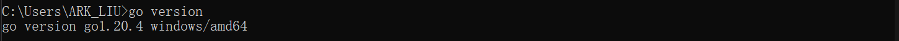
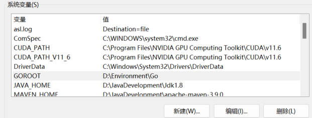

# Go语言基础

## 环境和配置

1. 下载Go最新版本并安装 https://go.dev/dl

2. 检查Go是否配置成功，使用cmd输入 go version 查看是否安装成功，如果不成功则需要配置环境变量

	

3. 配置工作路径，在系统环境变量中配置GOROOT为GO的安装目录

	

4. 配置GOPATH，按照同样地方法，添加一个环境变量并设置为自己创建的GOPATH目录即可，用于存放代码；在该文件夹下创建src，bin，pkg三个目录

5. 按照Go语言开发工具，如GoLand或者Vscode即可

6. 测试HelloWorld程序：在GoLand中新建一个项目，新建一个.go文件

	```go
	package main //声明在main包下，main包是唯一的可执行入口包
	
	import "fmt" //导入fmt包，允许输出
	
	func main()  {  //定义一个main函数,作为程序的唯一执行入口函数
		fmt.Println("Hello, World!") //使用fmt输出一个字符串
	}
	
	```

	使用cmd中go run hello.go 即可运行，或者在goland中直接运行。

## 基础语法

- 注释

	```go
	//单行注释
	/*
	多行注释
	*/
	```

- 变量

	```go
	//var name type
	func main() {
		var name string = "myName"
		var (
			num int = 2345
			age int = 2
		)
		name = "123"
		fmt.Println(name, num, age)
	}
	//变量初始化,短变量推导类型，只能对第一次出现的变量使用
	age := 12
	//变量交换
	var a int = 100
	var b int = 200
	b,a = a,b
	//变量作用域
	//局部变量只能在函数内使用，全局变量可以在文件内使用
	//go语言遵循就近原
	```

- 常量

	```go
	//常量是不能被改变的
	const URL string = "localhost:8080"
	const a,b,c = 123,"231",false
	//常量计数器，从0开始计数，在同一个const组内每次存在一个常量加1
	const {
	  a = iota //0
	  b = "s"  //iota = 1但不赋值
	  c =   //2
	}
	```

- 函数

	```go
	// 设定函数返回值
	func test() (int, int) {
		return 100, 200
	}
	func testA() {
		//匿名变量，调用函数并抛弃不需要的返回值
		a, _ := test()
		fmt.Println(a)
	}
	```

- 数据类型转换

	在go中，所有数据都是显式的转换

	```go
	a := 3
	b := 5.0
	c := float64(a)
	d := int(b)
	```

- 运算符

	```go
	a + b
	a - b
	a * b
	a / b
	a % b
	//自增和自减运算符不返回值
	fmt.Println(a++) //错误
	```

	```go
	a == b
	a != b
	a <= b
	a > b
	```

	```go
	a == 1 && b == 2
	a == 1 || b == 2
	!c && !d
	```

	

## 基本数据类型

- bool，只包含true和false，默认是false

	```go
	var isTrue = true
	fmt.Printf("%T,%t",isTrue,isTrue) //bool,true
	```

- 整数和浮点数

	int和uint，整数和无符号整数，可以定义整数长度

	```go
	var age int = 18
	var score float64 = 91.33
	//int,91.33
	fmt.Printf("%T,%.2f\n",age,score) //保留2位小数
	```

	byte = uint8

	rune = int32

- 字符串

	```go
	var str string = "Hello"
	fmt.Printf("%T,%s\n",str,str)
	v1 := 'A'
	fmt.Printf("%T,%d",v1,v1) //打印ascii
	fmt.Printf("%T,%s",v1,v1) //打印字符
	fmt.Printf("%s",str+str)
	```

	


