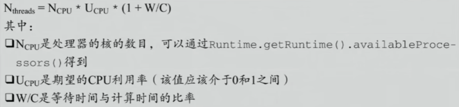

# 高性能编程

## 计算性能常见问题

##### 线程和进程的区别是什么？

进程是操作系统分配资源相关的最小单位，而线程是进程内执行计算的最小单位；线程之间共享其所在进程的资源。

##### 线程的切换问题？

在切换线程时，需要保存上下文到进程空间内的缓存中，并加载需要执行线程的上下文。

##### 线程越多越好吗？

不是，如果线程数量过多可能导致上下文切换开销较大，需要保证线程的最小执行时间片，所以非计算开销较大。

##### 单核CPU多线程执行有什么用？

使用多线程是最大化利用计算资源的举措，有时线程的执行速度取决于很多因素，如I/O、网络，可以能取决于其他线程，这时就需要让出计算资源，让其他任务先执行。

##### 对于程序来说，线程设置多少个合适？

在并发编程实践中，一般设置为

这样设置可以尽量达到期望的资源占用。但W/C的比例是无法精确得到的，并且操作系统不止运行一个程序，实际情况下还是需要在压力测试下进行调整。

##### 缓存一致性协议

CPU和内存的速度差距过大，为了提升CPU利用率，就需要加入高速缓存，一般是三级缓存，缓存级别越高速度越快容量越小。

一般来说，L3是多核共享，L1和L2是独立服务单CPU核心。

**超线程一般指，单核心对应多套寄存器，使得ALU的使用率提高，并且一个核心可以同时保存多个线程的数据**

高速缓存中，缓存读取是按照一行（一段内存空间）来读取的，这是根据空间局部性设计的。时间局部性是指下一次访问的质量一般也在当前指令周围。

缓存块大会高命中但不命中惩罚大，而缓存块小是低命中低惩罚，一般采用64Byte来作为一行。

缓存因为在不同执行了该线程的CPU中都有备份，所以需要保证不同核心缓存的数据是一致的，这就需要缓存一致性协议。

**MESI缓存一致性协议**（Intel）：CPU对Cache Line使用两位标记缓存行的状态，分别是Modified、Exclusive、Shared、Invalid。这是一种缓存锁。而无法被缓存或跨越多个缓存行则需要使用总线锁。

如果需要增加运行速度，就可以避免多个CPU高速缓存中包含相同的数据，以免需要通知其他缓存进行修改。

##### 阻止乱序执行

CPU的流水线的设计运行后面的指令在前面的指令执行，这就是CPU乱序执行，也是指令的重排序。

线程的**as-if-serial**指的是，即使指令执行是乱序的，只要最终得到的结果是一样的即可。即看起来类似序列化执行就行了。

多线程情况下可能导致很多意外情况，如**this溢出**（即对象初始化未完成就被允许建立到变量的连接）

**Double Check Lock 单例需要volatile吗？**

synchronized是不能阻止指令重排序的。在双检查单例（即如果实例为空则创建，实例不为空则返回，对实例为空的情况执行加锁初始化实例）的情况中，可能导致另一个线程访问到初始化了一部分的对象。

编译器的优化中，只要前后指令不依赖就可能进行编译器的乱序优化，可以使用C语言级别的asm中:::memoery来禁止。

而指令级别的内存屏障之分为读屏障，写屏障和全屏障。

##### 系统屏障

内存屏障中的指令集中，存在一些内存屏障特殊指令，即执行到该指令时，前面的指令必须执行完毕后才能继续执行。

在JVM虚拟机中，必须实现四种屏障（**LoadLoad、StoreStore、LoadStore、StoreLoad**），这种屏障是逻辑级别的。

这四种屏障分别代表这些屏障前后的读或写操作，是不能换顺序执行的。

##### Volatile关键字

保证可见性，线程对数据的操作立即写入内存，读取也必须从内存访问。

阻止乱序执行，**即volatile的写在StoreStore和StoreLoad之间，volatile的读在LoadLoad和LoadStore之前**，这样就保证了volatile的操作是不能换顺序的。

CPU并发控制可以通过关中断，不允许中断的发生，保证强数据一致性