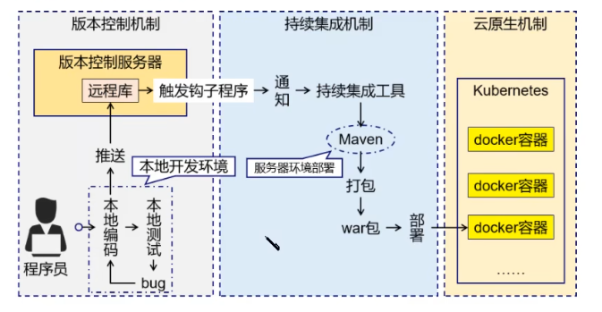
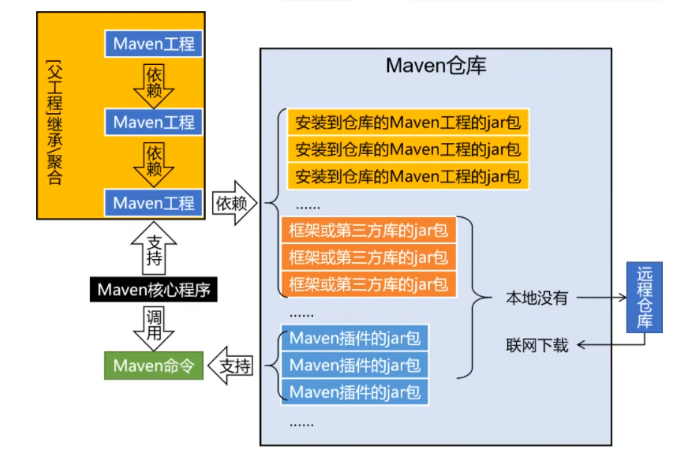
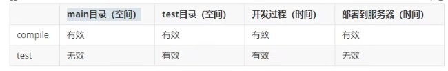
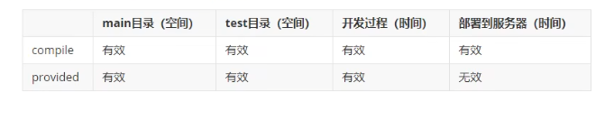
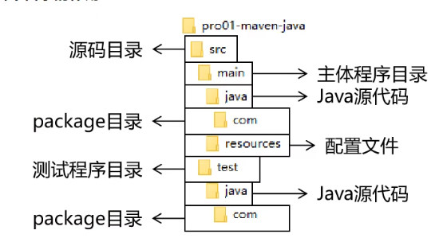

# Maven

## Maven介绍

为了管理项目的依赖升级，编译平台的差异，工程平台的不统一

Maven是一个项目管理工具，把项目的开发和管理抽象成项目对象模型

- POM（Project Object Model）：项目对象模型
- 项目依赖管理：使得其他资源和自己的资源都可以被当作项目的依赖资源使用，从中央仓库获取
- 构建声明周期/阶段


### Maven作用

- 项目构建：提供标准、跨平台的自动构建

	

- 依赖管理：管理项目依赖的资源（jar包），避免版本冲突

- 统一开发结构：提供标准的、统一的项目结构

解决jar包的版本和规范，解决jar包之间的依赖关系，脱离IDE后进行构建

## 项目构建和依赖

### 项目构建

- 使用Java源码、配置文件等其他资源等生成一个可以在服务器上运行的项目
- 构建的主要环节
	- 清理：清除上一次构建的结果，为下一次构建做好准备
	- 编译：把java源码编译成字节码
	- 测试：运行提前准备好的测试程序（Junit）
	- 报告：生成测试结果的全面信息
	- 打包：生成Java的jar包以及Web的war包等
	- 安装：把Maven生成的jar包或war包存入Maven仓库
	- 部署
		- 部署jar包：把jar包部署到Nexus私服服务器上
		- 部署war包：借助Maven插件（如cargo），部署到Tomcat服务器上

### 依赖

一个工程中使用了另一个工程中的类、接口、配置文件等资源，则A依赖B

依赖管理需要解决的问题

- jar包的下载：从远程到本地
- jar包之间的依赖：通过依赖传递性自动完成
- jar包的冲突：通过调整依赖配值，阻止某些jar包导入

## Maven工作机制



核心程序负责调度，Maven插件负责完成具体工作

通过创建Maven工程，进行工程管理

## Maven配置

下载地址：https://maven.apache.org/download.cgi

核心配置文件：apache-maven-3.9.0\conf\settings.xml

配置默认本地仓库：

```xml
  <!-- localRepository
   | The path to the local repository maven will use to store artifacts.
   |
   | Default: ${user.home}/.m2/repository
  <localRepository>/path/to/local/repo</localRepository>
  -->
<localRepository>d:\maven-repo</localRepository>
```

配置远程镜像仓库（也可以使用中央仓库):

- 注释原有部分，加入自己的仓库配置

```xml
<!--    <mirror>
      <id>maven-default-http-blocker</id>
      <mirrorOf>external:http:*</mirrorOf>
      <name>Pseudo repository to mirror external repositories initially using HTTP.</name>
      <url>http://0.0.0.0/</url>
      <blocked>true</blocked>
    </mirror> 
-->
    <mirror>
      <id>aliyunmaven</id>
      <mirrorOf>*</mirrorOf>
      <name>阿里云公共仓库</name>
      <url>https://maven.aliyun.com/repository/public</url>
    </mirror>
```

配置maven工程的基础JDK版本

配置Java环境变量和MAVEN环境变量:https://blog.csdn.net/qq_58036691/article/details/126629920

## Maven简单使用

### 根据坐标建立MAVEN工程

#### 通过三个向量定义MAven仓库中唯一的一个jar包

- groupId：一个公司或者组织ID
	- 一般是公司或者组织域名的倒叙+项目名称
	- 如：com.fantank.maven
- artifactId：一个项目或项目中一个模块的ID
- version：版本号
	- 如：SNAPSHOT为快照版本，RELEASE为正式发行版本

（项目可能会包含很多的工程）

#### 坐标的对应关系

```xml
<groupId>javax.servlet</groupId>
<artifactId>servlet-api</artifactId>
<version>2.5</version>
```

对应仓库位置

```
D:\JavaDevelopment\Maven-repo\javax\servlet\servlet-api\2.5\servlet-api-2.5.jar
```

####使用命令生成Maven工程

```
mvn archetype:generate
主命令 插件名.目标名

Choose a number or apply filter (format: [groupId:]artifactId, case sensitive contains): 7: 

Define value for property 'groupId':com.fantank.maven
Define value for property 'artifactId': mavenpro1-java

[INFO] ----------------------------------------------------------------------------
[INFO] Using following parameters for creating project from Old (1.x) Archetype: maven-archetype-quickstart:1.1
[INFO] ----------------------------------------------------------------------------
[INFO] Parameter: basedir, Value: D:\WorkSpace\MavenPro1
[INFO] Parameter: package, Value: com.fantank.maven
[INFO] Parameter: groupId, Value: com.fantank.maven
[INFO] Parameter: artifactId, Value: mavenpro1-java
[INFO] Parameter: packageName, Value: com.fantank.maven
[INFO] Parameter: version, Value: 1.0-SNAPSHOT
[INFO] project created from Old (1.x) Archetype in dir: D:\WorkSpace\MavenPro1\mavenpro1-java
[INFO] ------------------------------------------------------------------------
[INFO] BUILD SUCCESS
[INFO] ------------------------------------------------------------------------
[INFO] Total time:  04:36 min
[INFO] Finished at: 2023-02-16T12:05:16+08:00
[INFO] ------------------------------------------------------------------------
```

#### 解读pom.xml

```xml
<!--跟标签project，对当前工程进行配置和管理-->
<project xmlns="http://maven.apache.org/POM/4.0.0" xmlns:xsi="http://www.w3.org/2001/XMLSchema-instance"
  xsi:schemaLocation="http://maven.apache.org/POM/4.0.0 http://maven.apache.org/xsd/maven-4.0.0.xsd">
  <!--modelVersion:从Maven2之后固定为4.0,0-->
    <!--代表pom.xml的标签结构-->
  <modelVersion>4.0.0</modelVersion>
	<!--坐标信息，分别代表公司或组织的某个项目、项目下的某个模块、当前模块版本-->
  <groupId>com.fantank.maven</groupId>
  <artifactId>mavenpro1-java</artifactId>
  <version>1.0-SNAPSHOT</version>
 <!--当前模块打包方式，默认为jar(JAVA工程）或者war包(Web工程)或者pom(一个管理其他工程的工程）-->
  <packaging>jar</packaging>

  <name>mavenpro1-java</name>
  <url>http://maven.apache.org</url>
 <!--在Maven中自定义属性值-->
  <properties>
     <!--在构建项目过程中读取源码使用的字符集-->
    <project.build.sourceEncoding>UTF-8</project.build.sourceEncoding>
  </properties>
<!--配置具体依赖信息，包含多个dependency标签-->
  <dependencies>
    <!--配置一个具体依赖信息-->
    <dependency>
      <!--通过坐标信息，导入哪个jar包就放入其坐标信息-->
      <groupId>junit</groupId>
      <artifactId>junit</artifactId>
      <version>4.12</version>
      <!--配置当前依赖范围-->
      <scope>test</scope>
    </dependency>
  </dependencies>
</project>

```

### 在Maven工程中编写代码

源码放在main\java下包结构的最深处

```java
package com.fantank.maven; //和包名一致

import org.junit.Test;
import com.fantank.maven.calculate;;
import static org.junit.Assert.*; //静态导入qi，使得使用其方法不需要
//源码
public class Calculate {
    public int Cal(int a,int b){
        return a+b;
    }
}
//测试
public class CalculateTest{
    @Test
    public void testCal(){
        Calculate cl = new Calculate();
        int res = cl.Cal(5, 3);
        int expected = 8;
        assertEquals(expected, res);
    }
}
```

### 执行Maven命令

- 执行Maven命令时，需要进入到所操作工程的pom.xml所在目录下执行

	```sh
	mvn clean //清除target目录（已编译代码）
	mvn test-compile //编译源码项目
	mvn test-compile //编译test部分
	
	mvn test //执行测试，如果修改了源码会自动编译
	
	mvn package //执行打包操作，jar或者war
	
	mvn clean install //把打好的jar包放在本地仓库中
	```

- 测试报告可以在surefire-reports文件夹中查看

- jar包在target下，名称为项目名称+版本号，测试程序不会被打包

- install之后可以在本地仓库的对应包名下找到，写好的pom.xml会对应仓库中的.pom文件

### 创建Maven版的Web工程

```
mvn archetype:generate -DarchetypeGroupId=org.apache.maven.archetypes -DarchetypeArtifactId=maven-archetype-webapp -DarchetypeVersion=1.4
```

```java
import javax.servlet.http.*;
import javax.xml.ws.Response;

import java.io.IOException;

public class HelloServlet extends HttpServlet{
    protected void doGet(HttpServletRequest request,HttpServletResponse response) throws ServletException,IOException{
        response.getWriter().write("hello maven web");
    }
}
```

```xml
<?xml version="1.0" encoding="UTF-8"?>

<project xmlns="http://maven.apache.org/POM/4.0.0" xmlns:xsi="http://www.w3.org/2001/XMLSchema-instance"
  xsi:schemaLocation="http://maven.apache.org/POM/4.0.0 http://maven.apache.org/xsd/maven-4.0.0.xsd">
  <modelVersion>4.0.0</modelVersion>

  <groupId>com.fantank.maven</groupId>
  <artifactId>maven-pro-Web</artifactId>
  <version>1.0-SNAPSHOT</version>
  <packaging>war</packaging>

  <name>maven-pro-Web Maven Webapp</name>
  <!-- FIXME change it to the project's website -->
  <url>http://www.example.com</url>

  <properties>
    <project.build.sourceEncoding>UTF-8</project.build.sourceEncoding>
    <maven.compiler.source>1.7</maven.compiler.source>
    <maven.compiler.target>1.7</maven.compiler.target>
  </properties>

  <dependencies>
  <!-- 为了能够正常执行，导入ServletAPI -->
  <dependency>
      <groupId>javax.servlet</groupId>
      <artifactId>javax.servlet-api</artifactId>
      <version>3.1.0</version>
      <scope>provided</scope>
  </dependency>

    <dependency>
      <groupId>junit</groupId>
      <artifactId>junit</artifactId>
      <version>4.12</version>
      <scope>test</scope>
    </dependency>
  </dependencies>

</project>

```

需要手动导入servlet jar的依赖

查询依赖 https://mvnrepository.com/

```sh
mvn clean compile
mvn clean package
```

会生成一个war包，可以部署在tomcat上

### Web依赖Java工程

```xml
<?xml version="1.0" encoding="UTF-8"?>

<project xmlns="http://maven.apache.org/POM/4.0.0" xmlns:xsi="http://www.w3.org/2001/XMLSchema-instance"
  xsi:schemaLocation="http://maven.apache.org/POM/4.0.0 http://maven.apache.org/xsd/maven-4.0.0.xsd">
  <modelVersion>4.0.0</modelVersion>

  <groupId>com.fantank.maven</groupId>
  <artifactId>maven-pro-Web</artifactId>
  <version>1.0-SNAPSHOT</version>
  <packaging>war</packaging>

  <name>maven-pro-Web Maven Webapp</name>
  <!-- FIXME change it to the project's website -->
  <url>http://www.example.com</url>

  <properties>
    <project.build.sourceEncoding>UTF-8</project.build.sourceEncoding>
    <maven.compiler.source>1.7</maven.compiler.source>
    <maven.compiler.target>1.7</maven.compiler.target>
  </properties>

  <dependencies>
  <!-- https://mvnrepository.com/artifact/javax.servlet/javax.servlet-api -->
  <dependency>
      <groupId>javax.servlet</groupId>
      <artifactId>javax.servlet-api</artifactId>
      <version>3.1.0</version>
      <scope>provided</scope>
  </dependency>
    <!--指定被依赖工程的坐标-->
    <dependency>
      <groupId>com.fantank.maven</groupId>
      <artifactId>mavenpro1</artifactId>
      <version>1.0-SNAPSHOT</version>
    </dependency>
    <dependency>
      <groupId>junit</groupId>
      <artifactId>junit</artifactId>
      <version>4.12</version>
      <scope>test</scope>
    </dependency>
  </dependencies>

</project>

```

配置pom之后，依赖的jar包会被以前打包到war之中

Web依赖的jar包将会被放在WEB-INF/lib目录下

### 依赖范围的测试

```xml
  <dependency>
     <scope>compile/test/provided/system/runtime/import </scope>
  </dependency>
```

如果有效，表示在该范围下可用





- 默认为compile
- Junit一般用test
- runtime在开发过程中无效
- provided表示tomcat已引入的包，同时引入可能导致冲突

### 依赖的排除

因为有依赖传递，所以不需要导入全部依赖包

但是在某些情况下导致循环依赖或jar包版本冲突，此时必须阻断依赖

需要在依赖中配置exclude标签，以排除该jar包在本工程的访问性

```xml
    <dependency>
      <groupId>com.fantank.maven</groupId>
      <artifactId>mavenpro1</artifactId>
      <version>1.0-SNAPSHOT</version>
      
      <exclusions>
      	<exclusion>
        <!--指定时不需要指定version-->
          <groupId>commons-logging</groupId>
          <artifactId>commons-logging</artifactId>
        </exclusion>
      </exclusions>
    </dependency>
```

### 继承

父工程可以提取和管理全部子过程的pom文件，从而进行版本管理

父工程的创建方式和一般工程一样，但要修改打包方式

```xml
  <groupId>com.fantank.maven</groupId>
  <artifactId>maven-pro-parent</artifactId>
  <version>1.0-SNAPSHOT</version>
  <packaging>pom</packaging> 
	<!--打包方式只能是pom才能是父工程-->
```

只有打包方式为pom的Maven工程才能管理其他Maven工程，打包方式为pom的工程不写业务代码，只用来专门管理其他工程

如果需要管理，需要在父工程的pom.xml的moudules下添加,如果直接在父工程下创建则会自动添加

```xml
<!--聚聚合的设置-->
<modules>
<module>a-child-pro-module</module>
</modules>
```

同时,子工程也会有一个parent标签来表示父工程,如果子工程的groupId以及version和父工程的一样就可以省略,但artifactId不可能一样

```xml
 <parent>
  <groupId>com.fantank.maven</groupId>
  <artifactId>maven-pro-parent</artifactId>
  <version>1.0-SNAPSHOT</version>
</parent>

<groupId>com.fantank.maven</groupId>
  <artifactId>maven-pro-Web</artifactId>
  <version>1.0-SNAPSHOT</version>
  <packaging>war</packaging>
```

在父工程中统一管理依赖信息。但在父工程中配置了对依赖的管理，子工程中同样要明确写出需要依赖的条目，只是三坐标中可以省略版本号version由父工程管理；只要在父工程中修改，就不需要去子工程中再去修改，会自动生效。

```xml
<dependencyManagement>
	<dependencies>
		<dependency>
    	<groupId>org.springframework</groupId>
      <artifactId>spring-core</artifactId>
      <version>4.0.0.RELEASE</version>
    </dependency>  
  </dependencies>
</dependencyManagement>
```

```xml
<dependencies>
	<dependency>
  	  <groupId>org.springframework</groupId>
      <artifactId>spring-core</artifactId>
    <!--如果版本和父工程不一样，则子工程指定的版本会覆盖父工程的版本-->
        <!--最好是根据父工程的来-->
      <version>4.1.1.RELEASE</version>
  </dependency>
</dependencies>
```

#### 配置自定义属性标签

通过配置自定义的属性标签，可以维护一个属性值，使得不需要多次修改

```xml
<properties>
  <!--自定义属性名和属性值-->
  <!--引用方式，使用${}$-->
<fantank.spring.version>4.1.0.RELEASE</fantank.spring.version>
</properties>

<dependencies>
	<dependency>
  	  <groupId>org.springframework</groupId>
      <artifactId>spring-core</artifactId>
        <!--通过属性名解析后就知道了真值-->
      <version>${fantank.spring.version}$</version>
  </dependency>
</dependencies>
```

#### 实际意义

通过从父工程来继承已知的可用的依赖，就可以只关注自己项目工程中可以额外添加使用的依赖，提高效率

### 聚合

聚合的目的是通过上级工程管理下级工程

优点

- 一键执行Maven命令：很多构建命令都可以在总工程中执行

	工程聚合后，我们只需要在总工程执行mvn install就可以完成全部安装，不需要手动先安装父工程再逐层安装子工程

- 聚合后，所有模块会形成一个列表，方便查看

注意不要形成循环依赖

## Maven核心概念：POM

即项目对象模型（把现实世界的对象封装成模型），如DOM和BOM，使其可以被程序操作；对应的工程文件即pom.xml

### Maven约定目录结构



该目录结构只在超级pom中定义，超级pom是所有其他pom的父pom，单个工程中的pom成为有效pom

定义了约定的目录结构使得构建过程可以自动化完成

约定大于配置，配置大于编码

## Maven依赖传递

当产生依赖链时，complie范围可用传递，test和provided不能传递

## Maven IDEA工程

Project -> 父工程

Module -> 子工程

### Java工程

- 通过new project获取一个Maven工程，配置其项目名称（和artifactId自动同步）以及在Maven设置中选择安装的本地Maven位置，检查Maven仓库地址是否正确识别

- 如果添加了子工程Module，Idea会自动给父工程添加<package>pom<package>以及父工程和聚合设置，不用手动指定

- 如果需要执行maven命令，可以在Maven选项卡（右侧）选择LifeCycle中的命令，Plugins下也可以执行

- 点击Maven选项卡上的运行符号可以输入命令，但是注意在窗口右侧选择Module还是Project中执行；也可以右键pom文件在终端中打开，进入命令行运行

	```sh
	mvn insatll -Dmaven.test.skip=true
	#跳过测试，在Maven选项卡上部也可以选择
	#-D表示附加的命令参数
	```

### Web工程

- 把打包方式加上war

	```xml
	<artifactId>maven-idea-child-web</artifactId>
	<packaging>war</packaging>
	```

- 在ProjectStructure的Module目录下，可以找到已经自动生成的Web模块（Deployment Descriptor）中添加web.xml，将其路径修改为以下标准路径

	```
	D:\WorkSpace\maven-idea-parent\maven-idea-child-web\src\main\webapp\WEB-INF\web.xml
	```

	由于该目录不存在，所以点击下方的Web资源目录，选择路径并点击编辑后确认创建这个目录

- 在webapp下来创建网页即可

### 工程导入

来自版本控制系统需要学习git和远程库

来自工程目录，则直接使用idea打开pom.xml所在目录

重新配置自己的Maven环境

### 导入Module

- Java：直接把Module复制到Project中，在Project Structure中选择Modules中的+以及import Module，选中Module的目录并选择Maven导入方式
- Web：在上述操作后，检查Project Structure里是否检查到了Web，如果不对的话修改一下标准路径

## Maven生命周期

在Idea的Maven选项卡中也可以看到LifeCycle，暴露了一些生命周期使得程序员可以操作

### 为什么要有生命周期

为了构建自动化完成，Maven又三个生命周期，使得每个环节和其他环节解耦合

### 三个主要的生命周期

- Clean：清理操作

	

- Site：生成站点，把项目中的开发信息生成一组介绍的静态页面

	

- Default：主要构建过程，具有极多的周期

## 插件和目标

### 插件

Maven核心程序仅负责宏观调度，不做具体工作。插件来完成具体工作。

### 目标

目标就是插件的功能，使用具体的目标可以在Idea的Maven选项卡中Plugin，实际是可运行的jar包

### 仓库

- 本地仓库：为当前电脑的全部Maven工程服务

- 远程仓库：

	- 局域网：搭建Maven私服，如果存在本地Nexus则局域网访问，否则去外网寻找

	- 互联网

		- 中央仓库
		- 镜像仓库

		最好不要混用中央仓库和镜像仓库，以免发生冲突