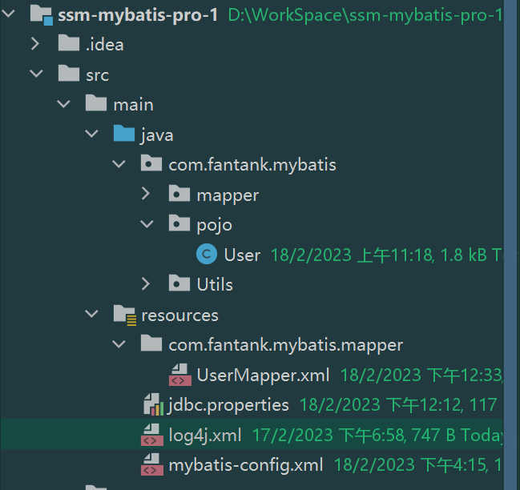
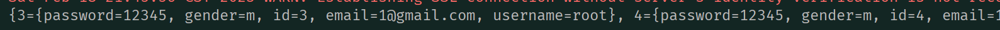

# MyBatis

这是一个Java的持久层框架，通过包括SQL Maps和Data Access Objects(DAO)

## 特性

- 支持定制化SQL、存储过程以及高级映射的优秀的持久层框架
- 避免了几乎所有的JDBC代码和手动设置参数和获取结果集
- 可以使用简单的XML或者注解用于配置和原始映射，将接口和Java的POJO(Plain Old Java Object)映射成数据库中的记录
- MyBatis是一个半自动的ORM（Object Relation Mapping)框架

### 下载

MyBatis下载地址：https://github.com/mybatis/mybatis-3/releases

### 和其他持久化层技术对比

- JDBC
	- SQL代码嵌入耦合度高
	- SQL变化多，需要频繁修改
	- 代码冗长
- Hibernate和JPA
	- 操作自动生成简便，开发效率高
	- 程序中复杂SQL需要绕过框架，否则实现困难
	- 内部自动生成SQL，不易做特殊优化
	- 给予全映射的全自动框架，大量字段的POJO不容易做部分映射
	- 反射操作太多，数据库性能不高
- MyBatis
	- 轻量级，性能好
	- SQL和Java编码分开，功能分开清晰
	- 开发效率不如Hibernate，执行效率远超Hibernate

## 开发环境

- Mysql的驱动类、链接地址url对于不同版本有区别

	- MySql5：
		- com.mysql.jdbc.Driver 
		- jdbc:mysql://localhost:3306/ssm

	- Mysql8：
		- com.mysql.cj.jdbc.Driver
		- jdbc:mysql://localhost:3306/ssm?serverTimezone=UTC

- Maven项目

	- 配置好Jdk版本
	- 配置好Maven的核心程序、配置文件和本地仓库地址
	- 选择打包方式jar

### 开发入门案例

#### 配置Maven依赖

根据自己下载的版本配置依赖

```xml
<?xml version="1.0" encoding="UTF-8"?>
<project xmlns="http://maven.apache.org/POM/4.0.0"
         xmlns:xsi="http://www.w3.org/2001/XMLSchema-instance"
         xsi:schemaLocation="http://maven.apache.org/POM/4.0.0 http://maven.apache.org/xsd/maven-4.0.0.xsd">
    <modelVersion>4.0.0</modelVersion>

    <groupId>org.example</groupId>
    <artifactId>ssm-mybatis-pro-1</artifactId>
    <version>1.0-SNAPSHOT</version>
    <packaging>jar</packaging>

    <properties>
        <maven.compiler.source>8</maven.compiler.source>
        <maven.compiler.target>8</maven.compiler.target>
        <project.build.sourceEncoding>UTF-8</project.build.sourceEncoding>
    </properties>

    <dependencies>
        <dependency>
            <groupId>org.mybatis</groupId>
            <artifactId>mybatis</artifactId>
            <version>3.5.6</version>
        </dependency>
        <dependency>
            <groupId>junit</groupId>
            <artifactId>junit</artifactId>
            <version>4.12</version>
            <scope>test</scope>
        </dependency>
        <!-- https://mvnrepository.com/artifact/mysql/mysql-connector-java -->
        <dependency>
            <groupId>mysql</groupId>
            <artifactId>mysql-connector-java</artifactId>
            <version>5.1.47</version>
        </dependency>

    </dependencies>
</project>
```

#### 配置数据库

使用Navicat或者其他软件配置一个简单的测试表即可

#### 配置用户类

进入Maven对于的源码存放位置，写一个测试类

```java
package com.fantank.mybatis;

public class User {
    private Integer id;
    private  String username;
    private String password;
    private  Integer age;
    private String gender;
    private String email;

    public User(Integer id, String username, String password, Integer age, String gender, String email) {
        this.id = id;
        this.username = username;
        this.password = password;
        this.age = age;
        this.gender = gender;
        this.email = email;
    }

    public User() {
    }
    public Integer getId() {
        return id;
    }
    public void setId(Integer id) {
        this.id = id;
    }
    public String getUsername() {
        return username;
    }
    public void setUsername(String username) {
        this.username = username;
    }
    public String getPassword() {
        return password;
    }
    public void setPassword(String password) {
        this.password = password;
    }
    public Integer getAge() {
        return age;
    }
    public void setAge(Integer age) {
        this.age = age;
    }
    public String getGender() {
        return gender;
    }
    public void setGender(String gender) {
        this.gender = gender;
    }
    public String getEmail() {
        return email;
    }
    public void setEmail(String email) {
        this.email = email;
    }
}

```

#### 配置MyBatis核心配置文件

习惯上命名为mybatis-config.xml，但并非强制。整合Spring之后，该配置文件可以省略

核心文件的作用是配置连接数据库的环境以及MyBatis的全局配置信息

配置文件需要放在resources文件夹下，可以从MyBatis的文档中拿出快速开始设置

```xml
<?xml version="1.0" encoding="UTF-8" ?> 
<!DOCTYPE configuration
  PUBLIC "-//mybatis.org//DTD Config 3.0//EN"
  "https://mybatis.org/dtd/mybatis-3-config.dtd">
<!--配置连接数据库环境-->
<configuration>
  <environments default="development">
    <environment id="development">
      <transactionManager type="JDBC"/>
      <dataSource type="POOLED">
        <!--数据库连接参数-->
        <property name="driver" value="com.mysql.jdbc.Driver"/>
        <property name="url" value="jdbc:mysql://localhost:3306/ssm"/>
        <property name="username" value="root"/>
        <property name="password" value="123456"/>
      </dataSource>
    </environment>
  </environments>
  <!--引入mybatis映射文件（用于语句）-->
  <mappers>
    <mapper resource=""/>
  </mappers>
</configuration>
```

#### 创建mapper接口

相当于之前的DAO，但是mapper仅仅是接口，不需要实现类，创建一个数据表对应的接口

#### 创建MyBatis映射文件

ORM关系数据映射（Object Relationship Mapping）

- 对象：java实体对象
- 关系：关系数据库
- 映射：二者对应关系

​	类 - 表

​	属性 - 字段

​	对象 - 记录

映射文件建议和mapper接口同名，可以使用官方文档内容


```xml
<?xml version="1.0" encoding="UTF-8" ?>
<!DOCTYPE mapper
        PUBLIC "-//mybatis.org//DTD Mapper 3.0//EN"
        "https://mybatis.org/dtd/mybatis-3-mapper.dtd">
<mapper namespace="com.fantank.mybatis.mapper.UserMapper">
    <!--int insertUser();-->
    <insert id="insertUser">
        insert into users values(0,'admin','123456','男','1234@gmail.com')
    </insert>
    <!--int updateUser();-->
    <update id="updateUser">
        update users set username='root',password='000000' where id=4
    </update>
    <!--int deleteUser();-->
    <delete id="deleteUser">
        delete from users where id=5
    </delete>
</mapper>
```

mapper标签中写的是sql语句

mapper接口和映射文件要保证两个一致:

- mapper接口的全类名和映射文件的namespace一致
- mapper接口中的方法的方法名要和映射文件中的sql的id保持一致

最后，在myBatis配置文件中引入映射文件的路径

```xml
  <mappers>
    <!--使用相对路径-->
    <mapper resource="mappers/UserMapper.xml"/>
  </mappers>
</configuration>
```

#### 测试功能

- 在test文件下创建包，以及测试目录，使用Junit进行测试

- 注意，执行完语句后要进行事务提交，否则会默认回滚
- 这段代码是固定的，可以封装后只使用SqlSession

```java
package com.fantank.mybatis.test;

import com.fantank.mybatis.mapper.UserMapper;
import org.apache.ibatis.io.Resources;
import org.apache.ibatis.session.SqlSession;
import org.apache.ibatis.session.SqlSessionFactory;
import org.apache.ibatis.session.SqlSessionFactoryBuilder;
import org.junit.Test;

import java.io.IOException;
import java.io.InputStream;

public class MyBatisTest {
    @Test
    public void testInsert() throws IOException {
        //获取核心配置文件的输入流 org.apache.ibatis.io
        InputStream is = Resources.getResourceAsStream("mybatis-config.xml");
        //获取sqLSessionFactoryBuilder对象
        SqlSessionFactoryBuilder sqlSessionFactoryBuilder = new SqlSessionFactoryBuilder();
        //获取一个SqlsessionFactory对象
        SqlSessionFactory ssf = sqlSessionFactoryBuilder.build(is);
        //获取sql会话对象SqlSession，是MyBais提供操作数据库的对象
        SqlSession sqlSession = ssf.openSession();
        //获取UserMapper的代理实现类对象,使用class类来创建一个代理模式获得的的接口实例
        //这个代理需要实现mapper接口的方法，需要提供mapper接口全类名先找到mapper代理的xml文件，
        // 再通过当前调用方法的名称找到mapper文件中对应的sql语句并执行
        UserMapper mapper = sqlSession.getMapper(UserMapper.class);
        //调用mapper接口中的方法，实现添加用户信息的功能
        int result = mapper.insertUser();
        //提交事务，数据库会回滚
        sqlSession.commit();
        System.out.println("Insert End!"+result);
        //执行完毕后，记得关闭SqlSession对象
        sqlSession.close();
    }
}
```

封装SqlSession

```java
public class SqlSessionUtil {
    public static SqlSession getSqlSession(){
        SqlSession sqlSession;
        try {
            //获取核心文件输入流
            InputStream is = Resources.getResourceAsStream("mybatis-config.xml");
            //获取SqlSessionFactoryBuilder
            SqlSessionFactoryBuilder sqlSessionFactoryBuilder = new SqlSessionFactoryBuilder();
            //获取SqlSessionFactory
            SqlSessionFactory build = sqlSessionFactoryBuilder.build(is);
            //获取SqlSession
            sqlSession = build.openSession(true);

        } catch (IOException e) {
            throw new RuntimeException(e);
        }
        return sqlSession;
    }
}
//测试
    @Test
    public void testUpdate(){
        //静态方法获取一个SqlSession
        SqlSession sqlSession = SqlSessionUtil.getSqlSession();
        UserMapper um = sqlSession.getMapper(UserMapper.class);
        um.updateUser();
        sqlSession.close();
    }
    @Test
    public void testDelete(){
        //静态方法获取一个SqlSession
        SqlSession sqlSession = SqlSessionUtil.getSqlSession();
        UserMapper um = sqlSession.getMapper(UserMapper.class);
        um.deleteUser();
        sqlSession.close();
    }
```

####功能优化

- 如果需要与数据库进行交互，需要获取SqlSession以及Mapper接口的代理实例对象来提交对应的Sql语句，所以可以进行封装

```java
//如果没有Mapper接口，通过Sql语句唯一标识找到Sql并执行
//唯一标识是namespace.sqlId
int res = sqlSession.insert("com.fantank.mybatis.mapper.UserMapper.insertUser");
```

- 默认情况下，mysql自动提交事务（每条语句独占事务）,所以也可以设置自动提交，安装如下设置

```java
 SqlSession sqlSession = ssf.openSession(true);
```

- 可以添加一个日志功能，如log4j
	- FATAL 
	- ERROR
	- WARN
	- INFO
	- DEBUG
	- 打印的日志级别是大于等于当前级别的日志

#### 测试查询功能

查询功能需要获取内容，所以需要一个预先写好的类对应查询的表的条目，设置Mapper接口时注意要返回该类的对象（如果没有可以返回Map集合）

```java
public interface UserMapper {

    int insertUser();
    int updateUser();
    int deleteUser();
  //返回设计好的java对象
  	User getUserById();
  //如果需要返回多个对象，使用容器
  	List<User> getAllUser();
}
```

这种需要返回数据到java程序中的语句，需要设置返回类型

```xml
    <!--User getUserById();-->
    <!--resultType:设置结果类型，即查询的数据转换为的java类型-->
    <!--resultMap:自定义映射，处理多对一或者一对多的映射-->
    <!-- 不能同时存在，也不能都不存在；注意要写全类名-->
    <select id="getUserById" resultType="com.fantank.mybatis.pojo.User">
        select * from users where id=4
    </select>

    <!--List<User> getAllUser()-->
    <!--需要先返回每个条目，再装入容器，要先返回类对象而不是容器-->
    <select id="getAllUser" resultType="com.fantank.mybatis.pojo.User">
        select * from users
    </select>
```

测试

```java
    @Test
    public void testSelect(){
        SqlSession sqlSession = SqlSessionUtil.getSqlSession();
        UserMapper um = sqlSession.getMapper(UserMapper.class);
        User user = um.getUserById();
        System.out.println(user);
    }

    @Test
    public void testAllUser(){
        SqlSession sqlSession = SqlSessionUtil.getSqlSession();
        UserMapper um = sqlSession.getMapper(UserMapper.class);
      //自动装入容器并返回
        List<User> list = um.getAllUser();
        list.forEach(System.out::println);
    }
```

## MyBatis核心配置文件

主要配置

- default：设置默认使用环境的Id

- environrmt:设置一个具体数据库连接的环境，Id不能重复

	- transactionManager：事务管理器

		- Type：JDBC / MANAGED

			JDBC:使用JDBC原生事务管理方式

			MANAGED：被管理的，如SPpring

	- dataSource：设置数据源

		- Type：POOLED/UNPOOLED/JUDI

			POOLED：表示使用数据库连接池

			UNPOOLED：不使用数据库连接层，每次重新创建连接

			JNDI：使用上下文的数据源

```xml
<?xml version="1.0" encoding="UTF-8" ?>
<!DOCTYPE configuration
        PUBLIC "-//mybatis.org//DTD Config 3.0//EN"
        "https://mybatis.org/dtd/mybatis-3-config.dtd">
<!--配置连接数据库环境-->
<configuration>
    <!--配置一个properties以访问键值对-->
    <properties resource="jdbc.properties"/>
    <!--配置一个别名以使用简单的名称来访问，如在Mapper文件中-->
    <typeAliases>
        <typeAlias type="com.fantank.mybatis.pojo.User" alias="pUser"></typeAlias>
    </typeAliases>
    <environments default="development">
        <environment id="development">
            <transactionManager type="JDBC"/>
            <dataSource type="POOLED">
                <!--数据库连接参数-->
                <property name="driver" value="${jdbc.driver}"/>
                <property name="url" value="${jdbc.url}"/>
                <property name="username" value="${jdbc.username}"/>
                <property name="password" value="${jdbc.password}"/>
            </dataSource>
        </environment>
    </environments>

    <!--引入mybatis映射文件（用于语句）-->
    <mappers>
        <!--使用相对路径-->
        <mapper resource="mappers/UserMapper.xml"/>
    </mappers>
</configuration>
```

可以使用Properties文件来配置键值对并引入配置文件

```properties
jdbc.driver=com.mysql.jdbc.Driver
jdbc.url=jdbc:mysql://localhost:3306/ssm
jdbc.username=root
jdbc.password=123456
```

使用别名typeAliases来设置类型别名，访问一个类型的名称，以简短访问名称。

- type：设置需要起别名的类型
- alias：设置某个类型的别名；如果不设置的话，这个类的类名会被设置成默认的别名，且不区分大小写

也可以通过设置包来使得一个包下面的全部类拥有默认的别名

```xml
<package name="com.fantank.mybatis.pojo"/>
<!----使得这个包下全部的类可以通过类名访问-->
```

**MyBatis中的配置文件的标签顺序必须按照一定的顺序配置**

properties?,settings?,typeAliases?,typeHandlers?,objectFactory?,objectWrapperFactory?,reflectorFactory?,plugins?,environments?,databaseIdProvider?,mappers?

```xml
		<!--使用typeAlias在核心文件配置后，Mapper文件可以使用别名-->
    <select id="getUserById" resultType="pUser">
        select * from users where id=4
    </select>
    <!--List<User> getAllUser()-->
    <select id="getAllUser" resultType="pUser">
        select * from users
    </select>

```

Mappers标签用来配置Mappers映射文件，可以通过package来一次性引入全部，但是这种写法有以下要求

- mapper接口和映射文件所在的包必须一致
- mapper接口的名字和映射文件的名字必须一致

所以需要在resources文件夹下建立一个和Mapper接口相同包名的路径，并把mapper文件名称和mapper接口文件名改为一致



### 使用IDEA配置MyBatis核心文件模板

- 通过设置IDEA-Settings-Editor-File and Code Templates设置好一个MyBatis-config的文件模板
- 通过new文件时选择对应的模板

```xml
<?xml version="1.0" encoding="UTF-8" ?>
<!DOCTYPE configuration
        PUBLIC "-//mybatis.org//DTD Config 3.0//EN"
        "https://mybatis.org/dtd/mybatis-3-config.dtd">
<configuration>
    <properties resource="jdbc.properties"/>
    <typeAliases>
<!--        <typeAlias type="" alias=""></typeAlias>-->
        <package name=""></package>
    </typeAliases>
    <environments default="development">
        <environment id="development">
            <transactionManager type="JDBC"/>
            <dataSource type="POOLED">
                <!--数据库连接参数-->
                <property name="driver" value="${jdbc.driver}"/>
                <property name="url" value="${jdbc.url}"/>
                <property name="username" value="${jdbc.username}"/>
                <property name="password" value="${jdbc.password}"/>
            </dataSource>
        </environment>
    </environments>

    <mappers>
        <!--使用相对路径-->
    <!-- <mapper resource=""/>-->
    <!--   使用包名引入-->
        <package name=""/>
    </mappers>
</configuration>
```

## MyBatis参数

通过在映射文件中拼接Sql语句来完成多种处理

### 获取参数的两种方法

- ${}：字符串拼接
- \#{}：占位符赋值

### 单个字面量类型的参数

如果Mapper接口的参数为单个字面量的参数，此时使用#和$以及任意的内容获取参数值；\$需要加单引号

如果使用#来解析，则使用占位符解析，无论在Mapper文件里写任何参数名都会按照传入的参数顺序解析，一般按照源码的参数名称即可

```xml
    <select id="getUserByUsername" resultType="User">
        select * from users where username = #{username}
    </select>
```

如果使用$则会直接进行字符串拼接，并且需要加单引号，这个占位符是会被运算的，虽然可以以任意内容获取，但是最好使用源码中的参数名称获取

```xml
    <select id="getUserByUsername" resultType="User">
        select * from users where username = '${username}'
    </select>
```

### 多个字面量类型的参数

如果存在多个参数，mybatis会通过Map集合存储键值对，以两种方式

- arg0,arg1,....为键，以参数值为值
- param1,param2,...为键，参数为值

所以在使用时需要使用这两个参数获取

```xml
    <select id="checkLogin" resultType="User">
        select * from users where username=#{arg0} and password= '${param2}'
    </select>
```

### 自行存储字面量

如果Mapper接口输入的参数类型是一个Map集合，就可以在Mapper文件中按照Map中的键来访问

```java
 User checkLoginByMap(Map<String, Object> map);

    @Test
    public void testLoginMap(){
        SqlSession sqlSession = SqlSessionUtil.getSqlSession();
        UserMapper mapper = sqlSession.getMapper(UserMapper.class);
        HashMap hashMap = new HashMap<String,Object>();
        hashMap.put("username","admin");
        hashMap.put("password","123");
        User user = mapper.checkLoginByMap(hashMap);
        System.out.println(user.toString());
    }
```

```xml
<!--    User checkLoginByMap(Map<String, Object> map);-->
    <select id="checkLoginByMap" resultType="User">
        select * from users where username=#{username} and password= '${password}'
    </select>
```

### 实体类参数

若mapper文件中的参数是实体对象，只需要通过属性名来访问对应的成员变量

**属性名是get和set方法后面跟随的名称的小写名称，成员变量是定义在类中的**

```java
     int insertUser(User user);

    @Test
    public void testInsertUser(){
        SqlSession sqlSession = SqlSessionUtil.getSqlSession();
        UserMapper mapper = sqlSession.getMapper(UserMapper.class);
        User user = new User(null,"root","12345",12,"m","1@gmail.com");
        mapper.insertUser(user);
        System.out.println(user.toString());
    }
```

```xml
    <select id="insertUser">
        insert into users values(null,#{username},#{password},#{gender},#{email})
    </select>
```

### 通过注解自定义属性名称

@Prarm可以使得myBatis把存在Map中的键替换为自定义字符串，但是原来的mybatis默认的键仍然可以使用

**注解中如果只有一个参数，可以省略value = **

```java
 User checkLoginByParam(@Param(value = "username")String username,@Param("password")String password);

    @Test
    public void testLoginByParam(){
        SqlSession sqlSession = SqlSessionUtil.getSqlSession();
        UserMapper mapper = sqlSession.getMapper(UserMapper.class);
        User user = mapper.checkLoginByParam("admin","123");
        System.out.println(user.toString());
    }
```


```xml
    <select id="checkLoginByParam" resultType="User">
        select * from users where username=#{username} and password=#{password}
    </select>
```

## MyBatis查询

### 查询一个实体类对象或者数据集合

```java
    @Test
    public void testGetUserById(){
        SqlSession sqlSession = SqlSessionUtil.getSqlSession();
        SelectUserMapper sum = sqlSession.getMapper(SelectUserMapper.class);
        User userById = sum.getUserById(1);
        System.out.println(userById);
    }
    @Test
    public void testGetAllUser(){
        SqlSession sqlSession = SqlSessionUtil.getSqlSession();
        SelectUserMapper sum = sqlSession.getMapper(SelectUserMapper.class);
        List<User> list = sum.getAllUser();
        list.forEach(System.out::println);
    }
```

```xml
<?xml version="1.0" encoding="UTF-8" ?>
<!DOCTYPE mapper
        PUBLIC "-//mybatis.org//DTD Mapper 3.0//EN"
        "https://mybatis.org/dtd/mybatis-3-mapper.dtd">
<mapper namespace="com.fantank.mybatis.mapper.SelectUserMapper">
<!--    User getUserById(@Param("id")Integer id);-->
    <select id="getUserById" resultType="User">
        select * from users where id=#{id};
    </select>
<!--    List<User> getAllUser();-->
    <select id="getAllUser" resultType="User">
        select * from users
    </select>
</mapper>
```

如果返回的数据条目和接收的对象容器不符合（比如多对一）则会出现TooManyResults错误，因为底层会调用对应条目的容器来接收结果。

所以要注意查询的结果数目，如果不确定可以统一使用容器来存放

### 查询单行单字段的数据

```xml
<!--    Integer getCountUser();-->
    <select id="getCountUser" resultType="Integer">
        <!--如果count内填写的字段为null则不会被计入-->
        select count(*) from users
    </select>
```

```java
    @Test
    public void testCount(){
        SqlSession sqlSession = SqlSessionUtil.getSqlSession();
        SelectUserMapper sum = sqlSession.getMapper(SelectUserMapper.class);
        System.out.println(sum.getCountUser());
```

MyBatis为Java的基本类型设置了很多别名，都可以使用

### 查询的结果不存在实体类

如果查询时存在为null的字段，字段不会被放入map

记得，这只是将一条记录的多个字段放入一个map，如果查询多条数据仍然需要一个容器存放多个map

```xml
<!--    Map<String, Object> getUserIdByMap();-->
    <select id="getUserIdByMap" resultType="map">
        select * from users where username=#{username}
    </select>
```

```java
    @Test
    public void testGetUserIdByMap(){
        SqlSession sqlSession = SqlSessionUtil.getSqlSession();
        SelectUserMapper sum = sqlSession.getMapper(SelectUserMapper.class);
        Map<String, Object> users = sum.getUserIdByMap("admin");
        System.out.println(users);

    }
```

### 查询多条数据存入Map

- 可以使用一个List存储多个Map

```xml
<!--    List<Map<String,Object>> getAllUserByMap();-->
    <select id="getAllUserByMap" resultType="map">
        select * from users
    </select>
```

```java
    @Test
    public void testAllUser(){
        SqlSession sqlSession = SqlSessionUtil.getSqlSession();
        SelectUserMapper sum = sqlSession.getMapper(SelectUserMapper.class);
        List<Map<String, Object>> allUserByMap = sum.getAllUserByMap();
        allUserByMap.forEach(System.out::println);
    }
```

- 使用@MapKey注解，可以将查询结果的一个字段设置为Map的键，值则也变成一个Map来存储

```java
    @MapKey("id")
    Map<String, Object> getUserIdByMap(@Param("username")String username);
```



## MyBatis特殊SQL

### 模糊查询

- 模糊查询的结果是不确定条目的，最好使用List获取
- 模糊查询不能使用#{}来查询，因为这样使用的是占位符解析，但模糊查询必须在单引号之中，使得#{}解析后不会被当作参数，导致参数缺失
- 解决方法
	- 使用${}来作为字符串拼接方法使用
	- 使用字符串函数concat进行字符串拼接
	- 使用双引号包裹%

```xml
<!--    List<User> getUserByLike();-->
    <select id="getUserByLike" resultType="User">
<!--        select * from users where username like '%${likeName}%-->
<!--            select * from users where username like concat('%',#{likeName},'%')-->
        select * from users where username like "%"#{likeName}"%"
    </select>
```

### 批量删除

- 不能使用#{}解析，因为会自动为解析的值加上单引号
- 删除时，在Sql在需要传入一个字符串ids，其中的字段用逗号隔开

```xml
<!--    void deleteMoreUser(@Param("ids")String ids);-->
    <select id="deleteMoreUser">
        delete from users where id in (${ids})
    </select>
```

### 动态设置表名

- 设置表名时是不能加单引号的，所以不能使用#{}

```java
    <!--    List<User> getUserFromTableById(@Param("tableName")String tableName,@Param("id")int id);-->
    <select id="getUserFromTableById" resultType="User">
        select * from ${tableName} where id=#{id}
    </select>
```

### 添加功能获取自增的主键

- 使用添加功能后获取自增的主键并完成后续操作
- JDBC中包含getGeneratedKeys来获取自增的主键功能，MyBatis则需要在Mapper文件中设置是否允许userGeneratedKeys，以及获取返回的主键存放在传入实体参数的某个属性的功能keyProperties

```java
    void insertUserAndGetMainKey(User user);

    @Test
    public void TesInstertUser(){
        SqlSession sqlSession = SqlSessionUtil.getSqlSession();
        SpecialSqlMapper specialSqlMapper = sqlSession.getMapper(SpecialSqlMapper.class);
        User u;
        specialSqlMapper.insertUserAndGetMainKey(u = new User(null,"boy","1234",2,"m","?@1.com"));
        System.out.println(u);
    }
```

```xml
<!--    void insertUserAndGetMainKey(User user);-->
    <insert id="insertUserAndGetMainKey" useGeneratedKeys="true" keyProperty="id">
        insert into users values(null,#{username},#{password},#{gender},#{email})
    </insert>
```

## 自定义映射resultMap

### resultMap处理字段和属性的映射

数据库字段名和java中属性名不一致的情况下无法自动对应，如数据使用下划线而java中使用驼峰，不对应的属性会变成null

- 可以修改查询语句，使得查询出来的结果具有别名，使得别名和属性名匹配

```xml
<!--    Emp getEmpById(@Param("id")int id);-->
    <select id="getEmpById" resultType="Emp">
<!--        select * from t_emp where emp_id=#{id}-->
        select emp_id empId, emp_name empName, age, gender from t_emp where emp_id=#{id}
    </select>
```

- 当字段名符合mysql使用下划线，而属性符合java使用驼峰，则可以在mybatis的核心配置文件中设置自动将下划线映射为驼峰

```xml
    <properties resource="jdbc.properties"/>
    <settings>
        <setting name="mapUnderscoreToCamelCase" value="true"/>
    </settings>
```

- 使用resultMap自定义映射，通过设定resultMap的id以及映射的实体类类型type，可以将返回结果映射到实体类
	- id 主键
	- result 一般字段
	- property 属性名
	- column 字段名

```xml
    <!--    Emp getEmpById(@Param("id")int id);-->
    <resultMap id="empResultMap" type="Emp">
        <id column="emp_id" property="empId"></id>
        <result column="emp_name" property="empName"></result>
        <result column="gender" property="gender"></result>
        <result column="age" property="age"></result>
    </resultMap>
    <select id="getEmpById" resultType="Emp" resultMap="empResultMap">
        select * from t_emp where emp_id=#{id}
    </select>
```

### 多对一映射

对一：对应一个对象

对多：对应一个集合

当出现一个实体类中对应另一个实体类对象，即进行多表联查时，得到的查询表中的结果不能直接对应到属性中的实体类，解决方法需要resultMap自定义映射

- 级联方式：使用resultMap来自定义查询结果字段如何生成一个成员变量的新的实体类对象存储这些字段

	```xml
	<!--    Emp getEmpAndDeptById(@Param("empId")int empId);-->
	    <resultMap id="empAndDeptResultMap" type="Emp">
	        <id column="emp_id" property="empId"></id>
	        <result column="emp_name" property="empName"></result>
	        <result column="gender" property="gender"></result>
	        <result column="age" property="age"></result>
	        <result column="dept_id" property="dept.deptId"></result>
	        <result column="dept_name" property="dept.deptName"></result>
	    </resultMap>
	    <select id="getEmpAndDeptById" resultType="Emp" resultMap="empAndDeptResultMap">
	        select t_emp.*,t_dept.* from t_emp left join t_dept on t_emp.dept_id = t_dept.dept_id where t_emp.emp_id=#{empId}
	    </select>
	```

- Association：专门处理多对一和一对一的关系，处理实体类类型属性

	通过设置这个标签，可以将一个实体类需要映射的类成员变量映射到一个Java类，并且创建这个类并按照字段赋值

	- property:设置需要处理映射关系的属性的属性名
	- javatype：设置需要生成的属性的实体类型

	```xml
	    <resultMap id="empAndDeptResultMap" type="Emp">
	        <id column="emp_id" property="empId"></id>
	        <result column="emp_name" property="empName"></result>
	        <result column="gender" property="gender"></result>
	        <result column="age" property="age"></result>
	        <association property="dept" javaType="Dept">
	            <id column="dept_id" property="deptId"></id>
	            <result column="dept_name" property="deptName"></result>
	        </association>
	    </resultMap>
	    <select id="getEmpAndDeptById"  resultMap="empAndDeptResultMap">
	        select t_emp.*,t_dept.* from t_emp left join t_dept on t_emp.dept_id = t_dept.dept_id where t_emp.emp_id=#{empId}
	    </select>
	```

- 分步查询

	- property 设置需要映射关系的属性的属性名

	- select 设分步查询的下一步的函数接口的全类名和接口名

	- column 将上一步查询的结果中的某字段作为参数传入函数接口进行第二步查询

	- 优势：延迟加载，可以仅执行需要查询的步骤，不执行后续的sql，提高性能；

		​			即如果获取了第一步查询的结果，但并未使用其中需要分步加载的字段，则对应的sql不会执行

		- LazyLoadingEnabled：实验延迟加载功能的全局配置，延迟加载，默认不开启

			```xml
			        <setting name="lazyLoadingEnabled" value="true"/>
			```

		- aggressiveLazyLoading：触发延迟加载规则的全局设置，默认为true会默认进行分布查询的全部sql并加载；设置为false后会按需加载；

			```xml
			        <setting name="aggressiveLazyLoading" value="false"/>
			```

		- fetchType：association的属性，可以设置该分步查询是否使用延迟加载，eager为立即加载，lazy为延迟加载

​	使用association自带的调用下一个查询的方法来进行下一步的查询，有一定的优势


```java
    Emp getEmpAndDeptByIdStepOne(@Param("empId")int empId);

    Dept getEmpAndDeptByIdStepTwo(@Param("deptId")int deptId);

    @Test
    public void testGetEmpAndDeptSteps(){
        SqlSession sqlSession = SqlSessionUtil.getSqlSession();
        EmpMapper em = sqlSession.getMapper(EmpMapper.class);
        Emp e = em.getEmpAndDeptByIdStepOne(2);
        System.out.println(e);
    }
```

```xml
<!--    Emp getEmpAndDeptByIdStepOne(@Param("empId")int empId);-->
    <resultMap id="empAndDeptStepMap" type="Emp">
        <id column="emp_id" property="empId"></id>
        <result column="emp_name" property="empName"></result>
        <result column="gender" property="gender"></result>
        <result column="age" property="age"></result>
        <association property="dept" select="com.fantank.mybatis.mapper.DeptMapper.getEmpAndDeptByIdStepTwo" column="dept_id">
        </association>
    </resultMap>
    <select id="getEmpAndDeptByIdStepOne" resultMap="empAndDeptStepMap">
        select * from t_emp where t_emp.emp_id=#{empId}
    </select>
    
    <!--    Dept getEmpAndDeptByIdStepTwo(@Param("deptId")int deptId);-->
    <select id="getEmpAndDeptByIdStepTwo" resultType="Dept">
        select * from t_dept where dept_id=#{deptId}
    </select>
```

### 一对多映射

- collection

	- 处理一对多映射，放在resultMap中；
		- property 实体类属性名
		- ofType 容器内的实体的类型

	```java
	Dept getDeptAndEmp(@Param("deptId")int deptId);
	
	    @Test
	    public void testGetDeptAndEmpByDeptId(){
	        SqlSession sqlSession = SqlSessionUtil.getSqlSession();
	        DeptMapper mapper = sqlSession.getMapper(DeptMapper.class);
	        System.out.println(mapper.getDeptAndEmp(2));
	    }
	```

	```xml
	<!--    Dept getDeptAndEmp(@Param("deptId")int deptId);-->
	    <resultMap id="deptAndEmpMap" type="Dept">
	        <id column="dept_id" property="deptId"></id>
	        <result column="dept_name" property="deptName"></result>
	        <collection property="emps" ofType="Emp">
	            <id column="emp_id" property="empId"></id>
	            <result column="emp_name" property="empName"></result>
	            <result column="gender" property="gender"></result>
	            <result column="age" property="age"></result>
	        </collection>
	    </resultMap>
	    <select id="getDeptAndEmp" resultMap="deptAndEmpMap">
	        select t_emp.*,t_dept.* from t_dept left join t_emp on t_dept.dept_id=t_emp.dept_id where t_dept.dept_id=#{deptId}
	    </select>
	```

- 分步查询

	和之前的分步查询相似

```java
Dept getDeptAndEmpStepOneByDeptId(@Param("deptId")int deptId);

List<Emp> getDeptAndEmpStepTwo(@Param("deptId")int deptId);

    @Test
    public void testGetDeptAndEmpStep(){
        SqlSession sqlSession = SqlSessionUtil.getSqlSession();
        DeptMapper mapper = sqlSession.getMapper(DeptMapper.class);
        System.out.println(mapper.getDeptAndEmpStepOneByDeptId(1));
    }
```

```xml
<!--    Dept getDeptAndEmpStepOneByDeptId(@Param("deptId")int deptId);-->
    <resultMap id="deptAndEmpStepMap" type="Dept">
        <id column="dept_id" property="deptId"></id>
        <result column="dept_name" property="deptName"></result>
        <collection property="emps" select="com.fantank.mybatis.mapper.EmpMapper.getDeptAndEmpStepTwo" column="dept_id" ofType="Emp">
            <id column="emp_id" property="empId"></id>
            <result column="emp_name" property="empName"></result>
            <result column="gender" property="gender"></result>
            <result column="age" property="age"></result>
        </collection>
    </resultMap>
    <select id="getDeptAndEmpStepOneByDeptId" resultMap="deptAndEmpStepMap">
        select * from t_dept where dept_id=#{deptId}
    </select>

<!--    List<Emp> getDeptAndEmpStepTwo(@Param("deptId")int deptId);-->
    <select id="getDeptAndEmpStepTwo" resultType="Emp">
        select * from t_emp where dept_id=#{deptId}
    </select>
```

## 动态SQL

这是一种根据特定条件来动态拼装SQL的功能，实现多条件拼装SQL的功能

- 使用if标签的表达式判断标签中的标签是否拼sql

	- 设置 1=1的条件是进行格式控制，使得where不会直接连接and，并且所有条件确实仍然可以运行

		```xml
		<!--    List<Emp> getEmpByCondition(Emp emp);-->
		    <select id="getEmpByCondition" resultType="Emp">
		        select * from t_emp where 1=1
		        <if test="empName != null and empName != ''">
		            and emp_name = #{empName}
		        </if>
		        <if test="age != null">
		            and age = #{age}
		        </if>
		    </select>
		```

- 使用where标签动态生成where关键字

	- 可以在标签内任意条件成立时生成where关键词

	- 可以去除标签内多余的前置and关键词

	- 如果标签内全部语句不成立，则该标签无效

		```xml
		    <!--    List<Emp> getEmpByCondition(Emp emp);-->
		    <select id="getEmpByCondition" resultType="Emp">
		        select * from t_emp
		        <where>
		            <if test="empName != null and empName != ''">
		                emp_name = #{empName}
		            </if>
		            <if test="age != null">
		                and age = #{age}
		            </if>
		        </where>
		    </select>
		```

- trim标签

	- where不能去掉最后多余的and

	- trim可以在指定位置添加和去掉某些内容

		- prefix，suffix 添加前缀或者后缀

		- prefixOverrides，suffixOverrides 去除前缀或后缀标签

			```xml
			    <!--    List<Emp> getEmpByCondition(Emp emp);-->
			    <select id="getEmpByCondition" resultType="Emp">
			        select * from t_emp
			        <trim prefix="where" suffixOverrides="and">
			            <if test="empName != null and empName != ''">
			                emp_name = #{empName} and
			            </if>
			            <if test="age != null">
			                and age = #{age} and
			            </if>
			        </trim>
			    </select>
			```

- choose when otherwise标签

	- 相当于if elseif else

		```xml
		<!--    List<Emp> getEmpByChoose(Emp emp);-->
		    <select id="getEmpByChoose" resultType="Emp">
		        select * from t_emp
		        <where>
		            <choose>
		                <when test="empName != null and empName !=''">
		                    emp_name = #{empName}
		                </when>
		                <when test="age != null and age !=''">
		                    age = #{age}
		                </when>
		                <otherwise>
		                    gender = 'f'
		                </otherwise>
		            </choose>
		        </where>
		    </select>
		```

- foreach标签

	- collection 传入的容器的在Map中的键值，可以使用@Param设置

	- item 每次循环获取的容器中的一个实体的名称

	- separator 每次执行的中间添加的分隔符

	- open 循环的内容的开头添加内容

	- close 循环的内容的结尾添加内容

		添加操作

		```xml
		<!--    void insertBatchEmp();-->
		    <insert id="insertBatchEmp">
		        insert into t_emp values
		        <foreach collection="emps" item="emp" separator=",">
		            (null,#{emp.empName},#{emp.age},#{emp.gender},null)
		        </foreach>
		    </insert>
		```

		```java
		     void insertBatchEmp(@Param("emps")List<Emp> emps);
		
		@Test
		    public void testinsertBatchEmp(){
		        SqlSession sqlSession = SqlSessionUtil.getSqlSession();
		        DynamicSqlMapper mapper = sqlSession.getMapper(DynamicSqlMapper.class);
		        ArrayList<Emp> newEmps = new ArrayList<>();
		        for (int i = 0; i < 3; i++) {
		            newEmps.add(new Emp(null,""+(i+'a'),i+20,""+(i/2==1?'m':'f')));
		        }
		        mapper.insertBatchEmp(newEmps);
		    }
		```

		删除操作

		```xml
		<!--    void deleteBatchEmp(@Param("empsIds")Integer[] empIds);-->
		    <delete id="deleteBatchEmp">
		        delete from t_emp where emp_id in
		        (
		            <foreach collection="empIds" item="empId" separator=",">
		                #{empId}
		            </foreach>
		        )
		    </delete>
		```

		```java
		    void deleteBatchEmp(@Param("empIds")Integer[] empIds);
		
		    @Test
		    public void testdeleteBatchEmp(){
		        SqlSession sqlSession = SqlSessionUtil.getSqlSession();
		        DynamicSqlMapper mapper = sqlSession.getMapper(DynamicSqlMapper.class);
		        Integer[] i = new Integer[]{1,3,5};
		        mapper.deleteBatchEmp(i);
		    }
		```

- sql标签

	可以记录一条常用的sql语句片段，使得之后可以引用；引用时使用include标签引用

```xml
    <sql id="empColumns">
        emp_id,emp_name,age,gender,dept_id
    </sql>
    <select id="getAllEmp" resultType="Emp">
        select <include refid="empColumns"></include>  from t_emp
    </select>
```

## MyBatis缓存

### 一级缓存

- 默认开启
- 一级缓存是SqlSession级别的，即通过相同的SqlSession查询的数据会被缓存，再次查询相同的数据则不会经过数据库查询，直接通过缓存获取

```java
    @Test
    public void testGetEmpByIdCache(){
        SqlSession sqlSession1 = SqlSessionUtil.getSqlSession();
      //通过一个SqlSession获取
        CacheMapper cm1 = sqlSession1.getMapper(CacheMapper.class);
        System.out.println(cm1.getEmpById(2));
        System.out.println(cm1.getEmpById(2));
			//通过另一个SqlSession获取
        SqlSession sqlSession2 = SqlSessionUtil.getSqlSession();
        CacheMapper mapper2 = sqlSession2.getMapper(CacheMapper.class);
        System.out.println(mapper2.getEmpById(2));
    }
```

- 一级缓存失效的四种情况

	- 在不同的SqlSession中对应不同的缓存

	- 在查询时查询条件不同（冷不命中）

	- 同一个SqlSession执行了任意一次增删改后会清除缓存，为了保证数据库和缓存数据的一致性

	- 同一个SqlSession可以通过手动清空缓存

		```java
		        SqlSession sqlSession1 = SqlSessionUtil.getSqlSession();
		        sqlSession1.clearCache();
		```

### 二级缓存

- 二级缓存是SqlSessionFactory级别的，通过同一个SqlSessionFactory创建的SqlSession的查询结果将会被缓存；使得再次执行相同的语句可以被从缓存中获取

- 二级缓存开启的条件

	- 在核心配置文件中设置全局配置cacheEnabled = true（默认开启）

	- 在映射文件中设置标签Cache

		```xml
		<mapper namespace="com.fantank.mybatis.mapper.CacheMapper">
		    <cache/>
		```

	- 二级缓存必须在SqlSession关闭或提交后才保存一次，一级缓存中的数据被存入二级缓存

		```java
		    @Test
		    public void testCache() throws IOException {
		        //由于工具类中是一个SqlSessionFactory对应一个SqlSession，所以测试二级缓存不能用
		        InputStream is = Resources.getResourceAsStream("mybatis-config.xml");
		        SqlSessionFactory sqlSessionFactory = new SqlSessionFactoryBuilder().build(is);
		        SqlSession sqlSession1 = sqlSessionFactory.openSession(true);
		        SqlSession sqlSession2 = sqlSessionFactory.openSession(true);
		
		        CacheMapper mapper1 = sqlSession1.getMapper(CacheMapper.class);
		        CacheMapper mapper2 = sqlSession2.getMapper(CacheMapper.class);
		
		        System.out.println(mapper1.getEmpById(2));
		        sqlSession1.close();
		
		        System.out.println(mapper2.getEmpById(2));
		    }
		```

	- 如果需要使用二级缓存，查询得到的实体类必须可以序列化，实现Serializable

- 二级缓存失效的条件

	- 两次查询操作之间执行任意一次增删改；一级缓存的手动清空不会使得二级缓存失效

- 二级缓存的配置

	- eviction 缓存回收策略：默认为LRU
		- FIFO 
		- SOFT 软引用：移除给予垃圾回收器状态和软引用规则的对象
		- WEAK 弱引用：更积极的移除给予垃圾回收器状态和弱引用规则的对象
	- flushInterval属性：刷新间隔，单位毫秒；默认为不设置，即仅在调用语句时刷新
	- size属性：可以存储的引用数目
	- readOnly属性：
		- True：只读缓存，会给所有调用者返回缓存中的真实实例对象，如果进行修改就会直接修改缓存中的数据，不能进行修改；会大量提升性能
		- False：默认为false 读写缓存，返回一个缓存对象的拷贝（通过序列化），修改不影响缓存中的数据；较慢但安全

### 缓存查询顺序

- 先查询二级缓存，二级缓存中可能存在有其他线程查询的数据，可以直接使用
- 二级缓存不命中时再查寻一级缓存，
- 一级缓存不命中则执行sql查询数据库

### 整合第三方缓存EHCache

MyBatis的二级缓存可以使用第三方缓存，具体配置可以见其他教程

## MyBatis逆向工程

- 正向工程：创建Java实体类，由框架夫希尔根据实体类生成数据库表（如Hibernate）
- 逆向工程：先创建数据库表，由框架负责根据数据库表生成
	- java实体类
	- Mapper接口
	- Mapper映射文件

配置依赖时注意JDBC版本和插件配置位置

```xml
<?xml version="1.0" encoding="UTF-8"?>
<project xmlns="http://maven.apache.org/POM/4.0.0"
         xmlns:xsi="http://www.w3.org/2001/XMLSchema-instance"
         xsi:schemaLocation="http://maven.apache.org/POM/4.0.0 http://maven.apache.org/xsd/maven-4.0.0.xsd">
    <modelVersion>4.0.0</modelVersion>

    <groupId>org.fantank.mybatis</groupId>
    <artifactId>ssm-mybatis-mbg</artifactId>
    <version>1.0-SNAPSHOT</version>

    <properties>
        <maven.compiler.source>8</maven.compiler.source>
        <maven.compiler.target>8</maven.compiler.target>
        <project.build.sourceEncoding>UTF-8</project.build.sourceEncoding>
    </properties>
    <dependencies>
        <dependency>
            <groupId>mysql</groupId>
            <artifactId>mysql-connector-java</artifactId>
            <version>5.1.25</version>
        </dependency>
        <dependency>
            <groupId>org.mybatis</groupId>
            <artifactId>mybatis</artifactId>
            <version>3.5.6</version>
        </dependency>
        <dependency>
            <groupId>junit</groupId>
            <artifactId>junit</artifactId>
            <version>4.12</version>
            <scope>test</scope>
        </dependency>
    </dependencies>
    <build>
        <plugins>
            <plugin>
                <groupId>org.mybatis.generator</groupId>
                <artifactId>mybatis-generator-maven-plugin</artifactId>
                <version>1.3.0</version>
                <dependencies>
                    <dependency>
                        <groupId>org.mybatis.generator</groupId>
                        <artifactId>mybatis-generator-core</artifactId>
                        <version>1.3.2</version>
                    </dependency>
                    <dependency>
                        <groupId>mysql</groupId>
                        <artifactId>mysql-connector-java</artifactId>
                        <version>5.1.25</version>
                    </dependency>
                </dependencies>
            </plugin>

        </plugins>
    </build>
</project>
```

配置逆向工程文件时，名称改为generatorConfig.xml

```xml
<?xml version="1.0" encoding="UTF-8"?>
<!DOCTYPE generatorConfiguration
        PUBLIC "-//mybatis.org//DTD MyBatis Generator Configuration 1.0//EN"
        "http://mybatis.org/dtd/mybatis-generator-config_1_0.dtd">
<generatorConfiguration>
    <!--
    targetRuntime: 执行生成的逆向工程的版本
    MyBatis3Simple: 生成基本的CRUD（清新简洁版）
    MyBatis3: 生成带条件的CRUD（奢华尊享版）
    -->
    <context id="DB2Tables" targetRuntime="MyBatis3">
        <!-- 数据库的连接信息 -->
        <jdbcConnection driverClass="com.mysql.jdbc.Driver"
                        connectionURL="jdbc:mysql://localhost:3306/ssm"
                        userId="root"
                        password="123456">
        </jdbcConnection>
        <!-- javaBean的生成策略-->
        <javaModelGenerator targetPackage="com.fantank.mybatis.pojo" targetProject=".\src\main\java">
            <property name="enableSubPackages" value="true" />
            <property name="trimStrings" value="true" />
        </javaModelGenerator>
        <!-- SQL映射文件的生成策略 -->
        <sqlMapGenerator targetPackage="com.fantank.mybatis.mapper"
                         targetProject=".\src\main\resources">
            <property name="enableSubPackages" value="true" />
        </sqlMapGenerator>
        <!-- Mapper接口的生成策略 -->
        <javaClientGenerator type="XMLMAPPER"
                             targetPackage="com.fantank.mybatis.mapper" targetProject=".\src\main\java">
            <property name="enableSubPackages" value="true" />
        </javaClientGenerator>
        <!-- 逆向分析的表 -->
        <!-- tableName设置为*号，可以对应所有表，此时不写domainObjectName -->
        <!-- domainObjectName属性指定生成出来的实体类的类名 -->
        <table tableName="t_emp" domainObjectName="Emp"/>
        <table tableName="t_dept" domainObjectName="Dept"/>
    </context>
</generatorConfiguration>
```

Example查询（根据条件查询）

```java
public class TestGenteratorMethods {
    @Test
    public void testGets(){
        SqlSession sqlSession = SqlSessionUtil.getSqlSession();
        EmpMapper em = sqlSession.getMapper(EmpMapper.class);
        System.out.println(em.selectByPrimaryKey(2));
        //无条件查询
        List<Emp> list1 = em.selectByExample(null);
        list1.forEach(System.out::println);
        //条件查询
        EmpExample ee = new EmpExample();
        //创建一个查询条件
        ee.createCriteria().andEmpNameLike("%a").andAgeBetween(20,25);
        //or连接两个条件
        ee.or().andAgeBetween(50,69);
        System.out.println(em.selectByExample(ee));

    }
```

- 使用主键修改时，如果某个更新的字段为null，则也会修改数据库字段为null
- 如果使用条件修改，则不会修改更新为null的字段

## MyBatis分页插件

在sql中需要添加limit index，pagesize

- index：当前页数据条目的起始索引，即实际表分页后每页的第一条数据在原表中的是第几条，从0开始
- pagesize 每页显示的条数
- count 该表的总记录数
- totalPage 一共的页数 count/pagesize向上取整
- pageNum 当前页的页码
- limit 每次访问的页数

实现目标是网页的翻页导航栏

### 依赖

```xml
        <dependency>
            <groupId>com.github.pagehelper</groupId>
            <artifactId>pagehelper</artifactId>
            <version>5.2.0</version>
        </dependency>
```

设置mybatis核心配置，使其自动拦截分页查询功能

```xml
    <plugins>
        <plugin interceptor="com.github.pagehelper.PageInterceptor"></plugin>
     </plugins>
```

### 分页获取相关数据

```java
    @Test
    public void testPage(){
        SqlSession sqlSession = SqlSessionUtil.getSqlSession();
        EmpMapper em = sqlSession.getMapper(EmpMapper.class);
        //查询功能之前开启分页,Page对象可以获取分页的一部分数据
        Page<Object> page = PageHelper.startPage(1, 10);
        System.out.println(page);
        //原本访问全部数据，现在被拦截，只能访问第一页
        //   Page<Object> res = em.selectByExample(null); 如果自行修改,可以使得返回数据的类型等于Page
        List<Emp> list = em.selectByExample(null);
        //查询之后，可以通过PageInfo获取关于分页的所有数据，navugatePages是导航分页的页码数
        PageInfo<Emp> pageInfo = new PageInfo<>(list,5);
        list.forEach(System.out::println);
    }
```

PageInfo的字段包含很多关于分页的信息，包括前后页的信息，是否有前后页等信息，具体内容参见

```
pageNum:当前页的页码
pagesize:每页显示的条数
size:当前页显示的真实条数
total:总记录数
pages:总页数
prePage上一页的页码
nextPage:下—页的页码
isFirstPage/isLastPage:是否为第—页/最后—页
hasPreviousPage/hasNextPage:是否存在上一页/下一页
navigatePages:导航分页的页码数
navigatepageNums:导航分页的页码，[1,2,3,4,5]
```

