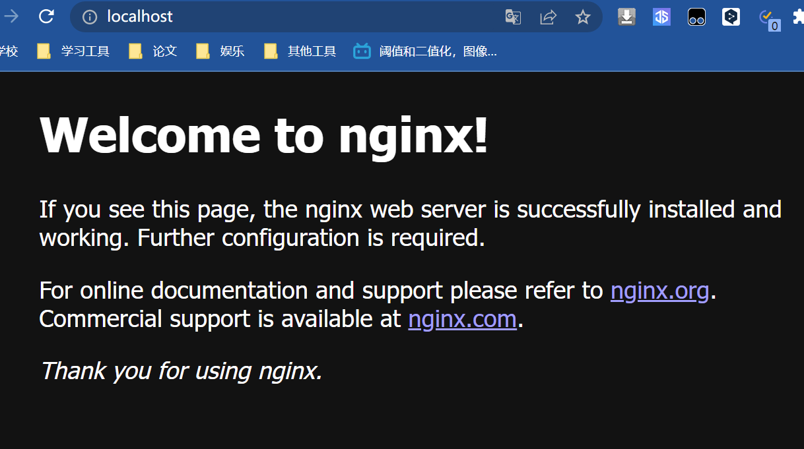

# Nginx

## 快速入门

高性能的HTTP和反向代理服务器，可以使用IMAP/POP3等邮件服务，占用内存小

### 作用

- 反向代理
	- 正向代理：通过一个外部服务器请求和相应和转发访问其他服务器
	- 反向代理：通过一个外部服务器代理多个其他服务器
- 均衡负载
	- 轮询
	- 加权轮询
- Iphash（session共享）
	- 通过ip来保证一个服务分配到固定的服务器上
- 动静分离
	- 静态资源从nginx直接返回，动态资源让服务器使用

### 安装

官网：http://nginx.org/en/download.html

```sh
nginx.exe
nginx -s stop #停止
nginx -s quit #安全退出
nginx -s reload #重载配置文件
```

​	


