# Unity VR 基础开发

- 该文章撰写依据：Unity Learn + Udemy
- 使用设备：Oculus Quest 2
- 使用Unity版本：2021.3.2 LTS
- 开发平台：Windows 11

## 配置开发环境

安装Unity Hub以及对应版本的操作不再赘述，请提前安装好Unity以及对应的Virtual Studio再继续。

1. 如果没有安装Oculus软件，需要先安装好对应软件

	前往Meta官网安装可能需要科学上网，也可以自行搜索资源。一般来说国内购买该设备时，商家会提供支持。

2. 将Quest设备开启开发者模式
	开启头显，开启Oculus软件，建议直接使用USB-C连接电脑和头显（Link），在左侧的设备选项卡中检查Oculus是否已连接。

	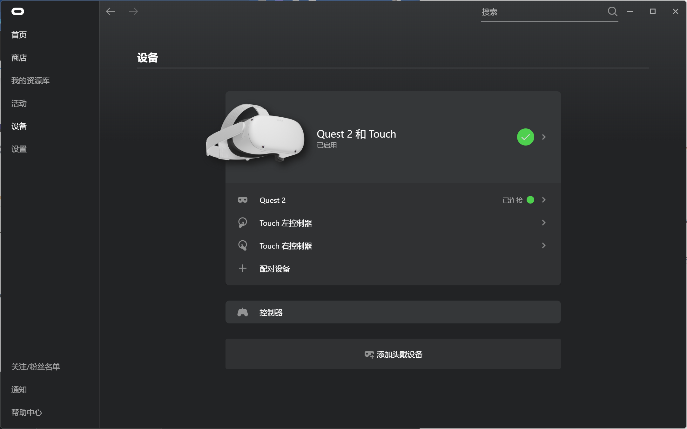

	在设置选项卡中的 通用 选项，选择运行未知来源，也可以把OpenXR Runtime设置为使用中。

	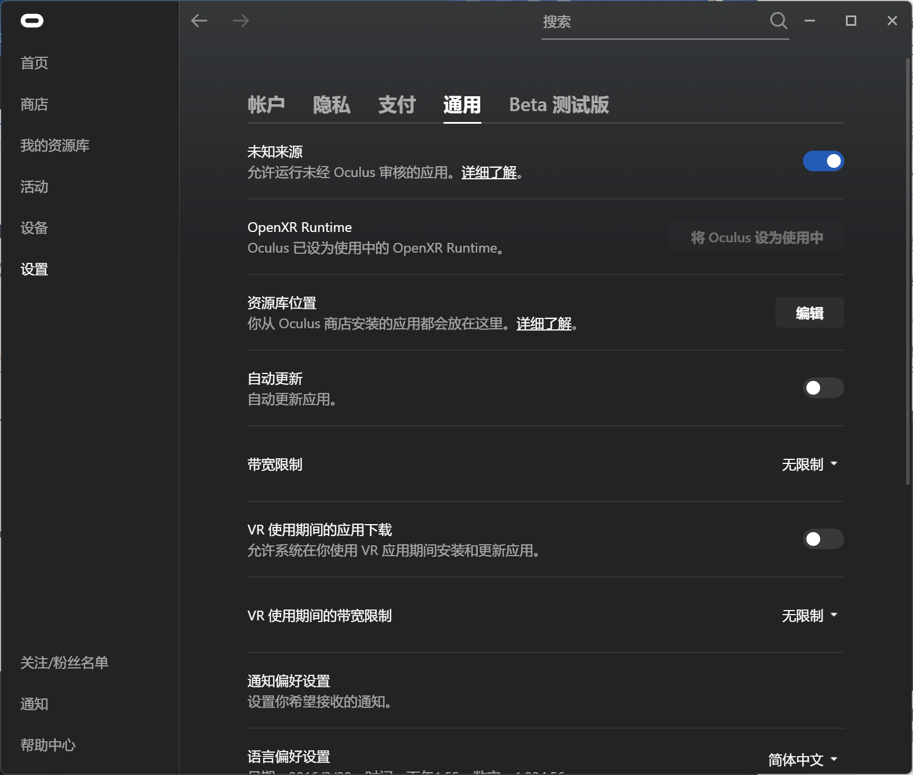

3. 安装Steam，配置SteamVR连接

	在Steam商店页搜索SteamVR，下载并开启该软件。

	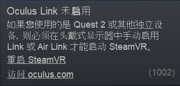

	如果出现该提示，则需要佩戴头显，在头显中选择允许电脑访问并且开启Oculus Link 或 Air Link，等待头显连接成功即可。

	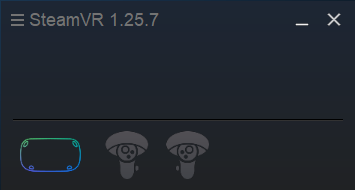

	出现类似的图标就说明已经连接成功了。 

4. （可选）使用版本控制

	Unity Learn建议使用版本控制，如果你熟悉Git等版本控制软件，构建一个仓库即可；如果不了解版本控制也无所谓，但是请注意自己之后项目的重大提交，以免造成损失。

## 初步构建VR项目

这一部分主要是为了体验VR开发，建议下载Unity Learn中的[Starter项目](https://connect-prd-cdn.unity.com/20220831/e04bb203-c0a3-4ae3-b1f3-28c32794581d/Create-with-VR_2021LTS.zip)来开始，体验UnityVR是如何运作的。

### 构建起始项目

1. 下载Stater项目，将其提取到电脑中一个自定义的文件夹中，这个步骤不再赘述

2. 在UnityHub中打开这个项目，记得选择2021.3.2的版本打开

	如果希望使用别的版本打开这个项目，记得选择该日期之后的版本，且不要差太多即可；使用不同版本会弹窗警告版本不匹配，选择Continue即可。

	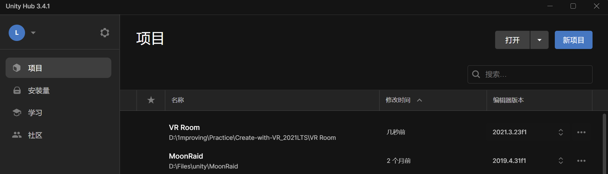

3. 进入Unity编辑器窗口，在上方的Winodow选项卡中选择Package Manager，可以看到VR项目与普通项目的区别

	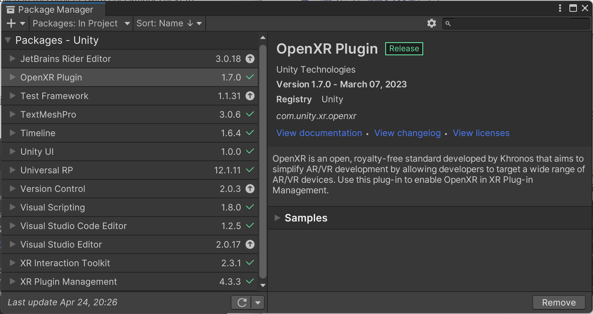

	- XR Plugin Management：用于简化XR插件的生命周期管理，并通过Unity统一设置系统为用户提供构建时的UI
	- XR Interaction Toolkit：用于创建VR和AR体验的高级、基于组件的交互系统。它提供了一个框架，使3D和UI交互可以从Unity输入事件中获取
	- Universal RP：是由Unity制作的预构建可编程渲染管线，提供了对美术师友好的工作流程，可让在各种平台上快速轻松地创建优化的图形

###  调试项目

1. 打开Scenes中的预设场景，尝试重命名场景

	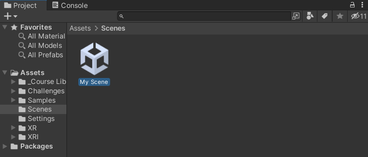

2. 在场景选项中，选择XR Rig中的Camera Offset下的Main Camera，并且在检查器窗口中查看Tracked pose Driver插件，其中的Tracking Type定义了追踪的类型（默认是三维转动和三维移动，可以仅追踪位置或转动角度）;

	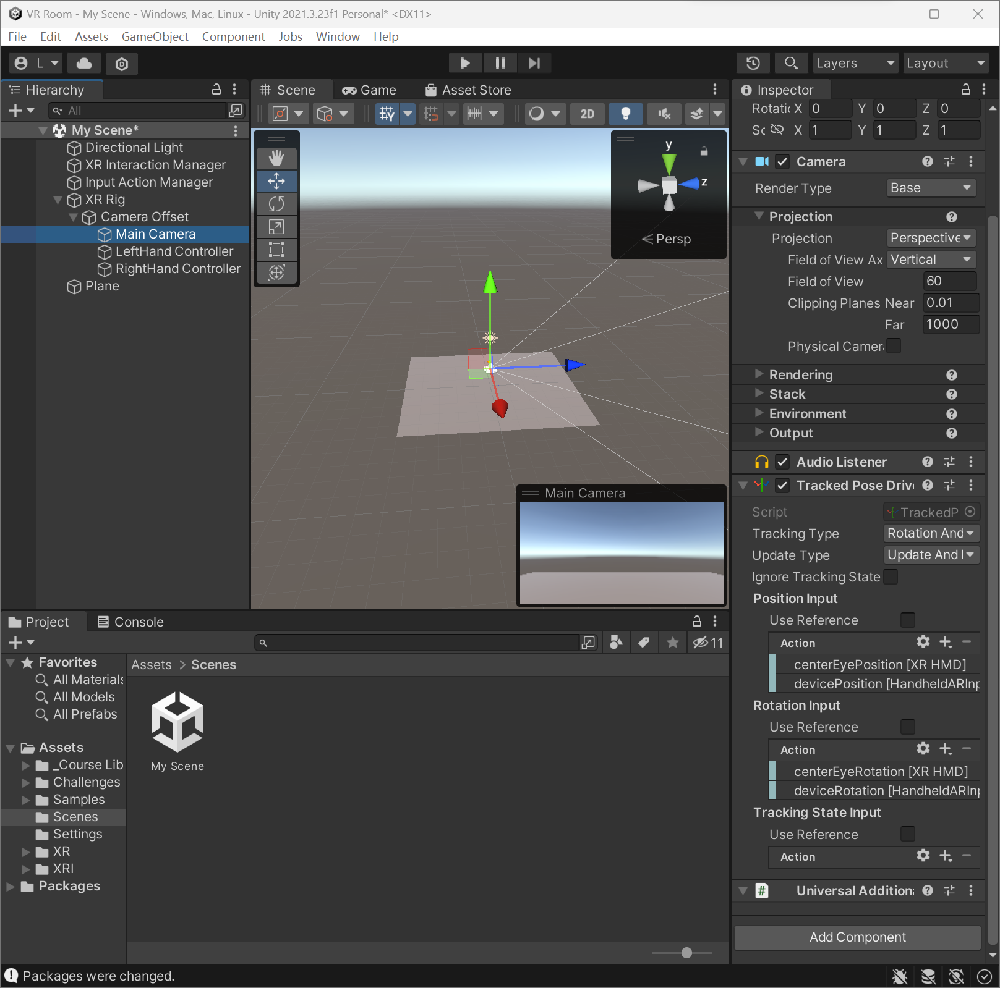

	选中场景中的LeftHand Controller和RightHand Controller，可以在检查器窗口中看到XR Controller插件，这是关于头显设备的控制相关的插件；

	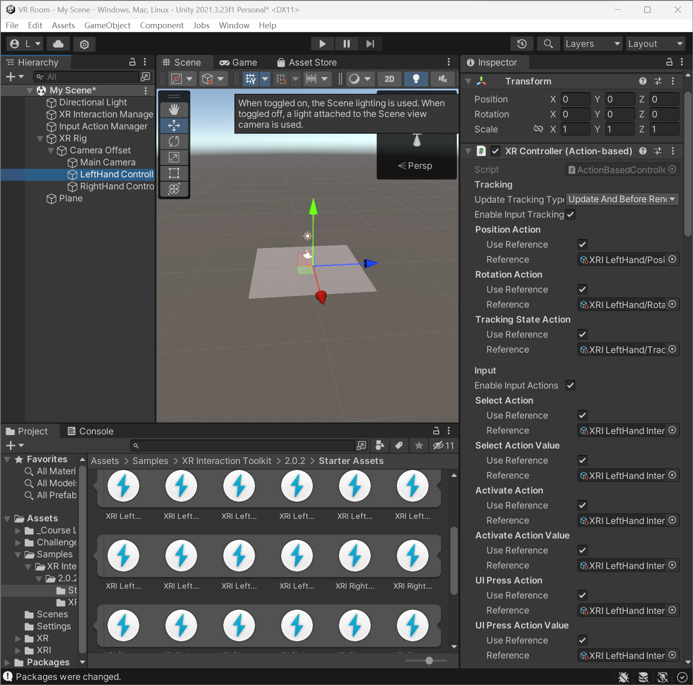

	在双击任意一个控制器方法时，会定位到XR Interaction Toolkit中的一个.inputactions文件，这个文件是用来监听设备输入的，比如可以设置手柄扳机键的功能等；

### 简单创作

接下来，就像创建其他Unity项目，开始构建一个基本的场景。其实很简单，只要将项目中提供的Prefab想搭积木一样就可以了。

1. 在_CourseLabrary/\_Prefabs/Rooms选择一个喜欢的房间，放到场景中的地面上
2. 选择其他Prefab，如外部场景、其他物件等简单装饰一下这个房间
3. 调整一下Directional Light，创建一个阳光照如房间的样子

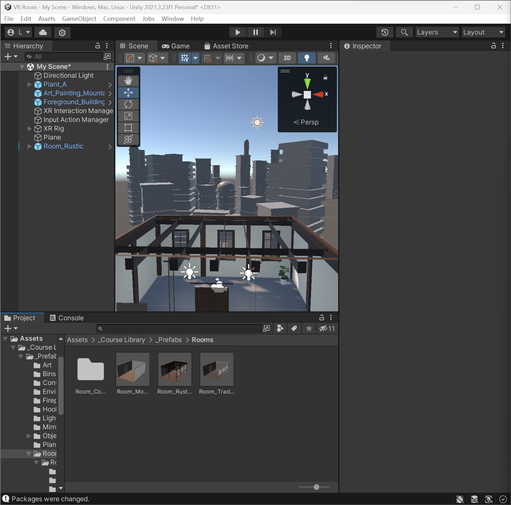

### 测试运行

接下来就可以在Oculus中测试了，如果你没有头显，可以使用 **[Device Simulator](https://learn.unity.com/tutorial/vr-project-setup?uv=2021.3&pathwayId=627c12d8edbc2a75333b9185&missionId=62554983edbc2a76a27486cb#627133f8edbc2a13728cc698)**来模拟，详见Unity Learn的教程。

1. 如果在头显中运行，首先在Unity的Edit选项卡中选择Project Settings，并在左侧选项卡中找到XR Plug-in Management；

	然后，在右侧窗口中，勾选OpenXR。

	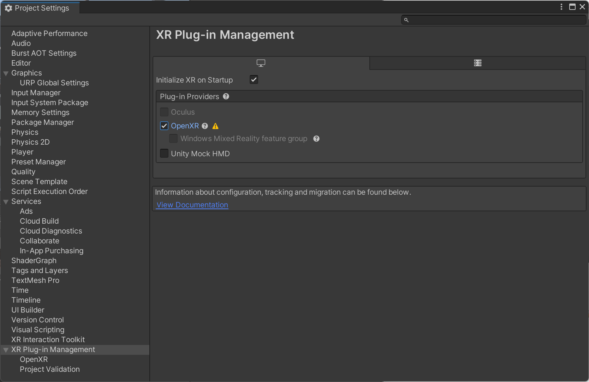

2. 勾选后，可能会出现一个警告，这时出现的警告可能各有不同，可以自行查阅解决方案

3. 解决警告后，在左侧选项卡中选择OpenXR，确保在Interaction Profiles中出现了 **Oculus Touch Controller Profile**，并且在下方的**OpenXR** **Feature Groups** 中勾选Mock Runtime 和 Runtime Debugger。

	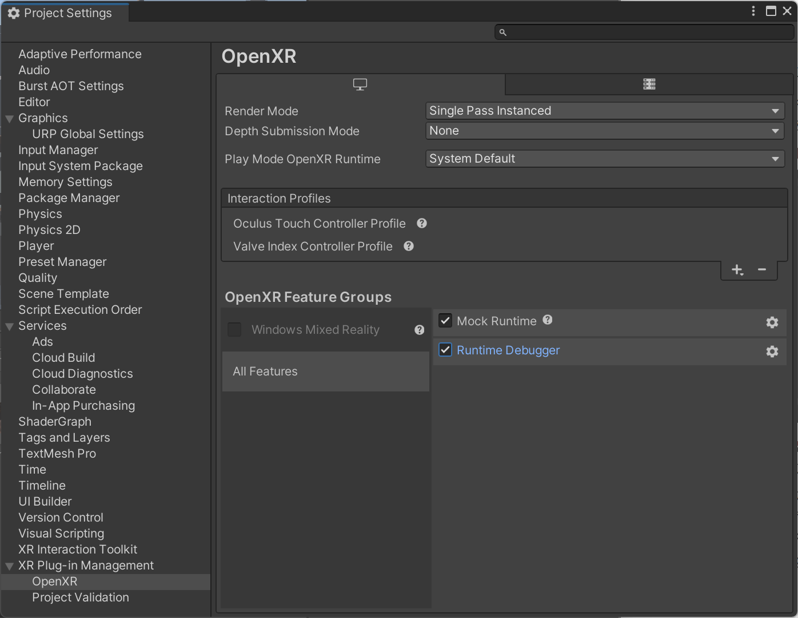

4. 再次进入Oculus软件确认连接是正常的，并且如果之前使用了**XR Device Simulator**一定要关闭；在测试之前一定要保证连接了Oculus Link或Air Link；

5. 点击Play按键，在头显中查看你的场景

	如果头显没有正常显示，可以选择取消第三步中的Mock Runtime后再次尝试，其他问题可以参考[这里](https://learn.unity.com/tutorial/vr-project-setup?uv=2021.3&pathwayId=627c12d8edbc2a75333b9185&missionId=62554983edbc2a76a27486cb#627133f8edbc2a13728cc699)

如果你希望将将其打包成App并且安装在Oculus上，可以参考[这个步骤](https://learn.unity.com/tutorial/vr-project-setup?uv=2021.3&pathwayId=627c12d8edbc2a75333b9185&missionId=62554983edbc2a76a27486cb#627133f8edbc2a13728cc69a)，但是这里暂时用不上所以先跳过。

## VR中的运动（Locomotion）

在VR中，一般存在三种运动方式：

- room-scale，即实际运动，你可以通过走动来实现在VR中的移动
- continuous，即连续运动（或基于控制器），就是使用控制器来连续的在空间中移动，可能会造成眩晕
- teleporting，即瞬间移动，指传送到某一个位置

在这部分中，我们将进一步完善房间并实现移动效果。

### 装饰房间

在上一部分中，房间的装饰还比较简陋，可以继续自行加一些装饰。

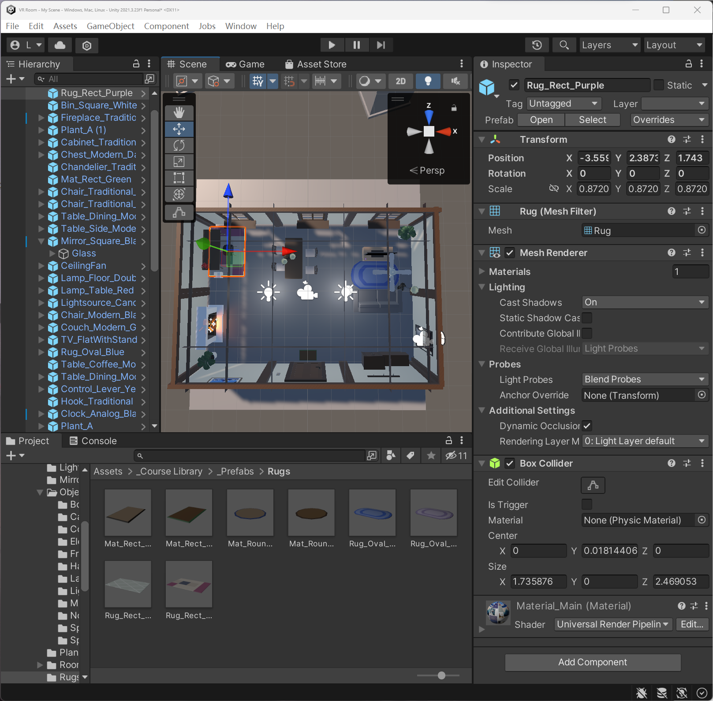

### 转动视角

转动视角需要我们先添加一些插件。

1. 在层级选项中选中XR Rig，在检查器栏目中看到XR Origin插件，在此添加一个Locomotion System组件，并且将XR Origin组件拖拽到Locomotion System的XR Origin属性中。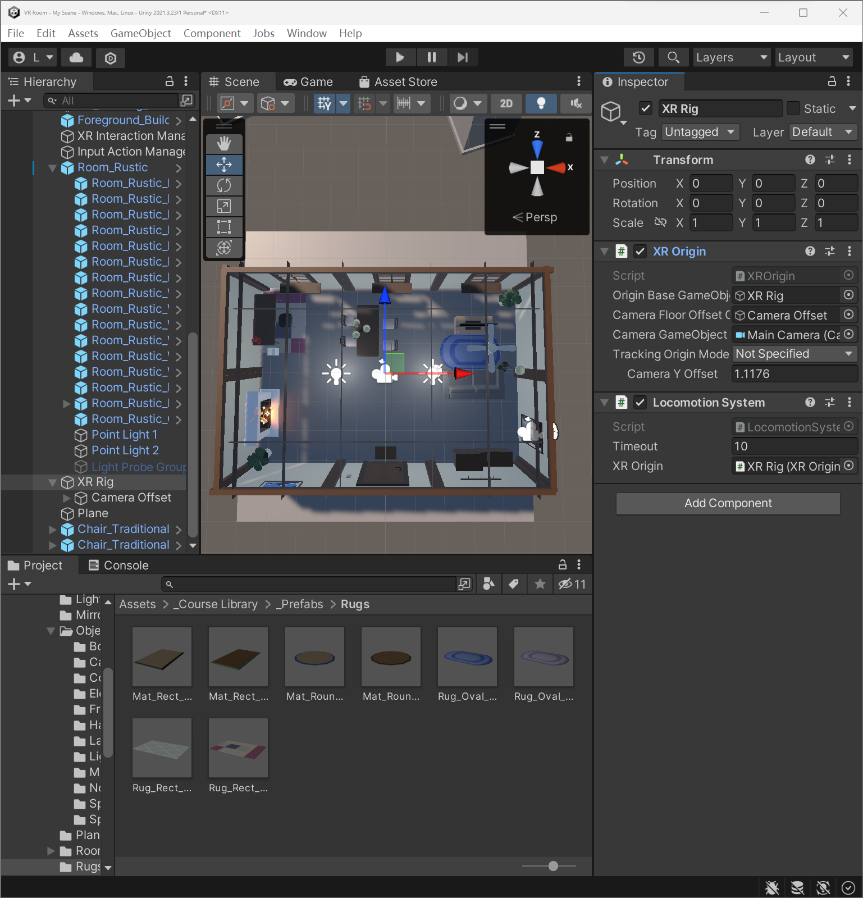
2. 在XR Rig中继续添加一个Snap Turn Provider（Action-based）组件，不要选择Device-based组件，因为这样可能只会兼容一种设备。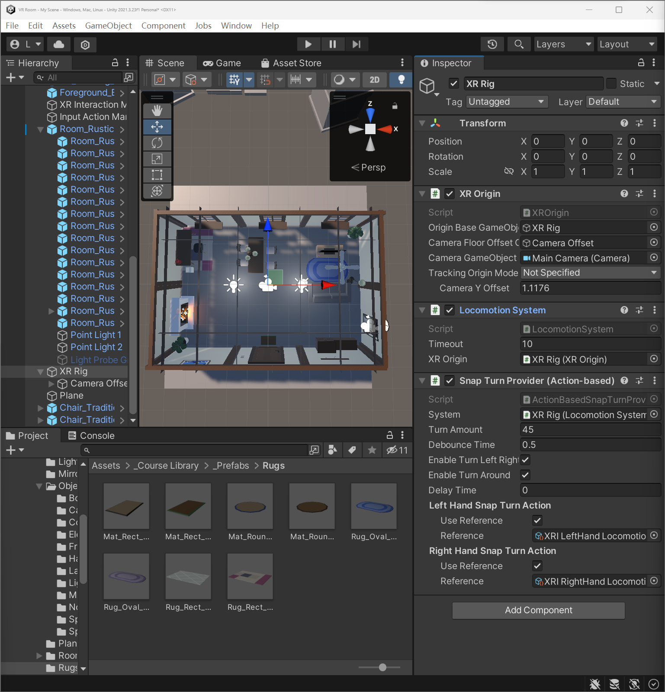
3. Snap Turn Provider组件具有一些属性：
	- System，运动系统，需要将刚刚添加的Locomotion System拖拽以启用
	- Turn Amount，每次转动的角度，指拨动一次摇杆后转动的角度
	- Debounce Time，退避时间，即两次摇杆拨动触发的时间间隔
	- Enable Turn Left Right，允许左右转动
	- Enable Turn Around，允许向后拨动摇杆时转身180°
	- Left/Right Hand Snap Turn Action,设置对哪个控制器启用该插件，默认情况下是两个控制器都启用的

完成设置后，启动测试，当使用控制器左右摇杆后，正确设置的情况下应该发现可以转动视角了。

当然，这时一种非连贯的转动视角，如果需要连贯转动视角，需要按照下面的配置。

1. 将上述配置了的Snap Turn Provider禁用，添加摇杆Continuous Turn Provider (Action Based) 的组件
2. 配置这个组件：
	- System，和之前的配置一样，需要选择使用的运动系统，将Locomotion System拖拽过来
	- Turn Speed，每秒钟转动的角度，即角速度，可以自行设定
	- Left/Right Hand Snap Turn Action,设置对哪个控制器启用该插件，默认情况下是两个控制器都启用的

再次注意，使用VR较少的用户在连续运动下产生眩晕感，这是正常的。

### 移动位置

移动位置需要设置一些新的组件，首先来看传送方式。

1. 在XR Rig中添加Teleportation Provider组件，并且将System属性值中拖入Locomotion System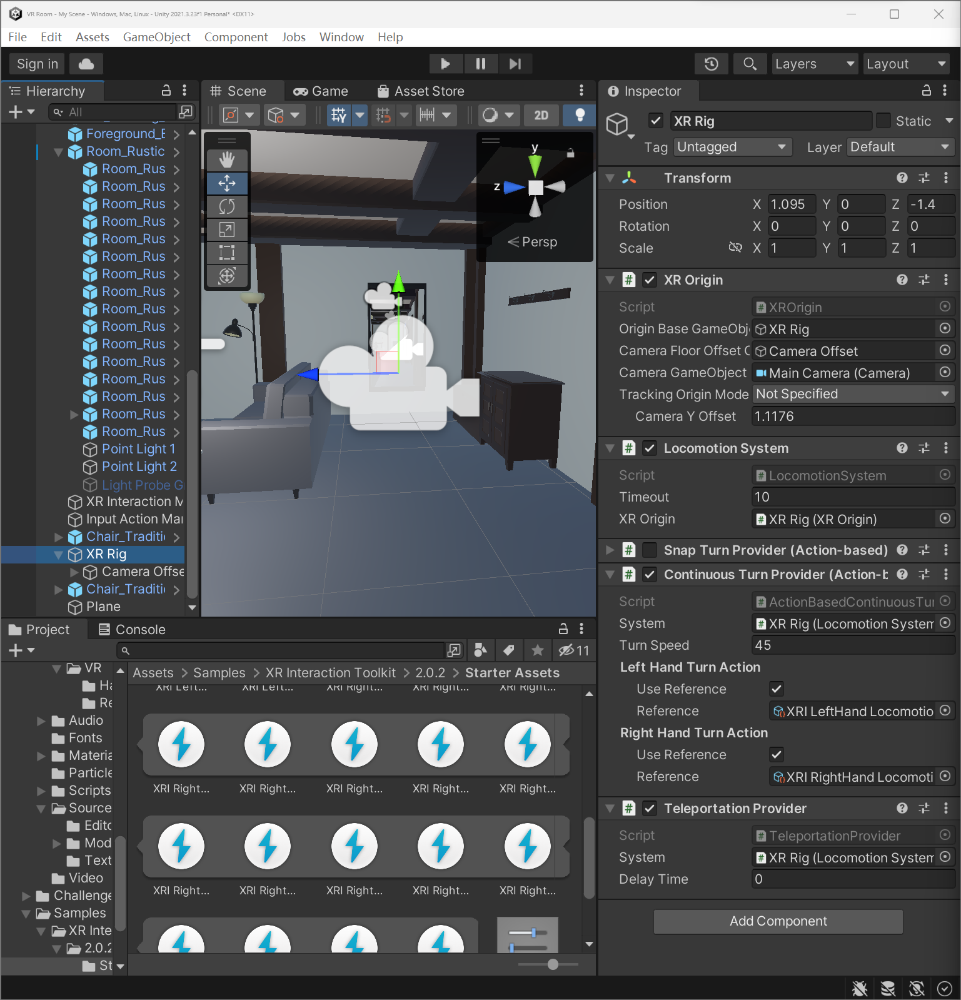
2. 选择一个区域，比如毯子或创建一个空物体在你想传送的区域，然后给这个物体添加一个Teleportation Area的组件，并设置其中的属性：
	- Interaction Layer Mask：允许与Interaction Layer Mask与任何图层重叠的Interactor进行交互，如果交互物体和该组件所在物体位于包含在同一层即可交互
	- Colliders：进行交互使用的碰撞器（如果为空，则使用任何子碰撞器）
	- Custom Reticle：当有效时，在选择线的末端出现的准星
	- Select Mode：指示Interactable的选择策略。这控制了有多少物体可以选择该物体进行交互。
		- Single：将Select Mode设置为Single，以防止同时有多个物体选择。
		- Multiple：将Select Mode设置为Multiple，以允许多个物体同时选择。
	- Match Orientation：瞬移后如何定向Rig。
		- World Space Up：保持根据世界空间上向量定向。
		- Target Up：根据目标Teleport Anchor Transform（需要添加该组件）的上向量定向。
		- Target Up And Forward：根据目标的Base Teleportation Interactable Transform的旋转定向。
		- None：保持瞬移前后相同的定向。
	- Teleport Trigger：指定何时触发瞬移。
		- OnSelectEntered：当选择这个物体时瞬移，如按下扳机键立刻触发
		- OnSelectExited：当这个Interactable不再被选择后瞬移，如放开扳机键后触发
		- OnActivated：当激活这个物体时瞬移，这里的激活和物体的Active是不一样的；如按下激活按钮时触发。
		- OnDeactivated：当取消激活这个Interactable时瞬移，如松开激活按钮时触发。
	- Teleportation Provider：指的是需要被移动的物体。如果没有配置，则会在Awake时尝试自动寻找一个。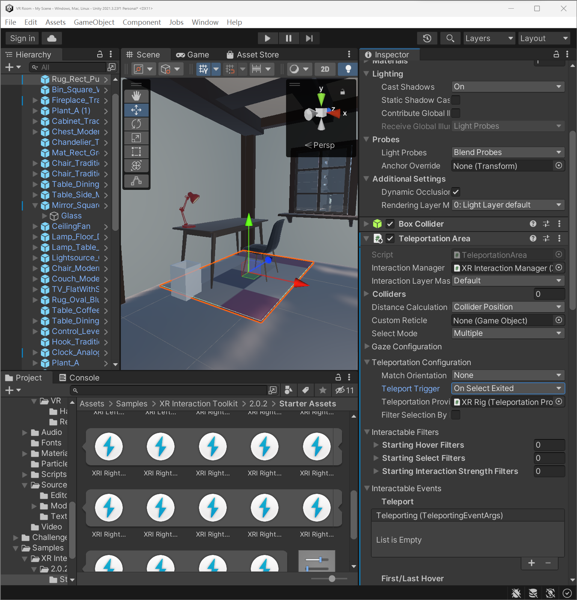

这时候，再次进入VR调试，你会发现启用了瞬移相关组件的Object可以交互了；当控制器指向该物体，引导线会变白，此时按下扳机键，你就可以传送到该物体的任何部分（具体的位置是根据Collider决定的，会传送到引导线和Collider碰撞的地方）。

当然，使用Teleprtation Anchor也可以进行传送。

1. 为了方便，可以修改Prefab的内容，给毯子的prefab加上该组件；如果不想这么做，也可以给每个实例添加Teleprtation Anchor。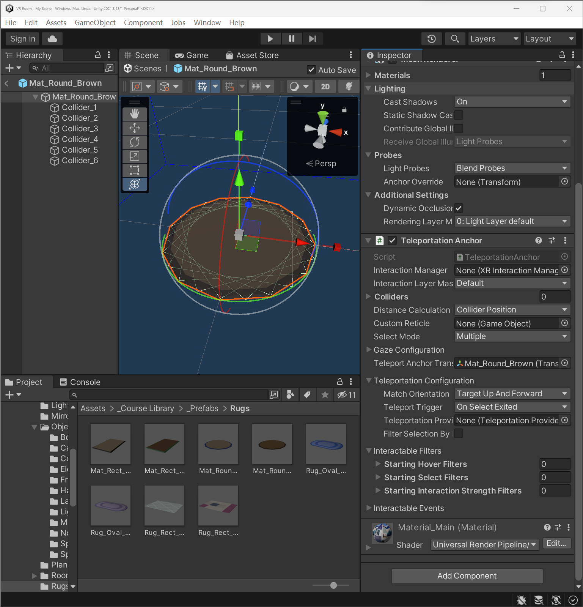
2. 这个组件存在很多属性，不过很多和Teleprtation Area类似，这里说一些关键的部分：
	- Interaction Manager，即要与该组件通信的XRInteractionManager，可以不设置因为会自动寻找
	- Teleportation Anchor Transform，指的是转送到的位置，使用Transform组件的一个引用，默认是自己物体的坐标

这样设置后，可以点击任意放置在场景中的毯子来进行传送了。如果设置了Target Up And Forward，那么就会传送的同时转向物体的local position的z方向。

最后一个小问题，如果只通过引导线来表现选中的传送区域，这样可能不太直观。一般的VR应用会在传送位置加上一个准星来表示传送的位置，这个选项在Teleprtation Area/Anchor的Custom Reticle选项中，只需要在_Prefabs/VR/Reticle文件夹中选择一个你喜欢的准心，拖拽上去即可。

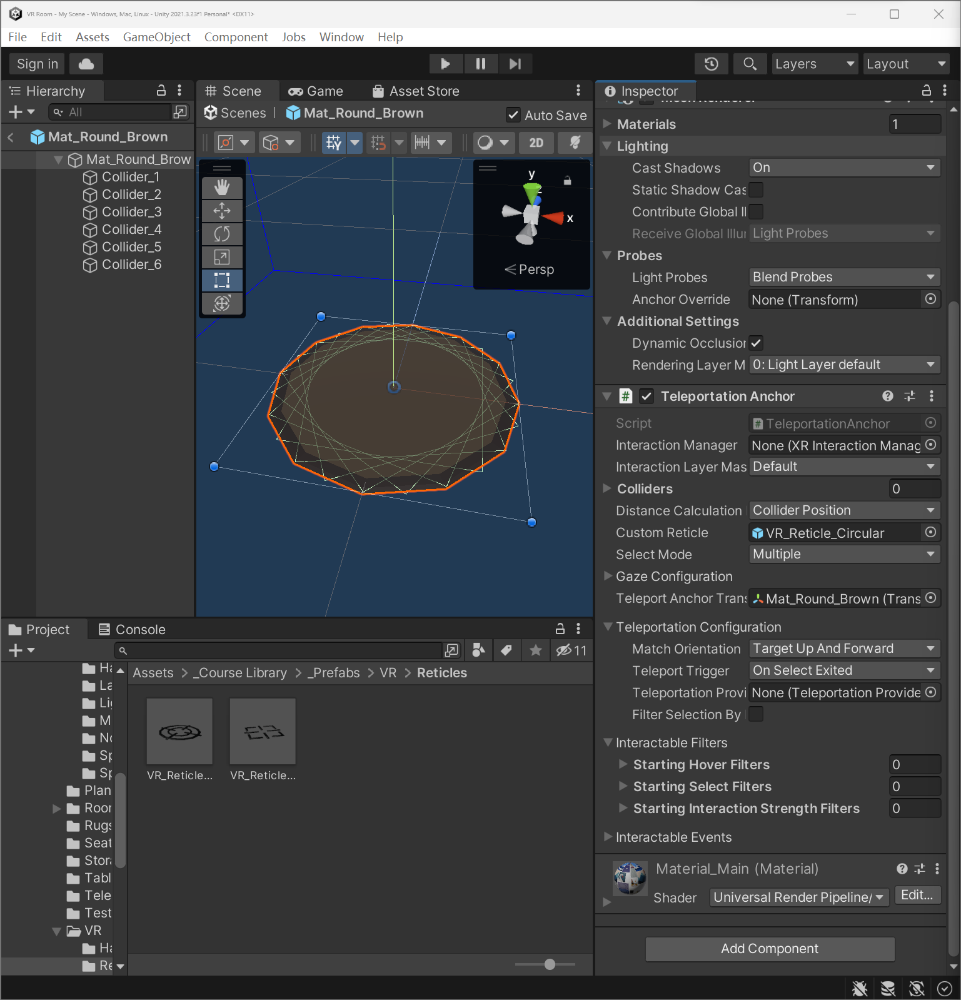

这样，再次带上头显，就可以看到选中区域出现准心了。

如果你想要连续移动，只需要给XR Rig添加一个Continuous Move Provider即可。

## 可拾取的物品

### 更换手部模型

在之前的内容中，控制器显示是一个球体，我们可以更换它。

1. 在XR Rig / Camera Offset下找到 LeftHand/RightHand Controller
2. 将_Prefabs/VR/Hands的手部模型拖拽到 Model Prefab属性即可完成手部的更换

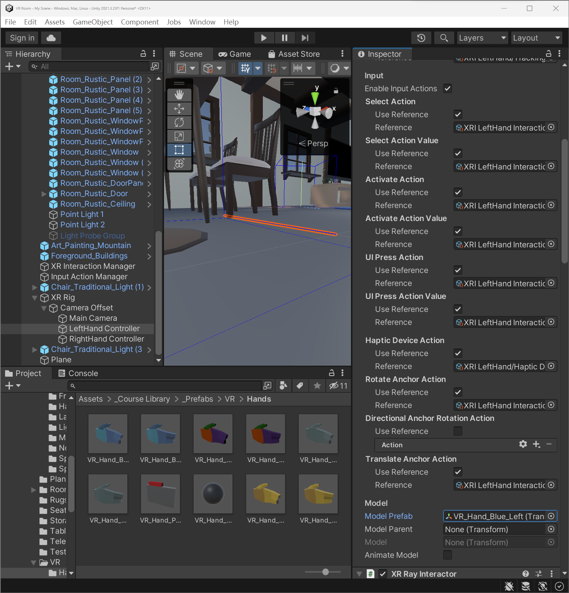

### 添加可拾取物品

我们可以拾取VR中的一些物品，这是非常重要的功能。

1. 选取一个物品放入场景中，比如一个苹果，并且给它添加一个XR Grab Interactable组件；这个操作会自动给它添加一个刚体组件

	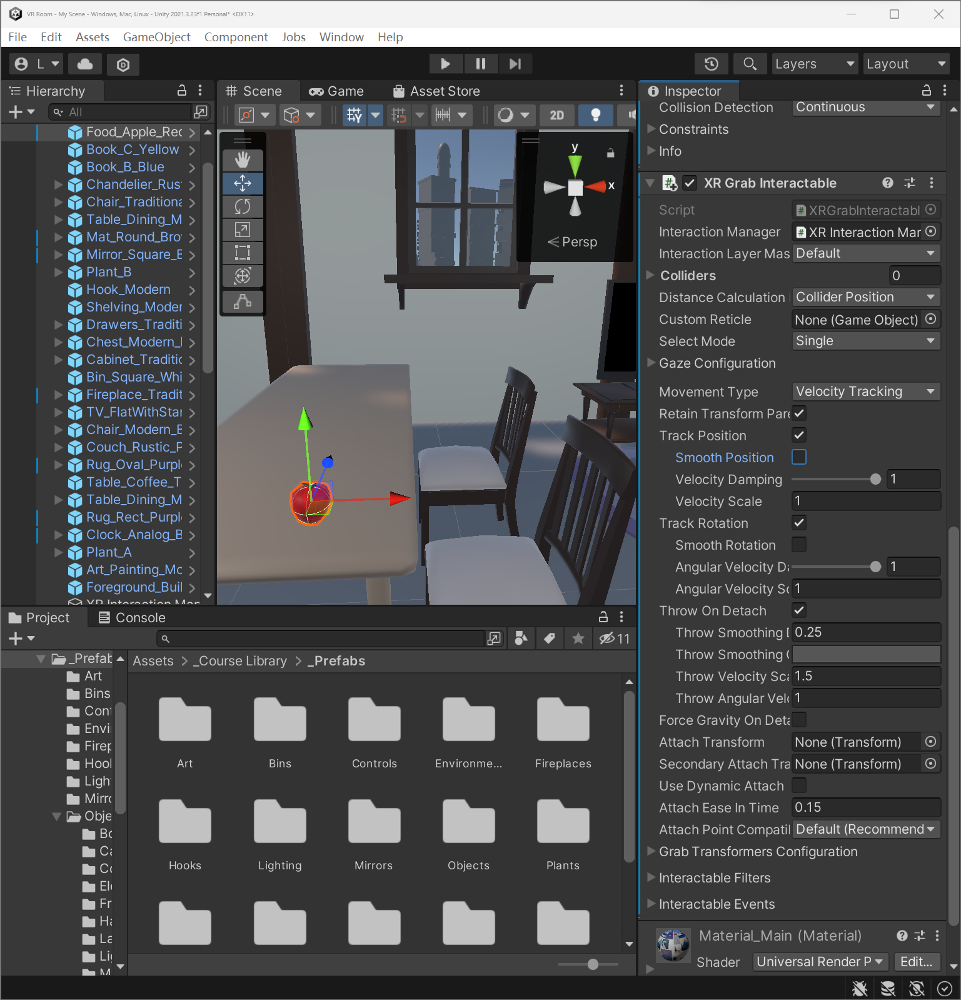

2. XR Grab Interactable带来了很多属性：

	- Colliders：这个属性是用来指定这个Interactable要用哪些碰撞器来进行交互的，如果没有指定，它会使用所有子物体上的碰撞器。
	- Distance Calculation Mode：这个属性是用来指定这个Interactable要用什么方式来计算和Interactor之间的距离的，有三种方式可以选择，从最快到最精确
		- Transform Position：这种方式是用Interactable的变换位置来计算距离，这种方式性能开销很低，但是对于一些物体可能距离计算不够准确。
		- Collider Position：这种方式是用Interactable的碰撞器列表中每个碰撞器的最短距离来计算距离，这种方式性能开销适中，对于大多数物体应该有适中的距离计算精度。
		- Collider Volume：这种方式是用Interactable的碰撞器列表中每个碰撞器的最近点（在表面或者内部）来计算距离，这种方式性能开销很高，但是有很高的距离计算精度。
	- Select Mode：这个属性是用来指定这个Interactable的选择策略的，它控制了有多少个Interactor可以同时选择这个Interactable。
		- Single：设置Select Mode为Single可以防止多于一个Interactor同时选择这个Interactable。
		- Multiple：设置Select Mode为Multiple可以允许多个Interactor同时选择这个Interactable。
	- Movement Type：这个属性是用来指定当这个物体被选中时，它是如何移动的，有三种方式可以选择
		- Velocity Tracking：设置Movement Type为Velocity Tracking可以让Interactable通过设置刚体的速度和角速度来移动。使用这种方式可以防止物体在跟随Interactor时穿过没有刚体的其他碰撞器，但是缺点是物体可能会有延迟感，不会像Instantaneous（瞬时）那样平滑。
		- Kinematic：设置Movement Type为Kinematic可以让Interactable通过移动运动学刚体来接近目标位置和方向。使用这种方式可以保持物体的视觉表现和物理状态同步，并且允许物体在跟随Interactor时穿过没有刚体的其他碰撞器。
		- Instantaneous：设置Movement Type为Instantaneous可以让Interactable通过每帧设置变换的位置和旋转来移动。使用这种方式可以让物体的视觉表现每帧都更新，最小化延迟，但是缺点是物体会穿过没有刚体的其他碰撞器。
	- Retain Transform Parent：启用这个属性可以让Unity在物体被释放后，把它的父物体设置回原来的父物体
	- Track Position：启用这个属性可以让物体在被选中时跟随Interactor的位置
	- Smooth Position：启用这个属性可以让Unity在跟随Interactor的位置时应用平滑效果
	- Smoothing Amount：这个属性是用来指定平滑效果的强度的，值越大，平滑效果越强
	- Track Rotation：启用这个属性可以让物体在被选中时跟随Interactor的旋转
	- Smooth Rotation：启用这个属性可以让Unity在跟随Interactor的旋转时应用平滑效果
	- Throw On Detach：启用这个属性可以让物体在被释放时保持速度和角速度
	- Throw Smoothing Duration：这个属性是用来指定释放时速度和角速度平滑过渡的时间长度的
	- Throw Velocity Scale：这个属性是用来指定释放时速度缩放比例Throw Angular Velocity Scale：这个属性是用来指定释放时角速度缩放比例的
	- Gravity On Detach：启用这个属性可以让物体在被释放后受到重力影响
		Colliders On Detach：启用这个属性可以让物体在被释放后启用碰撞器

完成这个步骤后，你应该可以在VR中捡起一些物体，并且进行一些基于物理的投掷等行为了。

但是，很容易发现的是，这种情况下拾取的物品是不在手中心的，并且如果使用摇杆转动或者移动这个物体，那么也会和已经设置的移动和视角转动功能冲突。

1. 首先，找到XR Rig下的Left/Right Hand Controller，并找到它对应的XR ray Interactor组件

	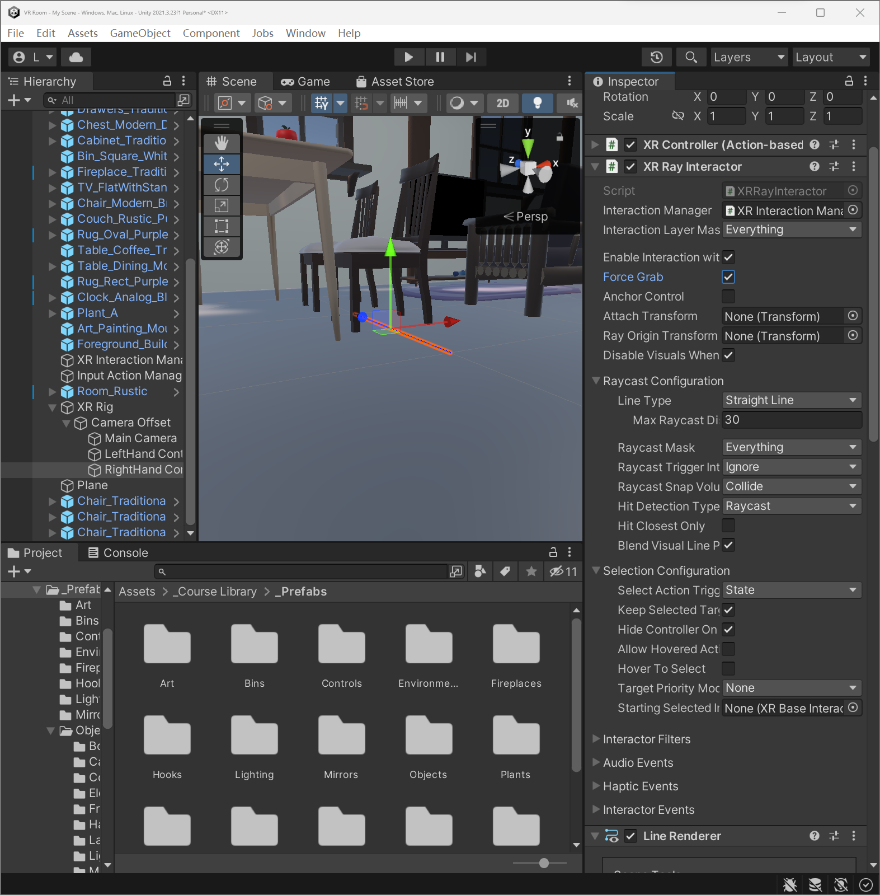

2. 对这个组件进行一些设置：

	- Force Grab：这个选项是用来允许物体和控制器可以间隔一段举例交互的，表现就是允许从远处抓取控制器碰不到的物品
	- Anchor Controller：允许使用摇杆来控制物品和控制器的距离和旋转
	- Hide Controller On Select：使得选中物品时，控制器的模型消失

经过这个设置，这样物体在抓取后不再能在手中转动了。

最后，对于XR Ray Interactor和XR Grab Interactable组件，有一些设置必须说明的属性：

- Attach Transform：抓取物体的位置，当抓取物体时两个组件中的该位置会被绑定，如果没有该组件则默认是Transform的位置

## 插槽持有可交互物体

如果我们希望将一个物体挂载在一个位置，而不是通过控制器持有它，我们需要做一些操作。

### 设置Socket

1. 给一个物体添加一个碰撞体，并且设置为is Trigger作为触发器使得可交互物体触碰时发生悬停，同时添加一个XR Socket Interactor组件

1. 对于这个组件，有以下属性需要关注：
	- **Interaction Layer Mask**：允许与那些交互层遮罩与这个交互层遮罩有任何层重叠的可交互物体进行交互。
	- **Attach Transform**：用作可交互物体的附着点的变换。如果没有则会在Awake时自动实例化并设置。
	- **Starting Selected Interactable**：这个交互器在启动时自动选择的可交互物体（可选，可以没有）。
	- **Keep Selected Target Valid**：是否在最初选择一个可交互物体后即使它不再是一个有效目标也保持选择它。启用这个选项可以让XRInteractionManager保留选择，即使可交互物体不包含在有效目标列表中。禁用这个选项可以让XRInteractionManager在可交互物体不在有效目标列表中时清除选择。禁用这个选项的一个常见用途是对于用于传送的射线交互器，当不指向它时让传送的可交互物体不再被选中。
	- **Show Interactable Hover Meshes**：是否让这个插槽在其附着点处为它悬停在上面的可交互物体显示一个网格。
	- **Hover Mesh Material**：用于渲染悬停可交互物体网格的材质（如果没有提供则会创建一个默认材质）。
	- **Can’t Hover Mesh Material**：用于渲染悬停可交互物体网格当插槽中已经有一个被选中的对象时的材质（如果没有提供则会创建一个默认材质）。
	- **Hover Scale**：渲染悬停可交互物体时的缩放比例。
	- **Socket Active**：是否启用插槽交互。
	- **Recycle Delay Time**：设置当一个对象从插槽中移除后，插槽拒绝悬停的时间。
2. 接下来，我们需要设置一个正确的悬停点，正如这个插件的Attach Transfrom属性，只需要设置一个正确的Transform来作为物体的正确悬停坐标就可以了，一般设置一个空物体作为子物体即可。

完成之后，我们应该可以通过让可交互物体的碰撞体和设置为触发器的socket的碰撞体发生交互，让可交互物体悬停在Attach Transform处。

同样地操作，你可以给XR Rig中的Main Camera添加一个XR Socket Interactor来带上帽子。

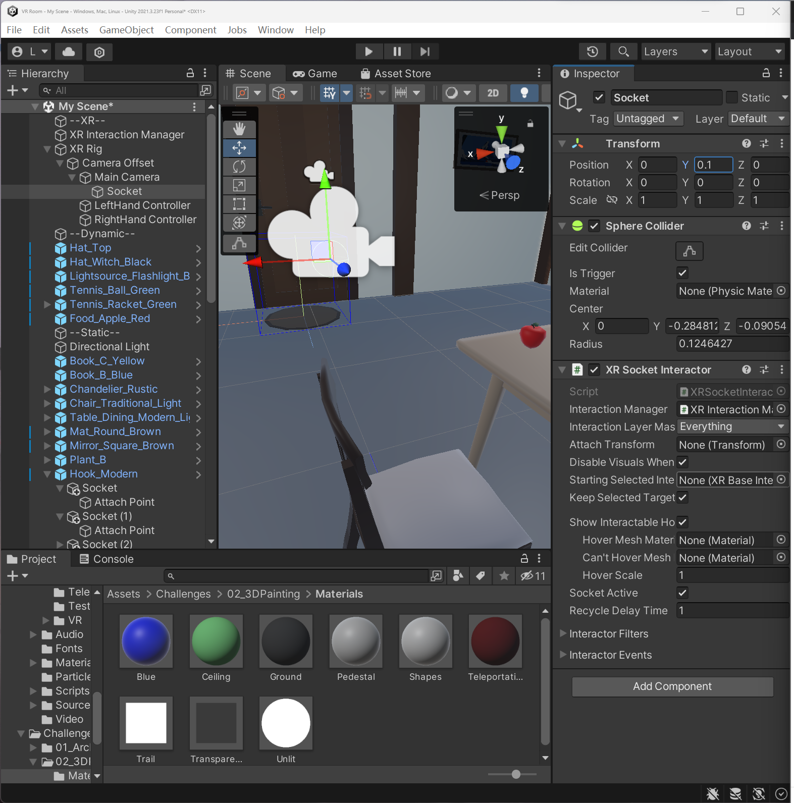

### 添加物品遮罩

前面一直遗留了一个问题，那就是可交互物品不应该是可以随意交互的，而是应该和不同的物品种类有关，比如只有帽子才能戴在头上。

1. 找到XR Socket Interactor中的Interaction Layer Mask 选项，选择Add Layer，添加自定义的Layer
2. 将Interaction Layer Mask设置为自定义的层级，并且将对应的可交互物品也设置成这个自定义的层级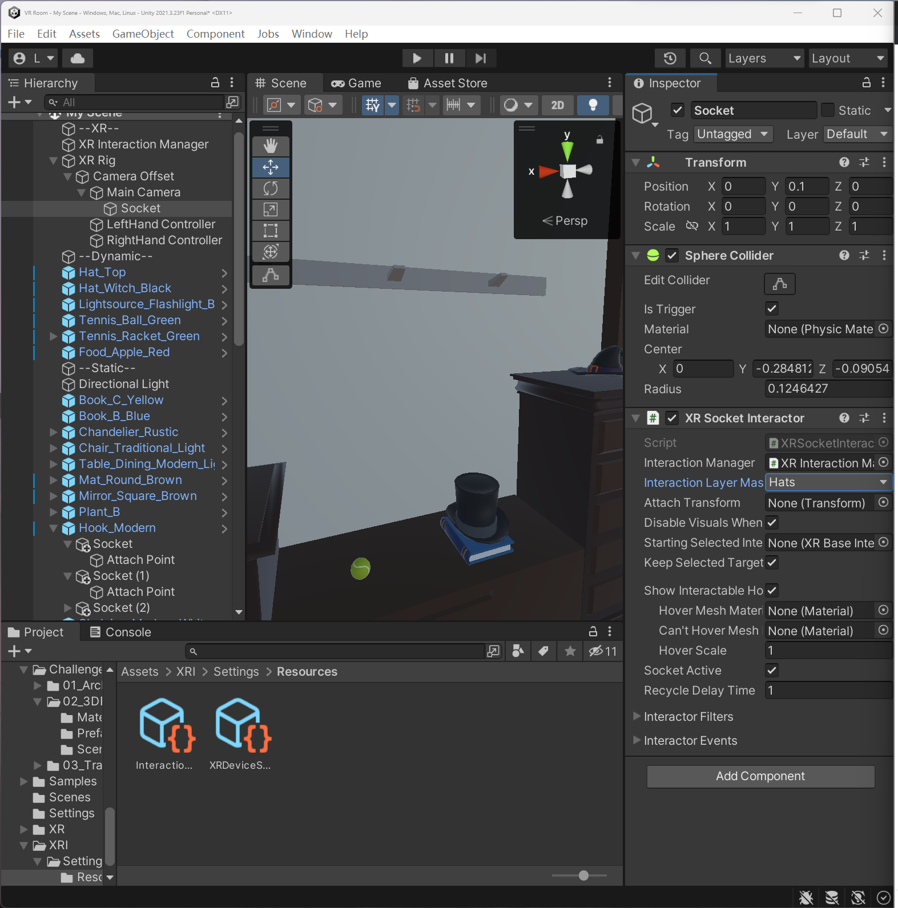

现在只有XR Socket Interactor 和 XR Grab Interactor的物品都选中了自定义层级的情况下才能触发交互了。当然对于Teleportation Area/Anchor也有这样的设置，原理是类似的。

